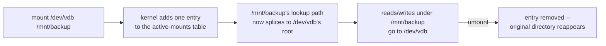

# Part 1 — Discovery, Formatting & Mounting

> Prerequisite: [Landing page](./course.md). Next: [Part 2 — Diagnosing a Stuck Disk](./course-02-diagnosing-a-stuck-disk.md).

This part takes a disk from raw sectors the kernel can see but nothing can use, to a directory you can write files into. Everything in Part 2 — busy mounts, stuck processes — only happens to a disk that has already been through the steps here.

## The unified file tree

On Windows, each disk gets its own letter: `C:`, `D:`, `E:`. The drives sit side by side, and you pick one by its letter.

Linux does not work that way. There is exactly one directory tree, and it starts at the root directory, written `/`. Every disk, whether it is an internal SSD, a USB drive, or a network share on another continent, has to be attached to *some directory inside that one tree* before you can use it. Attaching a disk to a directory is called **mounting**, and the directory it gets attached to is the disk's **mount point**. Once a disk is mounted at, say, `/mnt/backup`, writing a file to `/mnt/backup/report.txt` sends that data to the mounted disk; the kernel handles the redirection invisibly.

The layer that makes every kind of storage behave the same way to your programs is the kernel's **Virtual Filesystem (VFS)**. Because of VFS, an application writing a file does not need to know or care whether the target directory is on a local disk, a USB stick, or a remote server.

> As an analogy: mounting is like connecting a new wing to an existing building rather than parking a separate trailer outside. Visitors walk through the same front door and down the same hallways to reach the new rooms. The analogy breaks down in that a mounted disk can be detached cleanly at any time, which is not true of a building wing.

### What `mount` actually changes

`mount` does not copy or move any data, and it does not depend on the size of the filesystem being attached — mounting a 500 GB disk is exactly as fast as mounting a 5 GB one. That is because mounting is a purely in-memory bookkeeping operation: the kernel keeps a table of every currently active mount (you can see it as `/proc/mounts`), and each entry is a small record — the source device, the mount point, the filesystem type, the options — plus a pointer that splices the mounted filesystem's root directory into the directory tree at exactly the mount point's location. Walking into `/mnt/backup` after the mount, the kernel's path lookup hits that splice point and transparently continues resolution inside the mounted filesystem instead of the one underneath it.



This is also why unmounting is safe and reversible: `umount` just removes that table entry and un-splices the path. Whatever was in `/mnt/backup` *before* the mount was never touched — it was only hidden underneath the mounted filesystem — so it reappears exactly as it was.

## Discovering an unformatted disk

A brand-new disk shows up to the kernel as a **raw block device**: the kernel knows its size and can read and write its sectors, but there is no filesystem on it, so it has no UUID, no label, and cannot be mounted yet.

The command to list what block devices the kernel currently sees is `lsblk` ("list block devices"). It prints a tree: whole disks (named `sda`, `sdb`, … on physical hardware, or `vda`, `vdb`, … on virtual machines) with any partitions carved out of them shown as indented children (`vda1`, `vda2`, …).

A disk that has a filesystem also has a 128-bit **UUID** (universally unique identifier) written into its header. The `blkid` ("block ID") command reads those headers and reports the UUID and filesystem type of every formatted device. A raw disk has no header for `blkid` to read, so it simply does not appear in the output. That absence is how you confirm a disk is safe to format: if `blkid` does not mention it, there is no filesystem there to destroy.

> [!TIP]
> **Try it — spot the raw disk**
>
> ```sh
> lsblk
> sudo blkid
> ```
>
> Expect something like:
>
> ```text
> NAME    MAJ:MIN RM SIZE RO TYPE MOUNTPOINTS
> vda     254:0    0  15G  0 disk
> └─vda1  254:1    0  15G  0 part /
> vdb     254:16   0   2G  0 disk
>
> /dev/vda1: UUID="a1b2c3d4-..." TYPE="ext4" PARTUUID="..."
> ```
>
> `vda1` is mounted at `/` and shows up in `blkid` with a UUID and `TYPE`. `vdb` has no mount point, no children, and no line in `blkid` at all — that is the raw 2 GB disk, unformatted and safe to work on. Device names vary; confirm which one is the spare by its 2 GB size and empty mount point.

## Formatting: putting a filesystem on the disk

**Formatting** a disk means writing a **filesystem** onto it: an on-disk data structure that tracks file names, where each file's data blocks live, and metadata like permissions and timestamps. Without a filesystem, the disk is just an undifferentiated array of sectors.

This module uses **ext4** (the "fourth extended filesystem"), the long-standing default on many Linux distributions. It is a **journaling** filesystem, which matters for reliability: before changing its on-disk tables, ext4 writes a short description of the intended change to a reserved area called the journal. If power is lost mid-write, the kernel replays the journal on the next boot and the filesystem stays consistent instead of corrupting.

The tool that creates a filesystem is `mkfs` ("make filesystem"). You call the ext4-specific version directly:

```sh
sudo mkfs.ext4 /dev/vdb
```

This command overwrites the target. Running it on the wrong device destroys that device's data, so always confirm the device name with `lsblk` first.

### Why `mkfs` takes time proportional to size — and how you can run out of space with free bytes left

During the run, `mkfs.ext4` does three things that scale with the disk's size: it calculates the total block count, it lays out and reserves space for the **inode table** (the fixed-size array of per-file metadata records — permissions, timestamps, pointers to data blocks — one entry per file the filesystem will ever be able to hold), and it initializes the journal. The inode table is the part worth understanding, because it is sized *at format time* and never grows afterward: `mkfs.ext4` picks a **bytes-per-inode ratio** (how many bytes of disk space get one inode) and pre-allocates that many inode slots, whether or not you ever use them.

That fixed inode count is a real, separate resource from disk space. A filesystem that is nowhere near full on `df -h` can still refuse every new file with "No space left on device" if it holds far more small files than the default ratio anticipated (a mail spool or a cache directory with millions of tiny files is the classic case). `df -i` reports inode usage the same way `df -h` reports block usage — checking both is the only way to tell which resource is actually exhausted.

> [!TIP]
> **Try it — before and after formatting, and check both space and inodes**
>
> ```sh
> sudo blkid /dev/vdb
> sudo mkfs.ext4 /dev/vdb
> sudo blkid /dev/vdb
> df -i /dev/vdb 2>/dev/null || echo "(mount it first to query inode usage)"
> ```
>
> Expect something like:
>
> ```text
> (first blkid prints nothing and exits non-zero — no filesystem yet)
>
> mke2fs 1.47.0 (5-Feb-2023)
> Creating filesystem with 524288 4k blocks and 131072 inodes
> ...
> Writing superblocks and filesystem accounting information: done
>
> /dev/vdb: UUID="9f8e7d6c-5b4a-3210-fedc-ba9876543210" TYPE="ext4"
> ```
>
> The first `blkid` says nothing because there is no filesystem to identify. After `mkfs.ext4`, the same command reports a fresh UUID and `TYPE="ext4"`. The `mke2fs` line — `524288 4k blocks and 131072 inodes` — is the fixed inode budget for this filesystem, decided right now, for the life of the filesystem.

## Mounting: attaching the disk to the tree

A formatted disk still is not usable until it is mounted. Trying to `cd /dev/vdb` fails, because `/dev/vdb` is a device file, not a directory.

Mounting needs two things: an existing empty directory to serve as the mount point, and the `mount` command to connect the disk to it. Secondary disks are conventionally mounted under `/mnt`.

```sh
sudo mkdir -p /mnt/backup-black
sudo mount /dev/vdb /mnt/backup-black
```

After the `mount` call, any read or write under `/mnt/backup-black` goes to `/dev/vdb` instead of to the root disk. If the mount-point directory already contained files, those files are not deleted — they are hidden underneath the mount until you unmount, at which point they reappear, exactly as the mechanism above describes.

The `df` ("disk free") command lists mounted filesystems with their capacity and usage; the `-h` flag makes the sizes human-readable.

> [!TIP]
> **Try it — confirm the mount**
>
> ```sh
> sudo mkdir -p /mnt/backup-black
> sudo mount /dev/vdb /mnt/backup-black
> df -h /mnt/backup-black
> sudo touch /mnt/backup-black/completed
> ls -l /mnt/backup-black
> ```
>
> Expect something like:
>
> ```text
> Filesystem      Size  Used Avail Use% Mounted on
> /dev/vdb        2.0G   24K  1.9G   1% /mnt/backup-black
> ...
> -rw-r--r-- 1 root root 0 Aug 29 12:00 /mnt/backup-black/completed
> ```
>
> `df` now lists `/dev/vdb` against the mount point `/mnt/backup-black`, and the `completed` file you created lives on the new disk's sectors, not on the root disk.

> [!WARNING]
> **Common pitfalls**
>
> - **Running `mkfs` on the wrong device.** `mkfs.ext4 /dev/vda` would wipe the running system. There is no confirmation prompt and no undo. Always run `lsblk` and match the size and mount point before formatting.
> - **Only checking `df -h`.** A filesystem full of many small files can exhaust its inode budget long before its block budget. Check `df -i` too when "No space left on device" shows up on a mount that `df -h` says has room.

> *Formatting fixes a filesystem's inode budget forever; mounting only ever edits an in-memory table, never the data underneath it.*

## Reference

- `man mount` — the full list of mount options and behaviors this part only summarizes.
- `man mkfs.ext4` (or `man mke2fs`) — every format-time tunable, including `-i` to set the bytes-per-inode ratio explicitly.
- `man 5 proc` (search "mounts") — what `/proc/mounts` and `/proc/self/mountinfo` expose about the live mount table this part describes conceptually.
