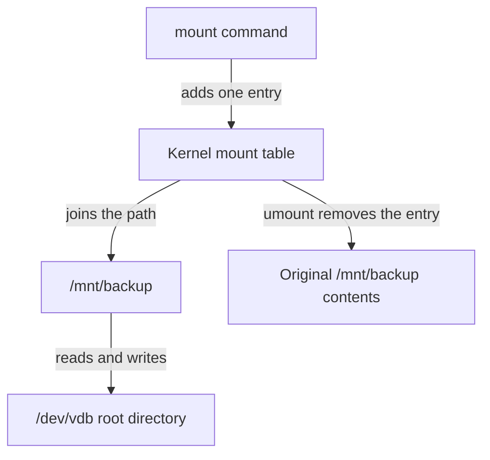

# Discovery, Formatting and Mounting

Astronaut, this is your first storage mission. You take a disk that the kernel can see but nothing can use, and you turn it into a directory you can write files into. Busy mounts and stuck processes only happen to a disk that has already been through these steps.

## One tree for every disk

On Windows, each disk gets its own letter: `C:`, `D:`, `E:`. The drives sit side by side, and you pick one by its letter.

Linux does not work that way. There is exactly one directory tree, and it starts at the root directory, written `/`. Think of it as the ship's one long corridor. Every disk, whether it is an internal SSD, a USB drive or a network share far away, must be attached to some directory inside that one tree before you can use it.

Attaching a disk to a directory is called **mounting**. The directory it gets attached to is the disk's **mount point**. In space terms, mounting docks a cargo hold to a hatch in the ship's corridor. Once a disk is mounted at `/mnt/backup`, a file written to `/mnt/backup/report.txt` goes to that disk. The kernel does this redirection for you, out of sight.

The kernel layer that makes every kind of storage behave the same way for your programs is the **Virtual Filesystem (VFS)**. Because of it, a program that writes a file does not need to know whether the directory sits on a local disk, a USB stick or a remote server.

## Find the raw disk

A brand-new disk shows up as a **raw block device**. That is an empty cargo hold: the kernel knows its size and can read and write it, but there are no shelves and no labels. It has no filesystem yet, so you cannot mount it.

Two commands help you find it, and this section shows both on your training ship.

### Two commands that read the disks

`lsblk` ("list block devices") shows every disk the kernel sees, as a tree. Whole disks are named `sda`, `sdb` and so on on physical hardware, or `vda`, `vdb` and so on in a virtual machine. Partitions cut out of a disk show up indented under it (`vda1`, `vda2`).

A disk with a filesystem also has a **UUID** (universally unique identifier) written into its header. The UUID is the hold's serial number: a 128-bit value that no other filesystem shares. `blkid` ("block ID") reads those headers and reports the UUID and the filesystem type of every formatted device.

A raw disk has no header for `blkid` to read, so it does not appear in the output at all. That absence is your safety check: if `blkid` does not list a disk, there is no filesystem on it to destroy.

### See it in your playground

List the disks, then ask `blkid` which ones carry a filesystem.

<!-- astrona:playground:renew -->

```sh
lsblk
sudo blkid
```

Expect something like:

```text
NAME    MAJ:MIN RM SIZE RO TYPE MOUNTPOINTS
vda     254:0    0  15G  0 disk
└─vda1  254:1    0  15G  0 part /
vdb     254:16   0   2G  0 disk

/dev/vda1: UUID="a1b2c3d4-..." TYPE="ext4" PARTUUID="..."
```

`vda1` is mounted at `/`, and `blkid` lists it with a UUID and a `TYPE`. `vdb` has no mount point, no children and no line in `blkid`: that is the raw 2 GB disk, safe to work on. Device names can differ, so confirm the spare disk by its 2 GB size and its empty mount point.

## Format the disk with ext4

**Formatting** a disk means writing a **filesystem** onto it. In space terms, you build the shelves and the labelling system inside the empty hold. The filesystem keeps track of file names, where each file's data sits, and details like owners, permissions and times. Anything stored on the disk before is lost.

This section shows the command, then explains the one limit that formatting fixes for good.

### The command and the filesystem it builds

This module uses **ext4** (the "fourth extended filesystem"), the long-standing default on many Linux systems. It is a **journaling** filesystem. The journal is the cargo officer's notebook: before ext4 changes its own tables on the disk, it writes a short note about the change into the journal. If the power fails in the middle of a write, the kernel replays the journal at the next start, and the filesystem stays in one piece.

The tool that creates a filesystem is `mkfs` ("make filesystem"). You call the ext4 version directly, as `sudo mkfs.ext4 /dev/vdb`. This command overwrites the target disk. If you run it on the wrong device, that device's data is gone, so always confirm the device name with `lsblk` first.

### The inode budget is fixed when you format

`mkfs.ext4` does three jobs that grow with the size of the disk. It counts the total blocks, it sets up the journal, and it reserves room for the **inode table**.

An **inode** is the cargo tag on each item: it records the owner, the permissions, the times and where the file's data blocks sit. Every file needs one inode. The inode table holds a fixed number of them, one for each file the filesystem will ever hold at the same time.

`mkfs.ext4` picks a **bytes-per-inode ratio**, that is, how many bytes of disk space get one inode. It creates that many inode slots right away, whether you use them or not. The table never grows later. To choose the ratio yourself, `mkfs.ext4` has the `-i` option; `man mke2fs` describes it and every other setting you can choose at format time.

So inodes are a separate resource from disk space. A filesystem that `df -h` shows as far from full can still refuse every new file with "No space left on device". This happens when it holds far more small files than the ratio expected. A mail spool or a cache directory with millions of tiny files is the classic case. `df -i` shows inode use the same way `df -h` shows space use. Check both to learn which one ran out.

### See it in your playground

Check the disk before and after you format it.

```sh
sudo blkid /dev/vdb
sudo mkfs.ext4 /dev/vdb
sudo blkid /dev/vdb
df -i /dev/vdb 2>/dev/null || echo "(mount it first to query inode usage)"
```

Expect something like:

```text
(first blkid prints nothing and exits non-zero — no filesystem yet)

mke2fs 1.47.0 (5-Feb-2023)
Creating filesystem with 524288 4k blocks and 131072 inodes
...
Writing superblocks and filesystem accounting information: done

/dev/vdb: UUID="9f8e7d6c-5b4a-3210-fedc-ba9876543210" TYPE="ext4"
```

The first `blkid` says nothing, because there is no filesystem to identify. After `mkfs.ext4`, the same command reports a fresh UUID and `TYPE="ext4"`. The line `524288 4k blocks and 131072 inodes` is the inode budget for this filesystem, fixed now for its whole life.

The recorded output above has no line for `df -i`. While `/dev/vdb` is not mounted, `df` reports the filesystem that holds the device file in `/dev` instead, so run `df -i /mnt/backup-black` after you mount the disk to see its real inode numbers.

## Mount the disk

A formatted disk is still not usable until it is mounted. `cd /dev/vdb` fails, because `/dev/vdb` is a device file, not a directory. This section docks the disk to a directory, then looks at what the kernel really changed.

### Dock the disk to a directory

Mounting needs two things: an existing directory to act as the mount point, and the `mount` command to connect the disk to it. Extra disks usually go under `/mnt`.

```sh
sudo mkdir -p /mnt/backup-black
sudo mount /dev/vdb /mnt/backup-black
```

From now on, every read or write under `/mnt/backup-black` goes to `/dev/vdb` instead of the root disk.

`df` ("disk free") lists mounted filesystems with their size and use. It shows how full each hold is. The `-h` option prints sizes that are easy to read. Check the new mount with it:

```sh
df -h /mnt/backup-black
```

Expect something like:

```text
Filesystem      Size  Used Avail Use% Mounted on
/dev/vdb        2.0G   24K  1.9G   1% /mnt/backup-black
```

`df` now lists `/dev/vdb` against the mount point `/mnt/backup-black`. Any file you create in that directory lands on the new disk, not on the root disk.

### What `mount` really changes

`mount` does not copy or move any data. Mounting a 500 GB disk is exactly as fast as mounting a 5 GB one, because mounting only changes a record in the kernel's memory.

The kernel keeps a table of every active mount; you can read it in `/proc/mounts`. Each entry is a small record: the source device, the mount point, the filesystem type and the options. The entry also holds a pointer that joins the mounted filesystem's root directory into the tree at the mount point. When a program walks into `/mnt/backup`, the kernel's path lookup reaches that joint and carries on inside the mounted filesystem, not the directory underneath.


```mermaid
flowchart TB
    A["mount command"] -->|"adds one entry"| B["Kernel mount table"]
    B -->|"joins the path"| C["/mnt/backup"]
    C -->|"reads and writes"| D["/dev/vdb root directory"]
    B -->|"umount removes the entry"| E["Original /mnt/backup contents"]
```

The diagram shows that `mount /dev/vdb /mnt/backup` only adds a table entry, and that `umount` removes it so the original directory shows again.

This is also why unmounting is safe and can be undone. `umount` removes the table entry and undoes the joint. If the mount point already held files, the mount never touched them. They were only hidden under the mounted filesystem, and they come back exactly as they were. `man 5 proc` (search for "mounts") explains what `/proc/mounts` and `/proc/self/mountinfo` show about this live table.

## Common pitfalls

> [!WARNING]
> - **Running `mkfs` on the wrong device.** `mkfs.ext4 /dev/vda` would wipe the running system. There is no question to confirm and no undo. Always run `lsblk` and match the size and mount point before you format.
> - **Only checking `df -h`.** A filesystem full of small files can run out of inodes long before it runs out of space. Check `df -i` too when "No space left on device" shows up on a mount that `df -h` says has room.

> *Formatting fixes a filesystem's inode budget for good; mounting only edits a table in the kernel's memory, never the data underneath.*

## Your mission: Filesystem Creation & Mounting Sandbox

You can now find a raw disk, format it with ext4 and mount it. The mission asks you to do exactly that on a fresh disk, mount it at `/mnt/backup-black` and leave a marker file on it.

The mission runs on its own training ship. A playground cannot be paused, so remove it first to free memory; it always starts clean again:

```sh
astrona destroy section-010-module-01-playground
```

Then start the mission and connect to it:

```sh
astrona run --git git@github.com:astrona-io/ATS004.git -c sections/section-010/module-01/labs/lab-01
astrona ssh ats-004-lab-014
```

Read the task in [`question.md`](./labs/lab-01/question.md) and solve it on your own first. When you think you are done, send it for grading:

```sh
astrona submit -c sections/section-010/module-01/labs/lab-01
```

When the mission is done, remove it and start a fresh playground:

```sh
astrona destroy ats-004-lab-014
astrona run --git ssh://git@github.com/astrona-io/ATS004.git -c sections/section-010/module-01/playground
```
