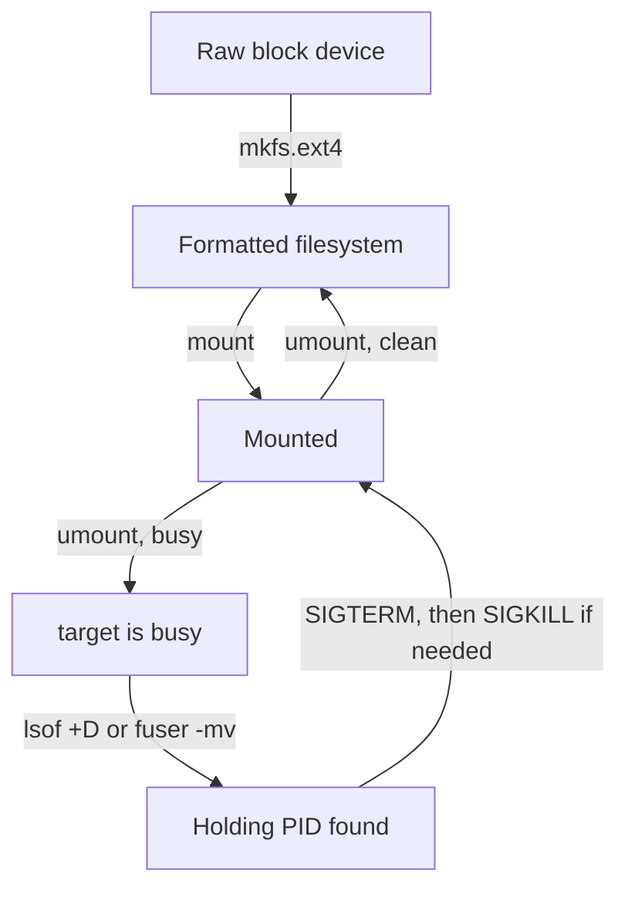

# Wrap-Up: Mission Debrief

Well flown, astronaut. You have finished every part and every mission in this module. Before you move on, look back at what you learned, check yourself, and land the playground cleanly.

## What you learned

This module followed one disk through its whole life: from an empty cargo hold, to shelves and a docked hatch, to undocking it again, even when crew were still inside.



A raw disk has no UUID and no label; after `mkfs.ext4` it has a UUID and `TYPE=ext4`, and once mounted it shows in `df -h`. A busy unmount is solved by finding the holding process and stopping it.

**From [Discovery, Formatting and Mounting](./course-01-discovery-formatting-mounting.md):**

- Linux has one directory tree that starts at `/`. Every disk is mounted on a directory inside it.
- `lsblk` lists every disk the kernel sees. `blkid` lists only disks that carry a filesystem, so a raw disk is missing from its output.
- `mkfs.ext4` builds an ext4 filesystem and destroys whatever was on the disk. Always confirm the device with `lsblk` first.
- The inode table is sized when you format and never grows. A filesystem can run out of inodes while it still has free space; `df -i` shows inode use and `df -h` shows space use.
- `mount` only adds an entry to the kernel's mount table (`/proc/mounts`). It copies no data, so it is equally fast for any disk size, and files under the mount point are only hidden until you unmount.

**From [Diagnosing a Stuck Disk](./course-02-diagnosing-a-stuck-disk.md):**

- `umount` (one `n`) detaches a filesystem. It fails with "target is busy" while anything points into the mount.
- The kernel counts open files, working directories, running program files, memory-mapped files and mounts stacked on top. If the count is not zero, it refuses with `EBUSY`.
- `lsof +D <dir>` and `fuser -mv <mount>` name the holding process. The `fuser` `ACCESS` letters say how it holds the mount: `c` directory, `e` program, `f` open file, `m` memory map.
- Try `cd ~` first. Then send `SIGTERM` (`kill`), and only use `SIGKILL` (`kill -9`) if the process ignores it.
- `umount -l` and `umount -f` are escape hatches, not a fix for the real cause.

**From [Finding Hidden Space](./course-03-finding-hidden-space.md):**

- Names that start with a dot are hidden from a plain `ls`.
- `ls -la` shows them, and `du -sh` totals how much space a directory really uses.
- Check what is inside a hidden directory before you empty it.

## Your missions

You proved each skill in a graded mission, right after the part that taught it:

| Mission | After the part | What you proved |
| --- | --- | --- |
| [Filesystem Creation & Mounting Sandbox](./labs/lab-01/README.md) | Discovery, Formatting and Mounting | find a raw disk, format it with ext4 and mount it at `/mnt/backup-black` |
| [Diagnosing & Evicting a Busy Mount](./labs/lab-02/README.md) | Diagnosing a Stuck Disk | find the process holding a mount, stop only that process, and unmount |

If you skipped one, go back to it now. Each mission is short, and the exam asks for exactly these skills.

## Check yourself

Try to answer each question before you open the answer.

<details>
<summary>1. <code>lsblk</code> shows a 2 GB disk <code>vdb</code>, but <code>sudo blkid</code> prints no line for it. What does that tell you?</summary>

The disk has no filesystem yet. `blkid` reads filesystem headers, and a raw disk has none, so it is missing from the output. That makes it safe to format.
</details>

<details>
<summary>2. <code>df -h</code> shows a mount at 40% used, but creating a new file fails with "No space left on device". What do you check?</summary>

Run `df -i`. The filesystem has probably used up its inodes. The number of inodes is fixed when you run `mkfs.ext4`, so many small files can use them all while space is still free.
</details>

<details>
<summary>3. A directory held three files before you mounted a disk on it. Where are they now, and what happens when you unmount?</summary>

They are still on the original disk, only hidden under the mounted filesystem. `mount` only changes the kernel's mount table. After `umount`, the three files show again, unchanged.
</details>

<details>
<summary>4. <code>fuser -mv</code> shows <code>..c..</code> for a <code>bash</code> process. What is holding the mount, and what is the gentlest fix?</summary>

The `c` means the shell's current directory is inside the mount. Run `cd ~` in that shell. That drops the hold without killing anything.
</details>

<details>
<summary>5. Why send <code>SIGTERM</code> before <code>SIGKILL</code>?</summary>

`SIGTERM` lets the process write out its data, close its files and exit cleanly. `SIGKILL` ends it at once with no cleanup, so unwritten data is lost. Use `SIGKILL` only when `SIGTERM` is ignored.
</details>

<details>
<summary>6. <code>ls /mnt/data</code> looks empty, but <code>df -h</code> says the mount is almost full. What do you run?</summary>

`ls -la /mnt/data` to show hidden dot-directories such as `.trash`, then `du -sh` on them to see how much space each one uses.
</details>

## Clean up the playground

Land your training ship before you leave. First see what is still running:

```sh
astrona list
```

Remove the playground. The command takes its name, not its folder path:

```sh
astrona destroy section-010-module-01-playground
```

If `astrona list` also showed a mission, remove it the same way, for example:

```sh
astrona destroy ats-004-lab-019
```

Then check again:

```sh
astrona list
```

The list should no longer show the playground or any mission from this module. You can start the playground again at any time with the `astrona run` command from the end of each mission; it always starts clean, so nothing you broke carries over.
