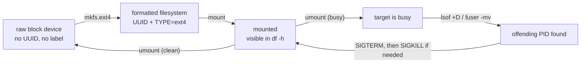

# The Lifecycle of Local Storage

<!-- astrona:playground -->
> [!NOTE]
> 🧪 **Hands-on playground for this module** — a clean, throwaway machine to explore on. No task, no grading. Folder: [`playground/`](https://github.com/astrona-io/ATS004/tree/main/sections/section-010/module-01/playground)
>
> ```sh
> astrona run --git ssh://git@github.com/astrona-io/ATS004.git -c sections/section-010/module-01/playground
> astrona destroy section-010-module-01-playground
> ```

When you plug a USB stick into a laptop, a file manager window usually pops open a few seconds later. On a Linux server, nothing happens. A newly attached disk is just a block of raw sectors that the kernel can see but has not been told what to do with. Turning that raw hardware into a directory you can write files to is a deliberate, several-step process, and doing it is a core part of a system administrator's job.

This module walks through that process end to end: how Linux presents a disk before it is usable, how you put a filesystem on it, how you attach that filesystem to the directory tree, and how you deal with the common problem of a disk that refuses to detach because something is still using it.



## How this module is organised

1. **[Part 1 — Discovery, Formatting & Mounting](./course-01-discovery-formatting-mounting.md)** — telling a raw disk from a formatted one, what `mkfs.ext4` actually lays down (and why you can run out of inodes with free space left), and what the kernel's mount table really changes when you run `mount`.
2. **[Part 2 — Diagnosing a Stuck Disk](./course-02-diagnosing-a-stuck-disk.md)** — why `umount` refuses with "target is busy" (a reference count, not a guess), reading `lsof`/`fuser` to find the exact holder, the `SIGTERM`-before-`SIGKILL` eviction ladder, and finding space hidden in dot-directories.

## Learning objectives

After this module you can:

- Tell a raw, unformatted block device apart from a formatted one using `lsblk` and `blkid`.
- Create an ext4 filesystem on a raw disk with `mkfs.ext4`, and explain what the format-time inode budget means for a filesystem that later runs out of files despite having free space.
- Explain what `mount` changes in the kernel's active-mounts table, and why mounting and unmounting are instant regardless of filesystem size.
- Mount a filesystem onto a directory and confirm the result with `df -h`.
- Explain why the kernel refuses to unmount a filesystem that is in use, in terms of the reference count it tracks.
- Identify which process is holding a mount open — and which kind of reference it holds (open file, cwd, executable, or mmap) — using `lsof` and `fuser -mv`.
- Stop a blocking process safely by sending `SIGTERM` before escalating to `SIGKILL`.
- Find space consumed by hidden dot-directories with `ls -la` and `du -sh`.

## Before you start

You should be comfortable moving around a Linux shell: `cd`, `ls`, `sudo`, and reading command output. You do not need any prior storage experience.

The linked playground gives you an Ubuntu server VM with passwordless `sudo` and one spare 2 GB disk attached raw and unformatted (commonly `/dev/vdb`). Every command block in both parts is meant to be run in that VM's shell after you have connected with `astrona ssh astro-section-010-module-01-playground`. All the tools used here — `lsblk`, `blkid`, `mkfs.ext4`, `mount`, `df`, `lsof`, `fuser` — are already installed.
