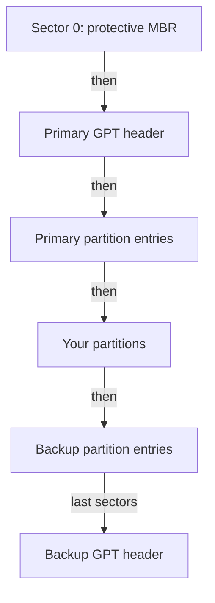

# Partition Tables: MBR vs GPT

Astronaut, a raw disk is an empty cargo hold. It is one long row of **sectors**, the small fixed-size blocks the disk is made of (usually 512 bytes each). Before you build shelves in it with a filesystem, you almost always split it into rooms.

Each room is a **partition**, and a small **partition table** at the front of the disk is the deck plan that lists them. This part shows what that deck plan holds on the disk, and why the format you write it in, MBR or GPT, matters far more than "which one is newer".

## What a partition is and why you draw one

A **partition** is a recorded region of a disk. It has a start sector, an end sector and a number. On the disk `vdb`, the partitions are called `vdb1`, `vdb2` and so on.

Think of a partition as a wall that splits one hold into rooms. The partition table is the deck plan that says where each wall stands. The hold itself does not change. The plan just lets everyone agree where one room ends and the next begins.

The picture has one limit. Building real walls takes time, but rewriting a partition table is instant. It also leaves the data that was already on the disk where it was.

Splitting a disk before you format it gives you three things:

- Each filesystem gets clear borders, so two filesystems can never overlap.
- The disk can hold several separate filesystems later, if you want that.
- Standard tools (boot loaders, `lsblk`, cloud imaging systems) expect a partition table, and they behave in a predictable way when they find one.

## MBR: one sector, no safety net

**MBR** stands for **Master Boot Record**. It dates from 1983, and it packs the whole deck plan into the disk's very first sector of 512 bytes. That small space explains both of its limits.

### What sits in that one sector

The 512 bytes are split into three pieces:

- 446 bytes of boot code, the small program a computer runs first when it starts from this disk.
- Exactly four **partition entries** of 16 bytes each. Each entry describes one partition.
- A 2-byte signature, `0x55AA`, that marks the sector as a valid boot record.

### Why MBR runs out of room

The layout causes two hard limits:

- **Four primary partitions.** There is room for four 16-byte entries and no more. To get a fifth partition, you turn one primary slot into an **extended** partition. It acts as a container that holds **logical** partitions inside it. It is a workaround added to a format that was never built to hold more than four.
- **A limit of about 2.2 TB.** Each entry stores its start and length as 32-bit sector counts. With 512 bytes per sector, 2^32 sectors × 512 bytes is about 2.2 TB. On a bigger disk, the space past that point has no sector number MBR can write down, so you simply cannot reach it.

### Only one copy

The bigger cost of putting everything in one sector is that there is exactly **one copy**. A bad sector, a write that stops halfway, or stray bytes from another tool can damage those 512 bytes. Then the layout of the whole disk is gone. Nothing backs it up.

## GPT: a guard sector, then two copies of the real table

**GPT** stands for **GUID Partition Table**. It is part of **UEFI** (Unified Extensible Firmware Interface), the start-up firmware standard that replaced the old PC BIOS. GPT fixes both MBR problems by design, not with a workaround.

### How GPT lays out the disk

Before the details, here is the order of the pieces from the start of the disk to the end.



The diagram shows that GPT keeps its table twice: one copy right after sector 0, and one copy at the very end of the disk.

### What each piece does

- **A "protective MBR" still sits in sector 0.** It holds one old-style entry that marks the *whole disk* as type `0xEE`. Its only job is to guard the disk. An old tool that only knows MBR sees "one big partition that is already in use" and leaves the disk alone. Without it, the old tool would call the disk blank and offer to overwrite it.
- **The real table lives in two places.** The **primary GPT header** and the list of partition entries start at **LBA 1**. LBA (Logical Block Address) is simply the sector number, so LBA 1 is the sector right after the protective MBR. An identical **backup copy** sits at the very end of the disk.
- **Each copy carries a checksum.** A **CRC32** (cyclic redundancy check) is a 32-bit number worked out from the table's contents. If the table changes by accident, the number no longer matches. When the primary header fails its check, tools that understand GPT fall back to the backup and can rebuild the primary from it. A damaged primary table is a repair job, not a disaster. MBR has nothing like this.
- **64-bit sector numbers** remove the 2.2 TB limit for any disk you will meet. **128 partition entries by default** remove the four-slot limit, with no extended-partition workaround.
- **Every partition and every disk has a GUID.** A GUID (Globally Unique Identifier) is a random serial number built into the format. MBR has no field for it at all.

### MBR and GPT side by side

The table sums up the differences:

| Property | MBR | GPT |
| --- | --- | --- |
| Partition entries | 4 (more via extended/logical) | 128 by default |
| Sector addressing | 32-bit (~2.2 TB max) | 64-bit (effectively unlimited) |
| Table redundancy | single copy, sector 0 only | primary at the start, backup at the end, both CRC32-checked |
| Partition/disk identity | none built in | every partition and disk has a GUID |

For any disk you set up today, use GPT. MBR only matters for very old systems that cannot start from a GPT disk.

## See it in your playground

Look at the empty disk, write a GPT label on it, and print the result. `fdisk -l` lists a disk's current table without opening the interactive editor. `sgdisk -p` prints a GPT table in its own format; if `sgdisk` is missing, the command falls back to `parted print`.

<!-- astrona:playground:renew -->

```sh
sudo fdisk -l /dev/vdb
sudo parted -s /dev/vdb mklabel gpt
sudo sgdisk -p /dev/vdb 2>/dev/null || sudo parted -s /dev/vdb print
```

Expect something like this (shortened to the lines that matter):

```text
Disk /dev/vdb: 12 GiB, 12884901888 bytes, 25165824 sectors
Disklabel type: dos            (or: the command reports no partition table)

Model: Virtio Block Device
Disk /dev/vdb: 12.9GB
Partition Table: gpt
```

On a fresh playground the disk has no partition table at all, so the first command shows no `Disklabel type` line. After `mklabel gpt`, the disk reports `Partition Table: gpt`.

The playground's disk is only 12 GB, so you cannot see the 2.2 TB MBR limit here. It only matters on disks bigger than that. The partition count and the backup copy are part of the format and apply at any size. That is why you should write `parted -s /dev/vdb mklabel gpt` out of habit, even on a small disk.

> *MBR has one table and hopes nothing damages it. GPT has two, checks both with a CRC, and can heal one from the other.*

## Common pitfalls

> [!WARNING]
> - **Setting up a large disk with MBR.** On a disk bigger than about 2.2 TB, MBR makes the space past that point unusable. Use `g` in `fdisk`, or `parted mklabel gpt`, for any modern disk.
> - **Reading the protective MBR as a real MBR table.** An old MBR-only tool sees one partition of type `0xEE` covering the whole disk. That is GPT's guard sector, not a sign that the disk uses MBR.
