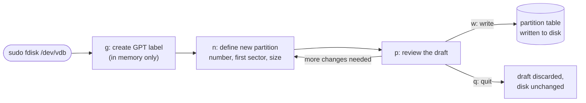
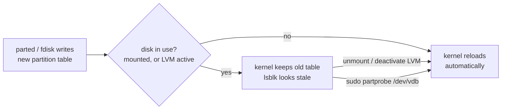

# Part 2 — Tools, Alignment & the Kernel Re-read Problem

> Prerequisite: [Part 1 — Partition Tables: MBR vs GPT](./course-01-partition-tables-mbr-vs-gpt.md). Next: [Module landing page](./course.md).

Part 1 covered what a partition table *is*. This part covers writing one — the two tools you will use, why the tools all default to starting a partition at sector 2048 instead of sector 0, and what happens when the kernel's in-memory view of a disk falls out of sync with what you just wrote to it.

## The tools: fdisk and parted

`fdisk` (short for *fixed disk*, an old term for a hard drive) is an interactive, menu-driven editor. `sudo fdisk /dev/vdb` drops you into a prompt where single letters build the layout **entirely in memory** until you explicitly commit it — nothing touches the disk until you do:

- `p` — print the current draft table
- `g` — create a fresh GPT label (`o` creates a legacy MBR label)
- `n` — new partition (prompts for number, first sector, last sector or a `+size` like `+10G`)
- `d` — delete a partition
- `t` — change a partition's type code
- `w` — write the in-memory layout to disk and exit
- `q` — quit **without** writing; the draft is discarded

`parted` (short for *partition editor*) does the same job but takes its commands on the command line, which makes it scriptable and non-interactive. `sudo parted -s /dev/vdb mklabel gpt` writes a GPT label in one shot; `-s` means "script mode, do not ask questions." Unlike `fdisk`, most `parted` sub-commands apply immediately rather than staging a draft — there is no separate `w`.

A worked `fdisk` session to put one 10 GB partition on an empty GPT disk: run `sudo fdisk /dev/vdb`; press `g` to lay down a GPT label; press `n`, accept the default partition number `1`, accept the default first sector `2048`, and answer the last-sector prompt with `+10G`; press `p` to review the draft; press `w` to commit.



Nothing touches the disk until `w`; `q` at any point throws the draft away. The `parted` equivalent below skips the draft/commit split entirely — each command lands as soon as it runs, which is what makes it safe to script but riskier to type interactively without double-checking the device name first.

> [!TIP]
> **Try it — create a GPT partition with parted**
>
> ```sh
> sudo fdisk -l /dev/vdb
> sudo parted -s /dev/vdb mklabel gpt
> sudo parted -s /dev/vdb mkpart data ext4 1MiB 10GiB
> lsblk /dev/vdb
> ```
>
> Expect something like:
>
> ```text
> NAME   MAJ:MIN RM SIZE RO TYPE MOUNTPOINTS
> vdb    254:16   0  12G  0 disk
> └─vdb1 254:17   0  10G  0 part
> ```
>
> After the two `parted` commands the disk has a GPT label and one 10 GiB child partition `vdb1`, ready to be formatted with `mkfs.ext4` exactly as in the previous module. The `mkpart` argument `ext4` only sets a type hint; it does not create a filesystem.

## Why partitions start at sector 2048

Left to their defaults, `fdisk` and `parted` both start the first partition at sector 2048, one full mebibyte in (2048 × 512 bytes = 1,048,576 bytes). The reason is physical alignment, and it is a real performance mechanism, not tooling superstition.

Older drives used 512-byte physical sectors. Modern drives and SSDs use larger physical blocks — usually 4096 bytes — but still present 512-byte *logical* sectors to the OS for compatibility ("512e" drives). The drive's own firmware translates logical sector addresses to physical blocks underneath. If a partition (and the filesystem blocks inside it) starts at a logical sector that is **not** a multiple of 8 (8 × 512 = 4096), every 4 KiB filesystem block straddles two physical blocks instead of landing inside one. A single logical write then forces the drive to do a **read-modify-write** across two physical blocks instead of a single clean write to one — this is **write amplification**: more physical I/O per logical write than the write actually needed, which cuts throughput and, on an SSD, wears out flash cells faster than the workload requires.

Sector 2048 is a multiple of 8, so partitions and the filesystem blocks inside them line up one-to-one with the physical 4 KiB blocks underneath. Accept the tools' default unless you have a specific reason not to — there almost never is one.

> [!TIP]
> **Try it — check partition alignment**
>
> ```sh
> sudo parted /dev/vdb align-check optimal 1
> sudo fdisk -l /dev/vdb
> ```
>
> Expect something like:
>
> ```text
> 1 aligned
>
> Device     Start      End  Sectors Size Type
> /dev/vdb1   2048 20973567 20971520  10G Linux filesystem
> ```
>
> `align-check optimal 1` reports partition 1 as `aligned`, and `fdisk -l` shows it starting at sector `2048` — the default the tools chose for you, and the reason you rarely need to think about this at all in practice.

## When the kernel keeps the old partition table

Every partition table lives in two places at once: the bytes you just wrote to disk, and the kernel's own **in-memory copy** of that table, which every other tool (`lsblk`, `mount`, LVM) actually reads. Writing a new table to disk does not, by itself, update the kernel's copy — something has to tell the kernel to re-read it, via the `BLKRRPART` ioctl (*block re-read partition table*). `fdisk`'s `w` and `parted`'s commands normally trigger that re-read automatically as their last step.

The kernel refuses that re-read while any partition on the disk is mounted or otherwise in use (an active LVM physical volume counts), to avoid pulling a live filesystem's layout out from under it mid-use. You then see:

```text
Re-reading the partition table failed.: Device or resource busy.
The kernel still uses the old table.
```

The bytes on disk are already correct at this point — only the kernel's in-memory view is stale. Two ways to force the re-read, no reboot needed:

1. Unmount every filesystem on the disk (and deactivate any LVM volume groups on it), then re-issue the write — nothing is blocking the ioctl anymore.
2. Ask the kernel to rescan directly with `partprobe` (*partition probe* — it re-issues `BLKRRPART` itself, without you having to re-run the partitioning tool):

   ```sh
   sudo partprobe /dev/vdb
   ```

The same lag shows up harmlessly on deletion too: delete a partition with `parted` or `fdisk`, and `lsblk` may still list the deleted child until a `partprobe` (or the tool's own end-of-session sync) refreshes the kernel's view — the on-disk table is already correct; only the display is behind.



> [!TIP]
> **Try it — force a partition-table rescan**
>
> ```sh
> sudo parted -s /dev/vdb rm 1
> lsblk /dev/vdb
> sudo partprobe /dev/vdb
> lsblk /dev/vdb
> ```
>
> Expect something like:
>
> ```text
> vdb    254:16   0  12G  0 disk
> └─vdb1 254:17   0  10G  0 part       <-- still listed right after rm
>
> vdb    254:16   0  12G  0 disk        <-- gone after partprobe
> ```
>
> `parted` removed the partition entry on disk, but the kernel's in-memory device list lagged until `partprobe` re-issued the reload ioctl. On a disk with a mounted partition, that reload is exactly what the kernel declines to do automatically — which is why the "device or resource busy" message exists at all.

> [!WARNING]
> **Common pitfalls**
>
> - **Initialising a large disk with `o` (MBR).** On a disk larger than ~2.2 TB, MBR makes the space past that point unusable. Use `g` in `fdisk`, or `parted mklabel gpt`, for any modern disk.
> - **Overriding the default start sector.** Typing a custom first sector (an old habit from the sector-63 era) can misalign the partition and cause write amplification. Accept sector 2048.
> - **Editing the wrong disk.** `fdisk` and `parted` act on whatever device you name. Confirm with `lsblk` — size and mount point — before writing a label.
> - **Expecting `q` in `fdisk` to save.** `q` quits and discards; only `w` writes.
> - **Assuming `lsblk` is instantly right after a change.** The kernel's in-memory table can lag a partition edit that already succeeded on disk. Run `sudo partprobe <disk>` if `lsblk` and reality disagree.

> *The disk and the kernel's picture of the disk are two different things that usually update together — `fdisk`/`parted` write the first, `BLKRRPART` (directly, or via `partprobe`) refreshes the second, and "busy" is the kernel refusing to do the second while something is still relying on the old one.*

## Reference

- `man 8 partprobe` — the rescan tool; also covers `-s` for a summary of what changed.
- `man 8 parted` — the `align-check` sub-command used above, and the full `mkpart` syntax.
