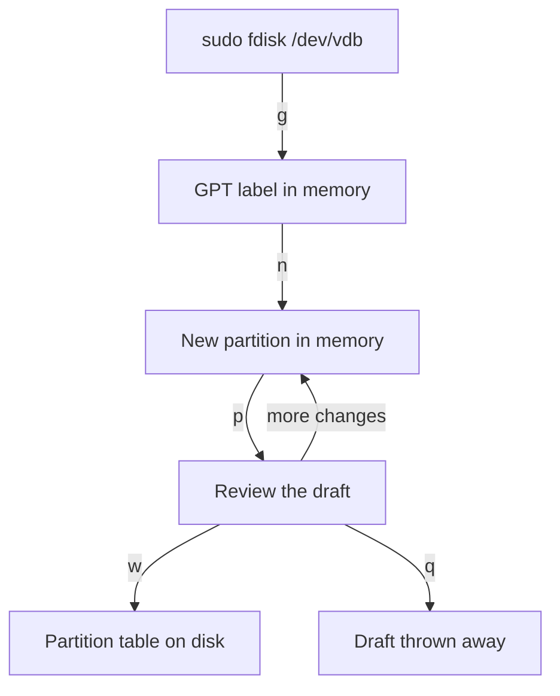

# Write an Aligned GPT Partition

Astronaut, you know what a deck plan is. Now you draw one. A partition table is the deck plan that splits a cargo hold (a raw disk) into rooms (partitions), and two tools write it: `fdisk` and `parted`.

This part shows both tools, then explains why they place the first room at sector 2048 instead of at the very start of the disk. A **sector** is one of the small fixed-size blocks a disk is made of, 512 bytes each as the system sees them.

## The tools: fdisk and parted

The two tools do the same job in two different styles. `fdisk` lets you build a draft and save it at the end. `parted` acts on each command right away. Knowing which style you are in tells you when the disk really changes.

### fdisk: build a draft, then write it

`fdisk` (short for *fixed disk*, an old term for a hard drive) is an interactive editor with a menu. `sudo fdisk /dev/vdb` opens a prompt where single letters build the layout. `fdisk` keeps the whole draft in its own memory until you tell it to write. Nothing touches the disk before that.

- `p`: print the current draft table
- `g`: create a fresh GPT label (`o` creates an old-style MBR label)
- `n`: new partition (asks for the number, the first sector, and the last sector or a `+size` such as `+10G`)
- `d`: delete a partition
- `t`: change a partition's type code
- `w`: write the draft to the disk and exit
- `q`: quit **without** writing; the draft is thrown away

Here is a full `fdisk` session that puts one 10 GB partition on an empty GPT disk:

1. Run `sudo fdisk /dev/vdb`.
2. Press `g` to lay down a GPT label.
3. Press `n`. Accept the default partition number `1`, accept the default first sector `2048`, and answer the last-sector question with `+10G`.
4. Press `p` to review the draft.
5. Press `w` to write it to the disk.



The diagram shows that the disk only changes on `w`. Pressing `q` at any point throws the draft away and leaves the disk as it was.

### parted: every command lands at once

`parted` (short for *partition editor*) does the same job, but it takes its commands on the command line. That makes it easy to use in scripts. `sudo parted -s /dev/vdb mklabel gpt` writes a GPT label in one step. The `-s` flag means "script mode": do not ask questions.

Unlike `fdisk`, most `parted` commands change the disk as soon as they run. There is no draft and no separate `w`. That is what makes `parted` safe to script, but risky to type by hand. Check the device name twice before you press Enter.

### See it in your playground

Create a GPT label and one partition from 1 MiB to 10 GiB with `parted`, then look at the result with `lsblk`.

<!-- astrona:playground:renew -->

```sh
sudo fdisk -l /dev/vdb
sudo parted -s /dev/vdb mklabel gpt
sudo parted -s /dev/vdb mkpart data ext4 1MiB 10GiB
lsblk /dev/vdb
```

Expect something like this (the `lsblk` output):

```text
NAME   MAJ:MIN RM SIZE RO TYPE MOUNTPOINTS
vdb    254:16   0  12G  0 disk
└─vdb1 254:17   0  10G  0 part
```

The disk now has a GPT label and one 10 GiB partition, `vdb1`, ready for a filesystem such as `mkfs.ext4`. The `ext4` word in `mkpart` only sets a type hint in the table. It does not build a filesystem.

## Why partitions start at sector 2048

Left to their defaults, `fdisk` and `parted` both start the first partition at sector 2048. That is exactly one mebibyte (MiB) into the disk: 2048 × 512 bytes = 1,048,576 bytes. The reason is **alignment**, and it has a real effect on speed.

### Logical sectors and physical blocks

Old drives stored data in 512-byte physical sectors. Modern hard drives and SSDs (solid-state drives) store data in bigger physical blocks, usually 4096 bytes. For compatibility they still show 512-byte *logical* sectors to the operating system. These are called "512e" drives (512-byte emulation).

The drive's own firmware does the translation. It turns each logical sector number into a place inside a physical block. The kernel and the filesystem never see the physical blocks.

Picture each 4096-byte physical block as one crate slot on a cargo deck. Eight logical sectors fit in one slot (8 × 512 = 4096).

### What goes wrong when a partition is misaligned

A filesystem such as ext4 stores data in 4 KiB blocks. If the partition starts on a sector that is **not** a multiple of 8, every 4 KiB filesystem block lies across two crate slots instead of inside one.

Then one write from the filesystem forces the drive to do a **read-modify-write**. It reads both physical blocks, changes part of each, and writes both back, instead of one clean write to one block. This is **write amplification**: the drive does more physical work than the write needed. It slows the disk down, and on an SSD it wears out the flash memory cells faster.

Sector 2048 is a multiple of 8. So the partition, and every filesystem block inside it, lines up one to one with the 4 KiB physical blocks underneath. Accept the tools' default unless you have a specific reason not to. You almost never do.

### See it in your playground

Ask `parted` whether partition 1 is aligned, and let `fdisk` show where it starts. The commands need the `vdb1` partition you just created.

```sh
sudo parted /dev/vdb align-check optimal 1
sudo fdisk -l /dev/vdb
```

Expect something like this (the `fdisk` output is shortened to the partition line):

```text
1 aligned

Device     Start      End  Sectors Size Type
/dev/vdb1   2048 20973567 20971520  10G Linux filesystem
```

`align-check optimal 1` reports partition 1 as `aligned`, and `fdisk -l` shows it starting at sector `2048`. That is the default the tools chose for you, which is why you rarely need to think about alignment in practice.

## Common pitfalls

> [!WARNING]
> - **Overriding the default start sector.** Typing your own first sector (an old habit from the days when partitions started at sector 63) can misalign the partition and cause write amplification. Accept sector 2048.
> - **Editing the wrong disk.** `fdisk` and `parted` act on whatever device you name. Confirm with `lsblk` (size and mount point) before you write a label.
> - **Expecting `q` in `fdisk` to save.** `q` quits and throws the draft away; only `w` writes.
> - **Thinking `mkpart ... ext4` formats the partition.** It only sets a type hint. You still need `mkfs` to build a filesystem.

## Your mission: Partitioning Raw Storage: GPT/MBR

You can now write a GPT label and create a partition that starts at sector 2048. The mission asks you to do exactly that on a fresh 2 GB disk, with a partition that ends at 1 GiB.

The mission runs on its own training ship. A playground cannot be paused, so remove it first to free memory; it always starts clean again:

```sh
astrona destroy section-010-module-02-playground
```

Then start the mission and connect to it:

```sh
astrona run --git git@github.com:astrona-io/ATS004.git -c sections/section-010/module-02/labs/lab-01
astrona ssh ats-004-lab-011
```

Read the task in [`question.md`](./labs/lab-01/question.md) and solve it on your own first. When you think you are done, send it for grading:

```sh
astrona submit -c sections/section-010/module-02/labs/lab-01
```

When the mission is done, remove it and start a fresh playground:

```sh
astrona destroy ats-004-lab-011
astrona run --git ssh://git@github.com/astrona-io/ATS004.git -c sections/section-010/module-02/playground
```
