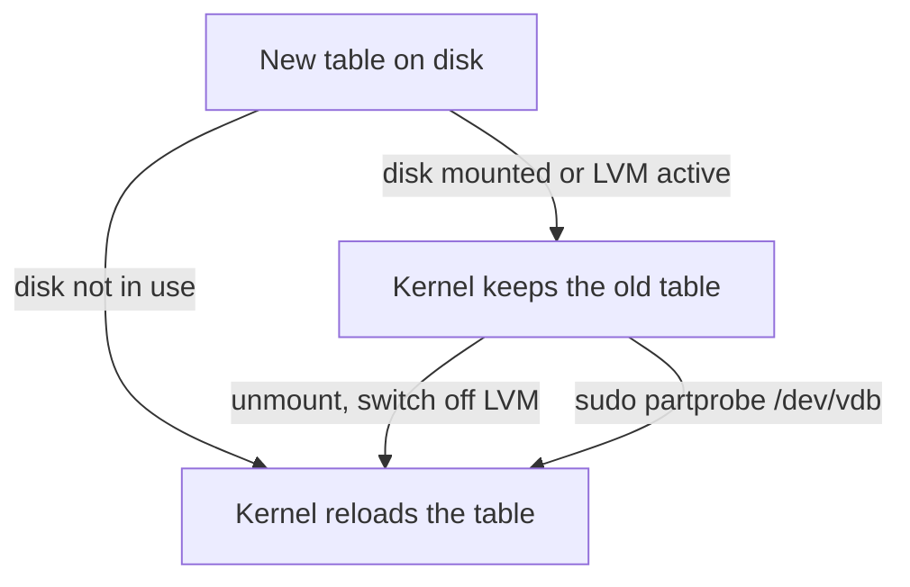

# When the Kernel Keeps the Old Table

Astronaut, a deck plan exists in two places at once. One copy is written on the disk. The other copy lives in the memory of the ship's core, the **kernel**, and that is the copy every other tool reads.

Usually the two copies change together. This part shows when they do not, what message you see then, and how to make the kernel read the new plan without a reboot.

## Two copies of one partition table

Every partition table lives in two places: the bytes `fdisk` or `parted` just wrote to the disk, and the kernel's own **in-memory copy** of that table. Tools such as `lsblk`, `mount` and LVM (the Logical Volume Manager, which pools disks together) read the kernel's copy, not the disk.

Writing a new table to the disk does not update the kernel's copy by itself. Something has to ask the kernel to read the table again. That request is the `BLKRRPART` **ioctl** (*block re-read partition table*). An ioctl (input/output control) is a direct order a program sends to the kernel about one device. `fdisk`'s `w` and `parted`'s commands normally send this order on their own as their last step.

## When the kernel refuses to re-read

The kernel does not always obey that order. This section shows when it says no, what the message looks like, and the two ways to get past it.

### The "device or resource busy" message

The kernel refuses to re-read the table while any partition on the disk is mounted or in use. An active LVM physical volume (a disk given to an LVM pool) also counts as in use. The kernel refuses so that it does not pull the layout out from under a filesystem that crew members are still working in.

When that happens, you see:

```text
Re-reading the partition table failed.: Device or resource busy.
The kernel still uses the old table.
```

At this point the bytes on the disk are already correct. Only the kernel's copy is old.

### Two ways to fix it without a reboot

You can make the kernel read the new table in either of these ways:

1. Unmount every filesystem on the disk (and switch off any LVM volume groups on it), then write the table again. Nothing blocks the order anymore.
2. Ask the kernel to read the table again with `partprobe` (*partition probe*), for example `sudo partprobe /dev/vdb`. It sends `BLKRRPART` itself, so you do not have to run the partitioning tool again.

The `-s` flag of `partprobe` also prints a short summary of what it found.



The diagram shows that the kernel only reloads on its own when nothing uses the disk; otherwise you clear the way first or ask again with `partprobe`.

## The same lag after a delete

The same delay can show up, harmlessly, when you delete a partition. `lsblk` may still list the deleted partition until `partprobe`, or the tool's own sync at the end of its session, refreshes the kernel's copy. The table on the disk is already correct; only the display is behind.

### Get a partition to delete

The commands below need a GPT label and the 10 GiB partition `vdb1` on the playground disk. If you started a fresh playground, create them again first.

<!-- astrona:playground:renew -->

```sh
sudo parted -s /dev/vdb mklabel gpt
sudo parted -s /dev/vdb mkpart data ext4 1MiB 10GiB
```

Check with `lsblk /dev/vdb` that `vdb1` is listed before you go on.

### See it in your playground

Delete partition 1, look at `lsblk`, ask the kernel to read the table again, and look once more.

```sh
sudo parted -s /dev/vdb rm 1
lsblk /dev/vdb
sudo partprobe /dev/vdb
lsblk /dev/vdb
```

Expect something like this (shortened, without the header lines):

```text
vdb    254:16   0  12G  0 disk
└─vdb1 254:17   0  10G  0 part       <-- still listed right after rm

vdb    254:16   0  12G  0 disk        <-- gone after partprobe
```

`parted` removed the partition entry on the disk, but the kernel's list of devices lagged until `partprobe` sent the reload order. On Ubuntu 24.04, `parted` often updates the kernel itself on an unused disk, so `vdb1` may already be gone at the first `lsblk`. Either way, `partprobe` makes sure the kernel's copy matches the disk.

On a disk with a mounted partition, that reload is exactly what the kernel refuses to do on its own. That is why the "device or resource busy" message exists at all.

> *The disk and the kernel's picture of the disk are two different things that usually change together. `fdisk` and `parted` write the first. `BLKRRPART`, sent directly or through `partprobe`, refreshes the second. "Busy" is the kernel refusing to refresh while something still relies on the old plan.*

## Common pitfalls

> [!WARNING]
> - **Assuming `lsblk` is right straight after a change.** The kernel's in-memory table can lag behind a partition edit that already worked on the disk. Run `sudo partprobe <disk>` if `lsblk` and reality disagree.
> - **Rebooting to fix "the kernel still uses the old table".** The disk already holds the right table. Unmount what uses the disk, or run `partprobe`; no reboot is needed.
