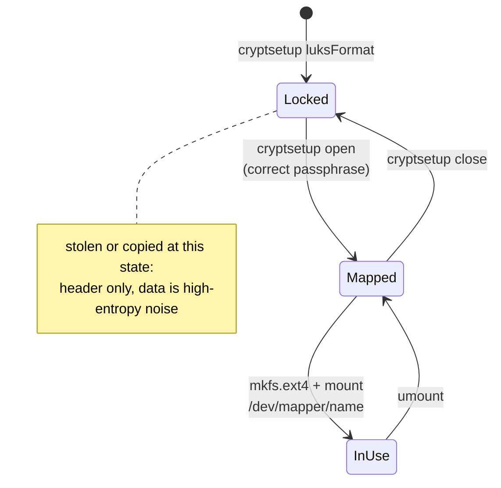

# Part 1 — The LUKS Model: Locking a Disk

> Prerequisite: [Module landing page](./course.md). Next: [Part 2 — Creating a Container & Its Keyslots](./course-02-creating-a-container-and-keyslots.md).

Filesystem permissions protect data only while the operating system enforcing them is running. Pull the disk out and read it on another machine, or clone a cloud volume offline, and permissions are irrelevant — the bytes are right there. This part covers exactly what threat LUKS answers, and the mapping model every other part builds on.

## What LUKS protects against

**LUKS** (Linux Unified Key Setup) encrypts every block before it reaches the physical media and decrypts it on the way back, using a key derived from a passphrase you supply. It defends against:

- a disk removed from a server and read elsewhere,
- an offline copy or snapshot of a cloud volume,
- a discarded or RMA'd drive that still holds readable data.

It does **not** protect a running system where the volume is already unlocked and mounted — at that point the kernel is decrypting reads for anyone with filesystem access. Nor does it help if the passphrase is weak or written on a sticky note. LUKS is one layer, aimed squarely at the "someone has the disk, not your running system" case.

## The mental model: lock the disk, work through a mapping

You never write a filesystem onto the locked device directly. Instead, four operations move a device between two states — **locked** (an opaque block device) and **mapped** (a decrypted virtual device you can use normally):

1. `cryptsetup luksFormat` writes a **LUKS header** to the start of the device and marks the rest as an encrypted region. This is a one-time setup step, done once per device.
2. `cryptsetup open` asks for the passphrase and, if it checks out, creates a decrypted **virtual device** under `/dev/mapper/`. This is not a copy or a temp file — it's a **device-mapper target**: the kernel registers a new block device whose reads and writes are transformed on the fly by `dm-crypt` before/after they reach the real, still-encrypted device underneath. Nothing decrypted ever touches the disk.
3. You format and mount the `/dev/mapper/` device like any normal disk — `mkfs`, `mount`, `umount` do not know or care that a crypt layer sits underneath.
4. `cryptsetup close` unregisters the virtual device. The physical disk is back to being an opaque encrypted blob; the decryption path that existed only in the kernel's device-mapper table is gone.

> As an analogy: the locked device is a heavy safe. `open` is spinning the dial to the right combination, which lets a service window (`/dev/mapper/secure_vault`) appear that you can pass documents through. `close` shuts the safe and the window disappears. The analogy breaks down because the "documents" (your filesystem) are never physically inside anything — `dm-crypt` transforms each block as it passes through the window, and nothing readable is ever stored.

The cipher doing that per-block transform is `aes-xts-plain64` by default: **XTS mode** is specifically designed for block storage — it encrypts each sector independently (tweaked by that sector's own position, the "plain64" part), so seeking to and rewriting one 512-byte sector never requires touching, decrypting, or re-encrypting any other sector on the disk. A stream cipher mode would not have that property, which is why disk encryption uses XTS rather than the modes typical for network traffic.

> *A locked LUKS device is not "your files, scrambled" — it's an opaque block device with no filesystem visible at all until a passphrase re-derives the one key that makes `dm-crypt`'s per-sector transform reversible.*

## Reference

- `man 8 cryptsetup` — the full command reference; `open`/`close` and `luksFormat` are covered in the next two parts.
- `man 4 dm-crypt` (or the kernel's `Documentation/admin-guide/device-mapper/dm-crypt.rst`) — the device-mapper target itself, including which cipher modes it supports beyond XTS.
