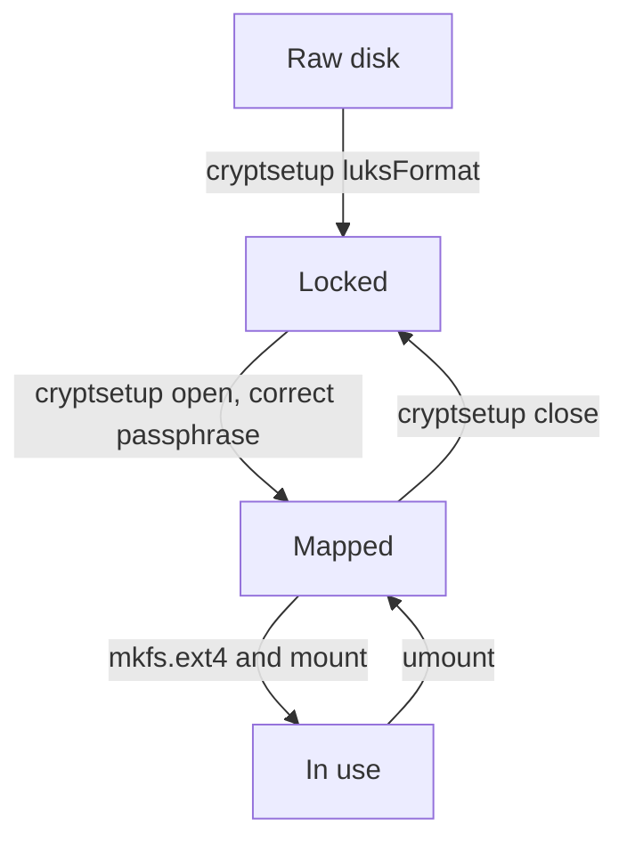

# The LUKS Model: Locking a Disk

Picture a cargo hold full of crates, each with a paper label. On your own ship, the crew rules decide who may open which crate. Those are your file permissions. Now someone unbolts the whole hold and flies it to their own ship. Your crew rules stay behind, and every label can be read.

That is the real risk with a stolen or copied disk. This part explains the one threat LUKS answers, and the simple model behind every `cryptsetup` command in this module.

## What LUKS protects against

LUKS stands for Linux Unified Key Setup. Think of it as a vault door on a cargo hold: no passphrase, no cargo. The ship's core (the kernel) scrambles every block before it reaches the disk, and unscrambles it on the way back. The key for that comes from a passphrase you type.

LUKS protects you in these cases:

- A disk is pulled out of a server and read on another machine.
- Someone makes an offline copy, or snapshot, of a cloud disk.
- An old or returned disk still holds data that someone could read.

LUKS does **not** protect a running system where the disk is already open and mounted. At that point the kernel unscrambles every read for anyone who has normal file access. A weak passphrase, or one written on a sticky note, does not help either. LUKS is one layer, aimed at one case: someone has your disk, but not your running system.

## Lock the disk, work through a mapping

You never write a filesystem straight onto the locked disk. Instead, the disk moves between two states, and four commands move it. Knowing which state the disk is in tells you which command comes next.

### The two states and the four commands

A LUKS disk is either **locked** or **mapped**:

- **Locked:** the disk is a closed block of scrambled bytes. No filesystem is visible.
- **Mapped:** the kernel shows a second, unscrambled device that you use like a normal disk.

Think of the mapped device as an airlock on the vault door. Cargo passes through it, and is unlocked on the way in and locked again on the way out. The hold itself only ever stores locked cargo.

These four steps move the disk between the states:

1. `cryptsetup luksFormat` writes a LUKS **header** to the start of the disk. The header is the label plate on the vault door: it says which lock this is and how to open it. The rest of the disk becomes the scrambled data area. You do this once per disk.
2. `cryptsetup open` asks for the passphrase. If it is right, the kernel creates a new, unscrambled device under `/dev/mapper/`. This is not a copy and not a temporary file. It is a **device-mapper** target: the kernel's device mapper adds a new block device, and its `dm-crypt` module scrambles and unscrambles each block on its way to and from the real disk. Nothing unscrambled is ever written to the disk.
3. You format and mount the `/dev/mapper/` device like any other disk. `mkfs`, `mount` and `umount` do not know that an encryption layer sits underneath.
4. `cryptsetup close` removes the mapped device. The real disk is back to a closed block of scrambled bytes. The way through the airlock existed only in the kernel's memory, and now it is gone.

```mermaid
flowchart TB
    R["Raw disk"] -->|"cryptsetup luksFormat"| L["Locked"]
    L -->|"cryptsetup open, correct passphrase"| M["Mapped"]
    M -->|"mkfs.ext4 and mount"| U["In use"]
    U -->|"umount"| M
    M -->|"cryptsetup close"| L
```

The diagram shows the cycle a LUKS disk goes through. If someone steals or copies the disk while it is locked, they only get the header, followed by data that looks like random noise.

### Why the cipher is AES-XTS

A cipher is the method the lock uses to scramble data. By default LUKS uses `aes-xts-plain64`. AES (Advanced Encryption Standard) is the scrambling method, and XTS is a mode built for disks.

XTS scrambles each sector on its own. A sector is the smallest piece the disk reads or writes, often 512 bytes. Each sector's own position on the disk goes into its scrambling recipe; that is the `plain64` part. So the kernel can jump to one sector and rewrite it without touching any other sector. A stream cipher, the kind often used for network traffic, does not work like that, which is why disk encryption uses XTS.

The full command reference is in `man 8 cryptsetup`. The kernel's own documentation for `dm-crypt` lists the other cipher modes it supports besides XTS.

## Common pitfalls

> [!WARNING]
> - **Treating LUKS as protection for a live system.** Once the disk is open and mounted, anyone with normal file access can read its contents. LUKS only helps while the disk is closed.
> - **Thinking `/dev/mapper/` holds an unscrambled copy.** The mapped device is a live path through the kernel, not a second copy of your data. When you close it, nothing readable is left behind.

> *A locked LUKS disk is not "your files, scrambled". It is a closed block device with no filesystem in sight, until a passphrase brings back the one key that lets `dm-crypt` undo its work, sector by sector.*
