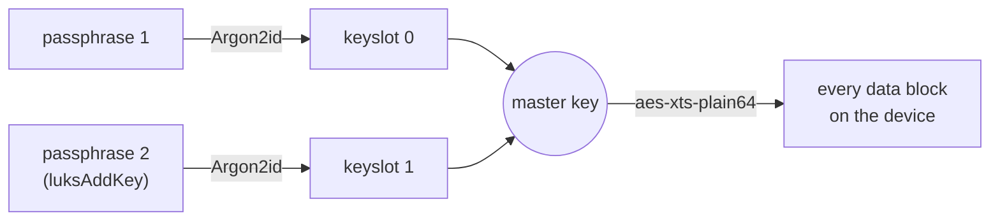

# Part 2 — Creating a Container & Its Keyslots

> Prerequisite: [Part 1 — The LUKS Model: Locking a Disk](./course-01-the-luks-model.md). Next: [Part 3 — Opening, Using, Closing & What's Visible Outside](./course-03-opening-using-closing.md).

Part 1 named the four operations. This part covers the first one in depth — `luksFormat` — and the key mechanism that makes multiple people able to share one encrypted device without sharing one secret.

## Creating a LUKS container

`cryptsetup luksFormat <device>` initializes the encryption. It overwrites the start of the device, so it demands you type `YES` in capitals, then asks for a passphrase twice. On current systems it creates a **LUKS2** header by default (LUKS1 still exists for compatibility with older tooling, but has no reason to be chosen new).

> [!TIP]
> **Try it — format and inspect the header**
>
> ```sh
> sudo cryptsetup luksFormat /dev/vdb
> sudo cryptsetup luksDump /dev/vdb
> ```
>
> `luksFormat` prompts:
>
> ```text
> WARNING!
> ========
> This will overwrite data on /dev/vdb irrevocably.
>
> Are you sure? (Type 'yes' in capital letters): YES
> Enter passphrase for /dev/vdb:
> Verify passphrase:
> ```
>
> `luksDump` then prints something like:
>
> ```text
> LUKS header information
> Version:        2
> ...
> Data segments:
>   0: crypt
>         offset: 16777216 [bytes]
>         cipher: aes-xts-plain64
> Keyslots:
>   0: luks2
>         Key:        512 bits
>         PBKDF:      argon2id
> ```
>
> The header records the cipher (`aes-xts-plain64`) and one active keyslot (`0`) holding your passphrase. The data region starts 16 MiB in, after the header. No filesystem exists yet — that comes in Part 3, after you open the device.
>
> *Scripting note:* to avoid the prompts you can pipe the passphrase in:
> `printf 'my-pass' | sudo cryptsetup luksFormat /dev/vdb --batch-mode --key-file=-`.

## Master key and keyslots

Your passphrase does not encrypt your data directly. It is too short and too guessable to serve as an AES-XTS key directly, and it's also completely impractical to re-encrypt an entire disk's worth of data every time someone adds or revokes a passphrase. Instead, `luksFormat` generates a long random **master key** — cryptographically strong, generated once — and it is the master key alone that encrypts every data block via `dm-crypt`.

The master key itself is then stored — encrypted — in a **keyslot** in the header. Your passphrase is run through a deliberately slow **key-derivation function** (Argon2id on LUKS2, chosen specifically because it is expensive to brute-force even with GPUs) and the result encrypts the master key into keyslot 0. LUKS2 has room for many keyslots, so several different passphrases can each independently unlock the *same* master key — which is the whole trick: adding or revoking a passphrase only ever touches one small keyslot, never the multi-gigabyte data region the master key protects.

That is how you grant a second person access without sharing your passphrase: `cryptsetup luksAddKey <device>` authenticates with an existing passphrase (to prove you're allowed to derive the current master key), then encrypts that same master key under a new passphrase and stores it in the next free slot.



Either passphrase unlocks its own keyslot to recover the same master key — that is what makes both of them work on the same data, and it's also why revoking one person's access (`cryptsetup luksKillSlot`) never requires re-encrypting anything: only their keyslot is destroyed, the master key and data are untouched.

> [!TIP]
> **Try it — add a second passphrase**
>
> ```sh
> sudo cryptsetup luksAddKey /dev/vdb
> sudo cryptsetup luksDump /dev/vdb | grep -A1 '^  [0-9]*: luks2'
> ```
>
> Expect something like:
>
> ```text
> Enter any existing passphrase:
> Enter new passphrase for key slot:
> Verify passphrase:
>
>   0: luks2
>         Key:        512 bits
>   1: luks2
>         Key:        512 bits
> ```
>
> There are now two keyslots. Either passphrase decrypts its slot to recover the one shared master key, so both unlock the same data. Removing a person's access is `cryptsetup luksKillSlot /dev/vdb 1` — only slot 1 is destroyed, the master key (and everything encrypted under it) is unaffected.

> *A keyslot is not "a copy of your data encrypted with your passphrase" — it's the master key, encrypted with your passphrase. That's the whole reason adding a tenth passphrase costs nothing more than adding a second one.*

## Reference

- `man 8 cryptsetup` — `luksAddKey`, `luksKillSlot`, and `luksChangeKey` all operate on keyslots without ever touching the data region.
- LUKS2 on-disk format spec (`cryptsetup` project wiki) — the exact JSON metadata area layout, if you need to reason about header size or a corrupted header by hand.
