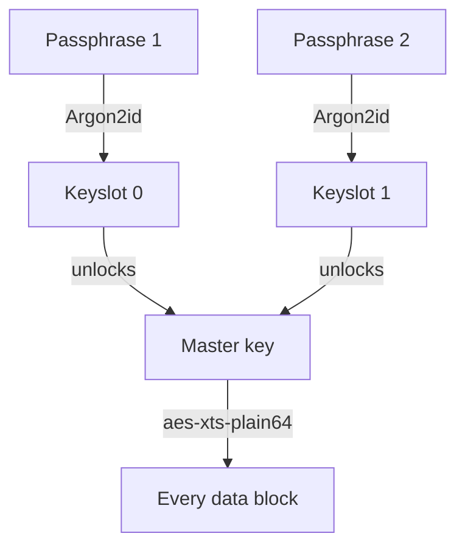

# Creating a Container and Its Keyslots

A LUKS disk is fitted with its vault door once, with `cryptsetup luksFormat`. After that, the door can have several keys, so more than one person can open the same disk without sharing one secret. This part shows both: how to create the container, and how its keys work.

## Creating a LUKS container

`cryptsetup luksFormat <device>` sets up the encryption. It writes over the start of the disk, so it asks you to type `YES` in capital letters first. Then it asks for a passphrase twice. On Ubuntu 24.04 it creates a **LUKS2** header by default. The older LUKS1 format still exists for old tools, but there is no reason to choose it for a new disk.

The examples encrypt the whole disk `/dev/vdb`. On a real server you would usually encrypt a partition such as `/dev/vdb1` instead. The commands are the same.

### See it in your playground: lock the disk and read the header

Confirm with `lsblk` that the 2 GB disk is `/dev/vdb`. Then format it as a LUKS container and print its header:

<!-- astrona:playground:renew -->

```sh
sudo cryptsetup luksFormat /dev/vdb
sudo cryptsetup luksDump /dev/vdb
```

`luksFormat` asks these questions:

```text
WARNING!
========
This will overwrite data on /dev/vdb irrevocably.

Are you sure? (Type 'yes' in capital letters): YES
Enter passphrase for /dev/vdb:
Verify passphrase:
```

`luksDump` then prints something like this (shortened):

```text
LUKS header information
Version:        2
...
Data segments:
  0: crypt
        offset: 16777216 [bytes]
        cipher: aes-xts-plain64
Keyslots:
  0: luks2
        Key:        512 bits
        PBKDF:      argon2id
```

The header records the cipher, `aes-xts-plain64`, and one keyslot in use, slot `0`, which holds your passphrase. The data area starts 16 MiB in, after the header. There is no filesystem yet. You add one later, on the opened device.

> [!TIP]
> In a script you can skip the questions and pipe the passphrase in:
> `printf 'my-pass' | sudo cryptsetup luksFormat /dev/vdb --batch-mode --key-file=-`.

## Master key and keyslots

Your passphrase does not scramble your data. Something stronger does that, and the passphrase only unlocks it. This split is what lets you add or remove passphrases in seconds, on a disk of any size.

### Why your passphrase does not encrypt the data

A passphrase is too short and too easy to guess to be a good AES-XTS key. It would also be slow to scramble the whole disk again each time someone adds or removes a passphrase. So `luksFormat` creates a long, random **master key** once. The master key is the vault's one real key. Only the master key scrambles the data blocks, through `dm-crypt` in the kernel.

The master key itself is stored, locked, in a **keyslot** in the header. A keyslot is one of several keys that open the same vault door. Inside, each keyslot is a small locked box that holds a copy of the master key.

`cryptsetup` runs your passphrase through a slow **key-derivation function**. That is a recipe that turns a passphrase into a key, and it is slow on purpose so that guessing millions of passphrases takes too long. LUKS2 uses Argon2id, which is costly to attack even with graphics cards. The result locks the master key into keyslot 0.

LUKS2 has room for many keyslots. Each one can hold the same master key, locked with a different passphrase. Adding or removing a passphrase only touches one small keyslot. It never touches the large data area that the master key protects.

### How a second passphrase works

To let a second person in without sharing your passphrase, use `cryptsetup luksAddKey <device>`. It first asks for a passphrase that already works, to prove you may unlock the master key. Then it locks the same master key with the new passphrase and stores it in the next free keyslot.


```mermaid
flowchart TB
    P1["Passphrase 1"] -->|"Argon2id"| K0["Keyslot 0"]
    P2["Passphrase 2"] -->|"Argon2id"| K1["Keyslot 1"]
    K0 -->|"unlocks"| MK["Master key"]
    K1 -->|"unlocks"| MK
    MK -->|"aes-xts-plain64"| D["Every data block"]
```

The diagram shows that passphrase 2, added with `luksAddKey`, opens its own keyslot but reaches the same master key, so both passphrases open the same data on the disk.

This is also why removing one person's access with `cryptsetup luksKillSlot` needs no new encryption. Only their keyslot is destroyed. The master key and the data stay as they are.

### See it in your playground: add a second passphrase

Add a new passphrase, then list the keyslots in the header:

```sh
sudo cryptsetup luksAddKey /dev/vdb
sudo cryptsetup luksDump /dev/vdb | grep -A1 '^  [0-9]*: luks2'
```

Expect something like:

```text
Enter any existing passphrase:
Enter new passphrase for key slot:
Verify passphrase:

  0: luks2
        Key:        512 bits
  1: luks2
        Key:        512 bits
```

There are now two keyslots. Either passphrase opens its own slot and gets back the one shared master key, so both open the same data. To remove a person's access, run `cryptsetup luksKillSlot /dev/vdb 1`. Only slot 1 is destroyed, and the master key and everything locked with it stay safe. `luksChangeKey` also works on keyslots only, and never on the data area.

## Common pitfalls

> [!WARNING]
> - **A lost passphrase means lost data.** If nobody knows a passphrase for any keyslot, and you have no header backup, the master key cannot be recovered. There is no back door, by design. Keep passphrases in a real password store, and think about `cryptsetup luksHeaderBackup`.
> - **Typing `yes` in small letters.** `luksFormat` only goes on when you type `YES` in capital letters, because it is about to write over the start of the disk.

> *A keyslot is not "a copy of your data locked with your passphrase". It is the master key, locked with your passphrase. That is why a tenth passphrase costs no more than a second one.*
