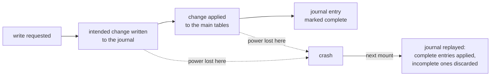
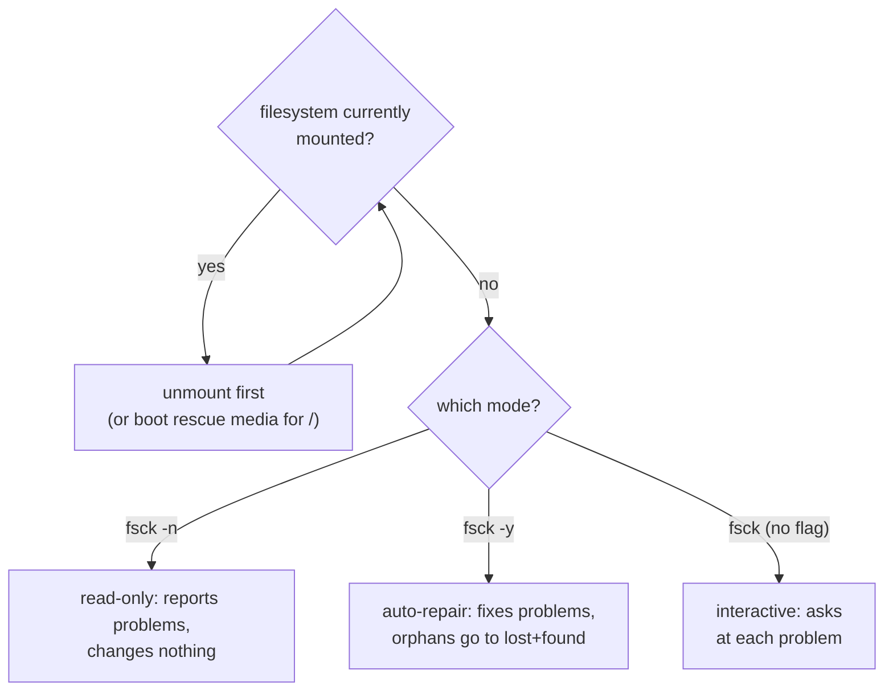

# Part 1 — Filesystem Corruption & the fsck Repair Model

> Prerequisite: [Module landing page](./course.md). Next: [Part 2 — Labels, UUIDs & Tuning Check Intervals](./course-02-labels-uuids-and-tuning.md).

A filesystem is a database on disk: tables of file metadata, maps of which blocks are free, indexes from directory names to those records. This part covers how that database gets damaged, the two structures (superblock and journal) that make most damage cheap to fix, and the safe way to run the tool that fixes what the journal cannot.

## Filesystems as databases, and how they get damaged

Every write you do is several coordinated changes: update the file's metadata record, mark data blocks as used, update the directory index, adjust the free-space count. If the machine dies between those changes, the on-disk structures disagree with each other — a directory entry pointing at a metadata record that was never written, blocks marked used that no file claims, and so on.

The tool that walks the whole structure and reconciles it is **`fsck`** (filesystem consistency check). When it finds a fragment of file data that has lost its directory entry, it does not throw it away; it links it into a directory called **`lost+found`** at the root of that filesystem, named by number, so you can inspect it later.

> As an analogy: the filesystem is a library and its card catalogue. A crash is a gust of wind that scatters some cards. `fsck` is the archivist who goes shelf by shelf, matches books to cards, shreds cards for books that are not there, and puts unlabelled loose pages in a box at the front desk (`lost+found`). The analogy breaks down because `fsck` works from redundant on-disk bookkeeping, not guesswork, and on a journaling filesystem it usually has almost nothing to do.

## The superblock and the journal

At a fixed spot near the start of an ext4 filesystem sits the **superblock**: the master record holding total block and inode counts, the free counts, the filesystem UUID and label, feature flags, and a "clean / not clean" state bit. It is important enough that `mkfs` writes backup copies at intervals across the disk; if the primary is damaged, tools can be pointed at a backup.

The **journal** is a small circular log, and understanding *why* it exists is what explains why `fsck` almost never runs at boot anymore. Before changing its main tables, ext4 writes a description of the intended change to the journal first, then applies the change to the real tables, then marks the journal entry complete. If power is lost partway, exactly one of two things is true on the next mount: either the journal entry never finished writing (safely discarded, the change never happened) or it finished writing before the crash (safely replayed, the change completes). There is no state where the journal is half-written and ambiguous — the entry itself is either fully present or it isn't, which is what makes replay a few seconds of work instead of a full structural scan.



`tune2fs` (*tune ext2/3/4 filesystem*) reads and adjusts ext-filesystem parameters that live in the superblock. `tune2fs -l <device>` prints the whole superblock in readable form.

> [!TIP]
> **Try it — read the superblock**
>
> ```sh
> sudo tune2fs -l /dev/vdb | grep -Ei 'volume name|state|mount count|UUID|features'
> ```
>
> Expect something like:
>
> ```text
> Filesystem volume name:   OLD_LABEL
> Filesystem UUID:          3f2b1c9a-7d6e-4a5b-8c0d-1e2f3a4b5c6d
> Filesystem features:      has_journal ext_attr resize_inode dir_index filetype extent 64bit flex_bg ...
> Filesystem state:         clean
> Mount count:              0
> Maximum mount count:      -1
> ```
>
> `has_journal` in the feature list confirms this is a journaling filesystem. `state: clean` means it was unmounted properly. `Maximum mount count: -1` means no automatic check is scheduled by mount count.

## Running fsck safely

The one hard rule: **never run `fsck` on a mounted filesystem.** A mounted filesystem has the kernel caching and flushing changes to the same sectors `fsck` wants to read and rewrite, each assuming it has exclusive control. The two writing at once corrupts the filesystem — this is not a permissions restriction, it's a genuine data-race between two things updating the same structures without coordinating. Unmount first; for the root filesystem, that means booting from rescue media or using a boot-time check, since you cannot unmount `/` while it's running the tool that would check it.

`fsck` is a wrapper that calls the right checker for the filesystem type (`e2fsck` for ext4). Its main modes:

- `sudo fsck /dev/vdb` — interactive; stops at each problem and asks.
- `sudo fsck -y /dev/vdb` — answers "yes" to every repair; used in unattended boot scripts.
- `sudo fsck -n /dev/vdb` — read-only; reports problems, changes nothing. Safe to run any time the filesystem is unmounted.



> [!TIP]
> **Try it — a read-only check**
>
> ```sh
> sudo fsck -n /dev/vdb
> ```
>
> Expect something like:
>
> ```text
> fsck from util-linux 2.39.3
> e2fsck 1.47.0 (5-Feb-2023)
> Pass 1: Checking inodes, blocks, and sizes
> Pass 2: Checking directory structure
> Pass 3: Checking directory connectivity
> Pass 4: Checking reference counts
> Pass 5: Checking group summary information
> OLD_LABEL: clean, 13/131072 files, 26156/524288 blocks
> ```
>
> The five passes check different parts of the structure in a fixed order (each pass depends on the previous one having already validated its layer); a healthy filesystem reports `clean` with file and block counts. If you run the same command while the disk is mounted, `e2fsck` warns `WARNING!!! ... filesystem is mounted` and asks you to confirm — the correct answer is no.

> *The journal turns "did this half-finished write survive the crash" into a yes/no question the next mount can answer in seconds; `fsck` exists for the damage that question can't cover — structural corruption the journal never recorded in the first place.*

## Reference

- `man 8 fsck` / `man 8 e2fsck` — the five-pass structure and every repair flag beyond `-y`/`-n` used above.
- `man 8 tune2fs` — the full set of superblock fields `-l` prints; Part 2 covers the ones you actually change.
