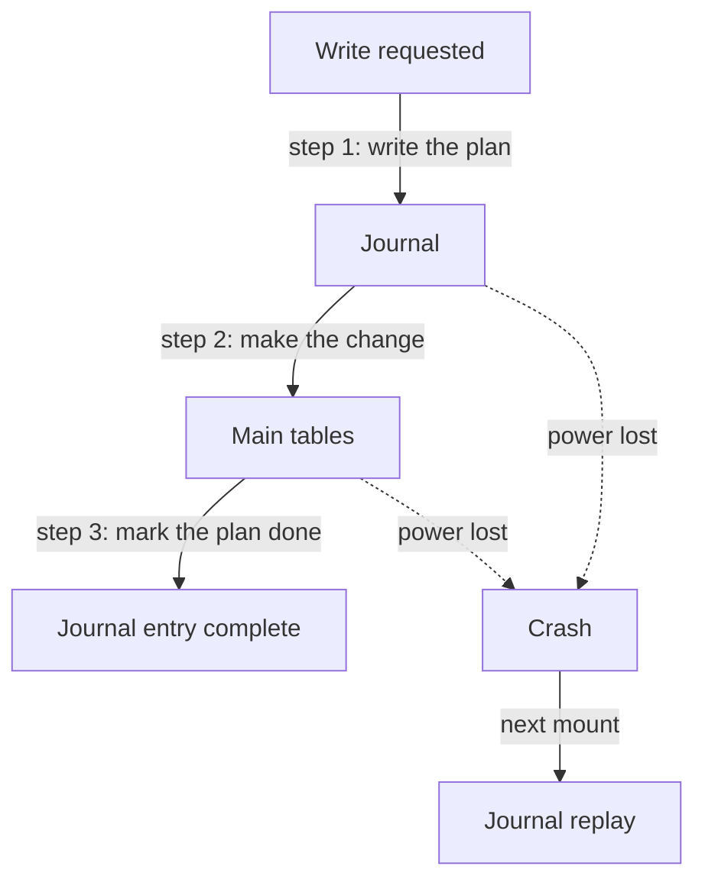
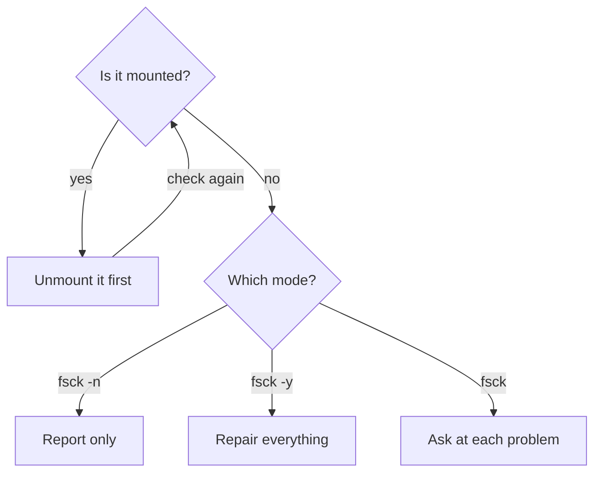

# Filesystem Corruption and the fsck Repair Model

Astronaut, a filesystem is the shelving and labelling system built inside a cargo hold. It is more than shelves, though. It keeps lists: a tag for every item, a map of which shelves are free, and an index from each name to its item. In other words, it works like a small database on the disk.

When the ship lands cleanly, all those lists agree with each other. A power cut, a fault in the disk controller or a bad spot on the disk in the middle of a write can leave them disagreeing. This page shows how that damage happens, the two structures that make most damage cheap to fix, and the safe way to run the repair tool for the rest.

## How a filesystem gets damaged

Every write you make is really several small changes that must happen together. When you save one file, the kernel's ext4 driver does all of these:

- It updates the file's **inode**. An inode is the cargo tag on each item: who owns it, its size and where it sits on the shelves.
- It marks the data blocks it used as taken.
- It adds the name to the directory index.
- It lowers the count of free space.

If the ship loses power between two of those changes, the lists no longer match. A directory entry may point at an inode that was never written. Blocks may be marked as taken while no file claims them.

The tool that walks the whole structure and makes it agree again is **`fsck`**, short for "filesystem consistency check". It is the repair crew that walks the shelves and fixes broken tags. When `fsck` finds a piece of file data that lost its directory entry, it does not throw it away. It links the piece into a directory called **`lost+found`** at the top of that filesystem, named by its inode number, so you can look at it later.

The repair crew does not guess. It works from bookkeeping that the filesystem stores more than once on the disk. On a filesystem with a journal (more on that below), it usually has almost nothing to do.

## The superblock and the journal

Two structures decide how bad a crash really is. The superblock describes the whole filesystem, and the journal records each change before it happens. Together they explain why a full check is rare today.

### The superblock

At a fixed spot near the start of an ext4 filesystem sits the **superblock**. Think of it as the hold's master manifest. It holds:

- the total number of blocks and inodes, and how many are free
- the filesystem's UUID (its serial number) and its label (its painted name)
- the feature flags, such as whether it has a journal
- a "clean" or "not clean" state

The superblock is so important that `mkfs` writes backup copies of it at intervals across the disk. If the main copy is damaged, the repair tools can read a backup instead.

### The journal

The **journal** is the cargo officer's notebook: each change is written down before it is made. It is a small log that wraps around when it is full. This is the reason `fsck` almost never runs at boot anymore.

The kernel's ext4 driver follows the same three steps for every change. It shows best as a picture.


```mermaid
flowchart TB
    W["Write requested"] -->|"step 1: write the plan"| J["Journal"]
    J -->|"step 2: make the change"| M["Main tables"]
    M -->|"step 3: mark the plan done"| D["Journal entry complete"]
    J -.->|"power lost"| R["Crash"]
    M -.->|"power lost"| R
    R -->|"next mount"| P["Journal replay"]
```

On the next mount, the kernel replays every journal entry that was fully written and throws away every entry that was not.

After a crash, only two cases are possible:

- **The entry was never fully written.** The kernel throws it away. The change never happened, and the main tables were not touched.
- **The entry was fully written before the crash.** The kernel replays it. The change completes.

There is no half-written entry that leaves the kernel unsure. That is why replaying the journal takes a few seconds, while a full check walks every shelf.

### Read the superblock

`tune2fs` ("tune ext2/3/4 filesystem") reads and changes the settings stored in an ext superblock. `tune2fs -l <device>` prints the whole superblock in readable form.

<!-- astrona:playground:renew -->

First, find the spare disk. It is usually `/dev/vdb`, but device names follow the order the disks were attached, so always check:

```sh
lsblk -f
```

Look for the 2 GB disk with `ext4` in the `FSTYPE` column, `OLD_LABEL` in the `LABEL` column and an empty `MOUNTPOINTS` column. The commands below use `/dev/vdb`; use your name if it differs.

Now read the most useful lines of its superblock:

```sh
sudo tune2fs -l /dev/vdb | grep -Ei 'volume name|state|mount count|UUID|features'
```

Expect something like:

```text
Filesystem volume name:   OLD_LABEL
Filesystem UUID:          3f2b1c9a-7d6e-4a5b-8c0d-1e2f3a4b5c6d
Filesystem features:      has_journal ext_attr resize_inode dir_index filetype extent 64bit flex_bg ...
Filesystem state:         clean
Mount count:              0
Maximum mount count:      -1
```

Your UUID will be different. The playground mounts the disk once while it prepares the sample files, so your mount count may show `1`.

`has_journal` in the feature list proves this filesystem has a journal. `state: clean` means it was unmounted properly. `Maximum mount count: -1` means no automatic check is planned by mount count.

## Running fsck safely

There is one hard rule, and it is not a formality. This section explains the rule, the modes of `fsck`, and what a healthy result looks like.

### The one hard rule

**Never run `fsck` on a mounted filesystem.** While a hold is docked, the kernel keeps parts of it in memory and writes changes back to the same spots that `fsck` wants to read and fix. Each of them thinks it is in sole control. If both write at once, they damage the filesystem. This is not a permission rule: it is two workers changing the same lists without talking to each other.

So undock first with `umount`. The root filesystem `/` is a special case. You cannot unmount it while the system runs from it, so you boot from rescue media, or let the system check it at boot before it is mounted for writing.

### The three modes

`fsck` itself is a front door. It finds the filesystem type and calls the right checker, which for ext4 is `e2fsck`. It has three main modes:

- `sudo fsck /dev/vdb` asks you at each problem whether to fix it.
- `sudo fsck -y /dev/vdb` answers "yes" to every repair. Unattended boot scripts use it.
- `sudo fsck -n /dev/vdb` is read-only. It reports problems and changes nothing. It is safe any time the filesystem is unmounted.


```mermaid
flowchart TB
    S{"Is it mounted?"} -->|"yes"| U["Unmount it first"]
    U -->|"check again"| S
    S -->|"no"| M{"Which mode?"}
    M -->|"fsck -n"| RO["Report only"]
    M -->|"fsck -y"| FIX["Repair everything"]
    M -->|"fsck"| ASK["Ask at each problem"]
```

The check always starts with "is it mounted?", and only an unmounted filesystem reaches a mode; with `-y`, pieces that lost their names end up in `lost+found`.

### See a read-only check

The spare disk is not mounted, so a read-only check is safe:

```sh
sudo fsck -n /dev/vdb
```

Expect something like:

```text
fsck from util-linux 2.39.3
e2fsck 1.47.0 (5-Feb-2023)
Pass 1: Checking inodes, blocks, and sizes
Pass 2: Checking directory structure
Pass 3: Checking directory connectivity
Pass 4: Checking reference counts
Pass 5: Checking group summary information
OLD_LABEL: clean, 13/131072 files, 26156/524288 blocks
```

Your file and block counts may differ a little. The five passes check different layers in a fixed order, and each pass trusts the layer the one before it already checked. A healthy filesystem ends with `clean` and its counts of used files and blocks.

If you run the same command while the disk is mounted, `e2fsck` warns that the filesystem is mounted and asks you to confirm. The right answer is no.

## Common pitfalls

> [!WARNING]
> - **Running `fsck` on a mounted filesystem.** It is the fastest way to destroy a filesystem. Always unmount first. For `/`, use rescue media or a check at boot.
> - **Assuming missing files after a repair are gone.** `fsck` moves recovered pieces into `lost+found` at the top of the filesystem, named by inode number. Look there before you decide data was lost.

> *The journal turns "did this half-finished write survive the crash?" into a yes-or-no question the next mount answers in seconds. `fsck` is for the damage that question cannot cover: broken structures the journal never recorded.*
