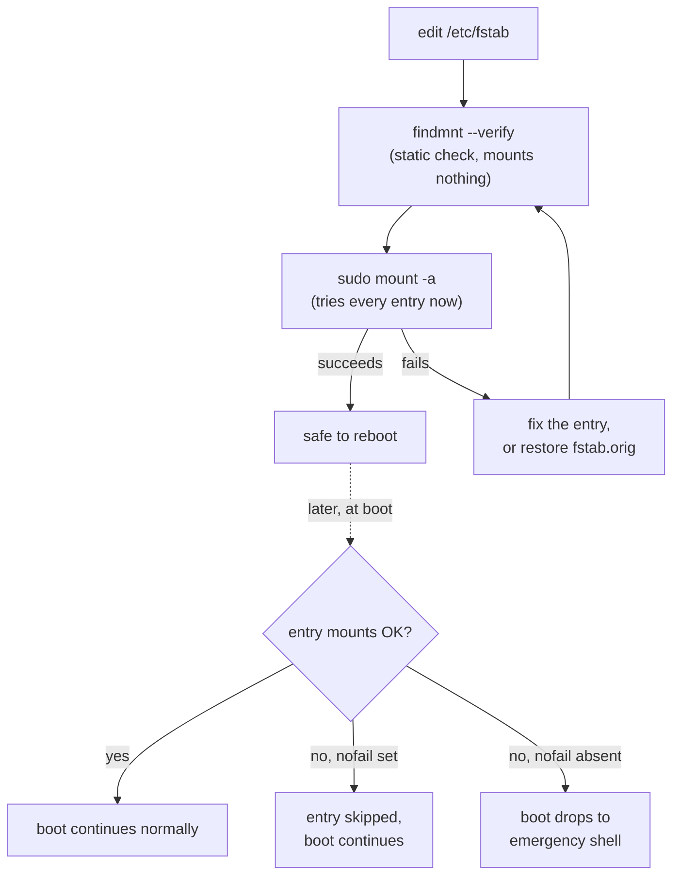

# Part 2 — Options & Verifying Before You Trust It

> Prerequisite: [Part 1 — fstab Fields & Stable Identifiers](./course-01-fields-and-stable-identifiers.md). Next: [Module landing page](./course.md).

Part 1 covered the six fields. This part covers the fourth field in depth — the options that actually change boot behaviour — and the checks that catch a broken entry while the machine is still reachable, instead of at 3 AM after a reboot.

## Options that matter

`defaults` expands to `rw,suid,dev,exec,auto,nouser,async` — a reasonable baseline. The ones you add or change most often, and what each actually controls at boot:

- **`nofail`** — if the device is missing at boot, systemd's generated `.mount` unit is marked non-critical and boot continues without it. Essential for removable and secondary disks; **do not** put it on a filesystem the system needs to function, since a missing-but-required mount without `nofail` is exactly the case that should stop and warn you.
- **`_netdev`** — tells the generator this mount needs the network, so its `.mount` unit is ordered *after* network-online targets instead of racing them during early boot. Required for `nfs`, `cifs`, iSCSI — without it, the mount is attempted before the network exists and simply fails.
- **`noatime`** — don't write an access timestamp on every read. A common, safe performance win, since a read-only operation otherwise still triggers a metadata write.
- **`ro`** — mount read-only.
- **`x-systemd.*`** — hand behaviour to systemd directly (automount, timeouts). Covered in full in Module 6.

The `dump` field is a historical artifact — set it to `0`. The `pass` field is the one to get right: `1` for root, `2` for other local filesystems that should be checked, `0` for anything that should not be (network mounts, swap, and filesystems like XFS that check themselves rather than relying on boot-time `fsck`).

## Testing before you trust it

An unmountable entry without `nofail` can leave a booting system dropping to an emergency shell — the generated `.mount` unit fails, and anything depending on it (or on `local-fs.target`, which most of the boot depends on) fails with it. Check every new entry while the system is up and easy to fix, before that dependency chain runs unattended at boot.

`sudo mount -a` tries to mount everything in the file and reports failures — this exercises the same mount attempt a `.mount` unit would make, without waiting for a reboot. `findmnt` (*find mount*) inspects mounts and the fstab; `findmnt --verify` parses `/etc/fstab` statically and flags problems — unknown filesystem types, missing mount points, suspicious options — without mounting anything, catching syntax and reference errors `mount -a` wouldn't even attempt.



> [!TIP]
> **Try it — catch a broken entry before reboot**
>
> ```sh
> echo "UUID=00000000-0000-0000-0000-000000000000  /mnt/nope  ext4  defaults  0  2" | sudo tee -a /etc/fstab
> findmnt --verify
> sudo mount -a
> ```
>
> Expect something like:
>
> ```text
> /mnt/nope
>    [E] unreachable on boot required source UUID=00000000-... not found
>
> mount: /mnt/nope: can't find UUID=00000000-0000-0000-0000-000000000000.
> ```
>
> `findmnt --verify` marks the line with `[E]` and `mount -a` fails on it — loudly, but harmlessly, because the system is already running. At boot, that same failure on a non-`nofail` entry is what forces the emergency shell (bottom-right of the diagram above). Remove the bad line, or restore the backup: `sudo cp /etc/fstab.orig /etc/fstab`.

> [!WARNING]
> **Common pitfalls**
>
> - **Naming devices by `/dev/sdX` or `/dev/vdX`.** These can change between boots (Part 1). Use `UUID=` (or `LABEL=`/`PARTUUID=`).
> - **Forgetting `nofail` on a secondary disk.** If that disk is absent or unformatted at boot, a non-`nofail` entry fails the mount and the boot drops to a recovery shell. Add `nofail` to anything the system does not strictly need.
> - **Missing `_netdev` on a network mount.** Without it, the generator orders the mount before networking is up; the mount fails and boot may stall waiting for it.
> - **A wrong `pass` value.** Setting `2` (or `1`) on a network mount or swap makes boot attempt an `fsck` that cannot run. Network mounts and swap are `0`.
> - **Editing `/etc/fstab` and rebooting without testing.** Always run `sudo mount -a` and `findmnt --verify` first, while the machine is still reachable.
> - **A missing mount-point directory.** `mount -a` fails if the target path does not exist. Create it (`mkdir -p`) or use the `x-mount.mkdir` option.

> *`findmnt --verify` and `mount -a` check two different things — one parses the file without touching the disk, the other actually attempts every mount — which is why the safe sequence runs both, in that order, before a reboot ever gets to find out the hard way.*

## Reference

- `man 5 fstab` — the full options list; `nofail`, `_netdev`, and `noatime` are a small subset of what's documented.
- `man 8 findmnt` — `--verify`'s exact error codes (`[E]` vs a plain warning) beyond the one shown above.
