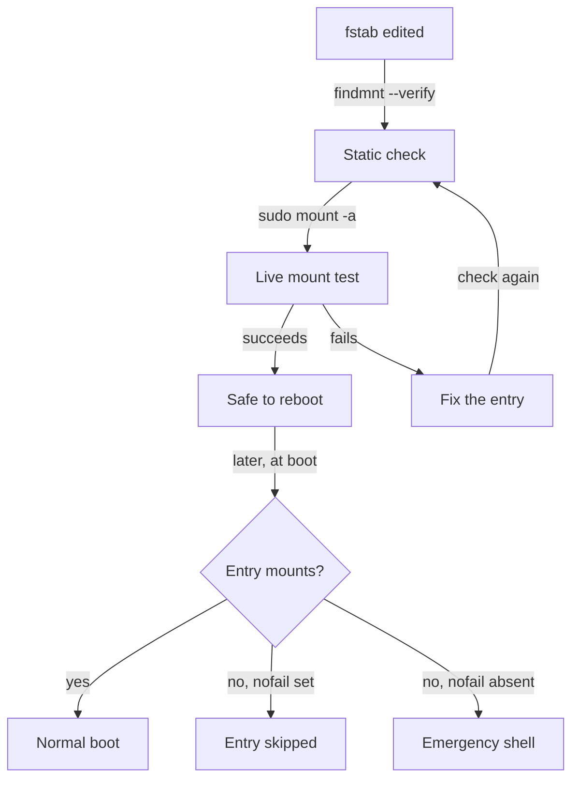

# Options and Verifying Before You Trust It

An `/etc/fstab` line has six fields: device, mount point, type, options, dump and pass. The fourth field, the options, changes how the ship behaves at launch. A small mistake in the logbook can stop a ship from booting into a normal state.

In this part you learn the options that change boot behaviour. Then you learn the two checks that catch a broken entry while the machine is still running and easy to fix, instead of at 3 AM after a reboot.

## Options that matter

The options field is a comma-separated list. Most entries start from `defaults` and add one or two options that change what happens at boot.

### The baseline: `defaults`

`defaults` expands to `rw,suid,dev,exec,auto,nouser,async`. That is a sensible baseline: read and write, mounted automatically at boot, and usable by programs on it.

### The options you add most often

These are the options you add or change most often, and what each one controls at boot:

- **`nofail`**: if the device is missing at boot, systemd marks the `.mount` unit it built from the line as not critical, and boot goes on without it. You need this for removable and secondary disks. **Do not** put it on a filesystem the system needs to work. For a required mount, a failure *should* stop the boot and warn you.
- **`_netdev`**: tells systemd's fstab generator that this mount needs the network. A network mount is a hold on another ship, reached over the communications array. With `_netdev`, systemd starts the mount *after* the network is up instead of racing it during early boot. You need it for `nfs`, `cifs` and iSCSI. Without it, the mount is tried before the network exists, and it simply fails.
- **`noatime`**: do not write an access time on every read. Normally even a read makes the filesystem write a small note about when the file was last read. Skipping that is a common, safe speed gain.
- **`ro`**: mount read-only.
- **`x-systemd.*`**: hand extra behaviour straight to systemd, such as mounting on first use (automount) and timeouts.

### Setting `dump` and `pass`

The `dump` field is left over from an old backup tool: set it to `0`. The `pass` field is the one to get right. It tells the repair crew (`fsck`, the filesystem check) whether and when to check this filesystem at boot:

- `1` for the root filesystem.
- `2` for other local filesystems that should be checked.
- `0` for anything that should not be: network mounts, swap (overflow storage used when memory is full), and filesystems like XFS that check themselves instead of relying on `fsck` at boot.

## Testing before you trust it

A broken line can stop a boot. Two commands find the problem while the ship is still flying, so you never have to find out the hard way.

### Why a broken line stops the boot

Suppose an entry cannot be mounted and has no `nofail`. At boot, the `.mount` unit that systemd built from that line fails. Everything that depends on it fails too, including `local-fs.target`, a checkpoint most of the boot waits for. The system then drops to an emergency shell. So check every new entry while the system is up and easy to fix.

### Two checks, two different jobs

The two checks look at different things:

- `findmnt --verify` reads `/etc/fstab` and checks it without mounting anything. `findmnt` means *find mount*: it shows mounts and the fstab. The `--verify` check flags unknown filesystem types, missing mount points and odd options. It catches mistakes in the file that `mount -a` would not even try.
- `sudo mount -a` tries to mount every entry in the file and reports what fails. It makes the same mount attempt a `.mount` unit would make at boot, without a reboot.


```mermaid
flowchart TB
    EDIT["fstab edited"] -->|"findmnt --verify"| VERIFY["Static check"]
    VERIFY -->|"sudo mount -a"| TEST["Live mount test"]
    TEST -->|"succeeds"| SAFE["Safe to reboot"]
    TEST -->|"fails"| FIXIT["Fix the entry"]
    FIXIT -->|"check again"| VERIFY
    SAFE -->|"later, at boot"| BOOT{"Entry mounts?"}
    BOOT -->|"yes"| UP["Normal boot"]
    BOOT -->|"no, nofail set"| SKIP["Entry skipped"]
    BOOT -->|"no, nofail absent"| EMERG["Emergency shell"]
```

The diagram shows the safe order: the static check first, then the live mount test, and only then a reboot. At boot, `nofail` decides whether a failed entry is skipped or drops the ship to the emergency shell. If the fix is hard, you can also restore the backup copy, `/etc/fstab.orig`.

### See it in your playground

Add a line with a UUID that no disk has, then run both checks:

<!-- astrona:playground:renew -->

```sh
echo "UUID=00000000-0000-0000-0000-000000000000  /mnt/nope  ext4  defaults  0  2" | sudo tee -a /etc/fstab
findmnt --verify
sudo mount -a
```

Expect something like this (the UUID in the first message is shortened):

```text
/mnt/nope
   [E] unreachable on boot required source UUID=00000000-... not found

mount: /mnt/nope: can't find UUID=00000000-0000-0000-0000-000000000000.
```

`findmnt --verify` marks the line with `[E]`, an error, and `mount -a` fails on it. Both fail loudly, but no harm is done, because the system is already running. At boot, the same failure on an entry without `nofail` is what forces the emergency shell. Remove the bad line, or restore the backup:

```sh
sudo cp /etc/fstab.orig /etc/fstab
```

> [!TIP]
> Make it a habit, on the exam and on real servers: after every edit to `/etc/fstab`, run `findmnt --verify` and then `sudo mount -a`. Reboot only when both are clean.

## Common pitfalls

> [!WARNING]
> - **Forgetting `nofail` on a secondary disk.** If that disk is missing or unformatted at boot, an entry without `nofail` fails the mount and the boot drops to a recovery shell. Add `nofail` to anything the system does not strictly need.
> - **Missing `_netdev` on a network mount.** Without it, the generator orders the mount before networking is up. The mount fails, and boot may stall waiting for it.
> - **A wrong `pass` value.** Setting `2` (or `1`) on a network mount or swap makes boot try an `fsck` that cannot run. Network mounts and swap are `0`.
> - **Editing `/etc/fstab` and rebooting without testing.** Always run `sudo mount -a` and `findmnt --verify` first, while the machine is still reachable.

> *`findmnt --verify` and `mount -a` check two different things. One reads the file without touching the disk; the other really tries every mount. That is why the safe order runs both, before a reboot ever gets to find out the hard way.*

## Your mission: Persistent fstab Mounting

You can now write a full `/etc/fstab` entry with a stable identifier and safe options, and check it before a reboot. The mission asks you to format a raw disk, add a `UUID=` entry with the right options, `dump` and `pass` values, mount it, and prove the file is clean.

The mission runs on its own training ship. A playground cannot be paused, so remove it first to free memory; it always starts clean again:

```sh
astrona destroy section-010-module-05-playground
```

Then start the mission and connect to it:

```sh
astrona run --git git@github.com:astrona-io/ATS004.git -c sections/section-010/module-05/labs/lab-01
astrona ssh ats-004-lab-015
```

Read the task in [`question.md`](./labs/lab-01/question.md) and solve it on your own first. When you think you are done, send it for grading:

```sh
astrona submit -c sections/section-010/module-05/labs/lab-01
```

When the mission is done, remove it and start a fresh playground:

```sh
astrona destroy ats-004-lab-015
astrona run --git ssh://git@github.com/astrona-io/ATS004.git -c sections/section-010/module-05/playground
```
