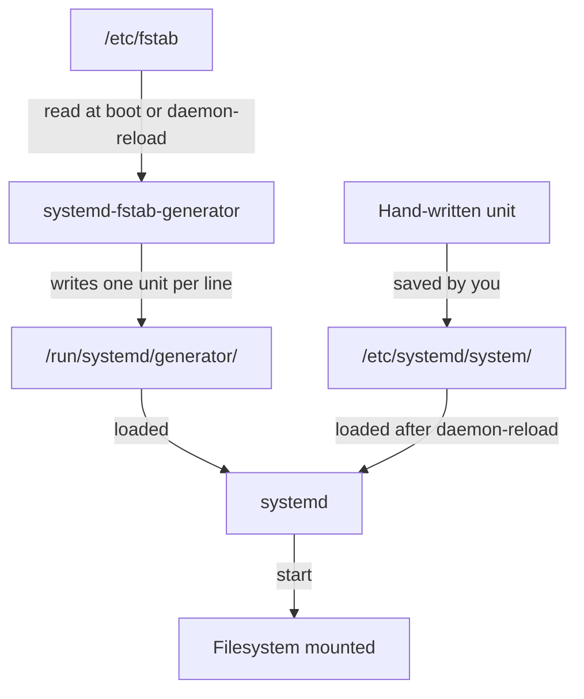

# How /etc/fstab Becomes systemd Units

Astronaut, before you write a duty order by hand, look at the ones your ship already has. Every line in `/etc/fstab` is quietly turned into a `.mount` unit for you. This page shows when that happens, where those units live, which copy wins when there are two, and the naming rule that lets systemd find any mount unit from its path alone.

## Every mount is a unit

On Ubuntu 24.04, **systemd** starts and watches almost everything on the machine. Think of it as the ship's duty officer: at every launch it starts each system in the right order. A **unit** is one item on the duty officer's list, such as a service or a mount.

A **`.mount` unit** is a duty order to dock a cargo hold to a hatch. Mounting is docking: the kernel attaches a filesystem to a directory, called the mount point, so you can reach it. `/etc/fstab` is the ship's logbook of holds to dock at every launch.

### See it in your playground

List the mount units the duty officer knows about, then print the unit for the root filesystem:

<!-- astrona:playground:renew -->

```sh
systemctl list-units --type=mount
systemctl cat -- -.mount
```

The list looks something like this (shortened):

```text
UNIT              LOAD   ACTIVE SUB     DESCRIPTION
-.mount           loaded active mounted Root Mount
boot.mount        loaded active mounted /boot
...
```

And `systemctl cat` prints a real unit file, even though nobody wrote one:

```text
# /run/systemd/generator/-.mount
# Automatically generated by systemd-fstab-generator
[Unit]
Documentation=man:fstab(5) man:systemd-fstab-generator(8)
...
[Mount]
What=/dev/disk/by-uuid/abcd-1234
Where=/
Type=ext4
```

The root filesystem is the unit `-.mount`, which is systemd's name for `/`. Its first line shows that it lives in `/run/systemd/generator/`, so a program wrote it, not a person. Every line in `/etc/fstab` has a matching unit like this.

The rows in your list, and the `What=` line, will show your own ship's devices. The `abcd-1234` value above is only an example.

## The fstab generator

The unit above came from **`systemd-fstab-generator`**. A **generator** is a small program that systemd itself runs. It is not a unit that systemd manages. Picture it as the duty officer's clerk: it reads the logbook and copies each line into a duty order.

### When the generator runs

The generator runs at two moments only:

- very early in boot, before any unit starts, and
- every time you run `sudo systemctl daemon-reload`.

Each run reads the current `/etc/fstab` from top to bottom. It writes one `.mount` unit per line into `/run/systemd/generator/`. systemd then loads those units like any other.



The diagram shows the two ways to describe a mount. A line in `/etc/fstab` and a hand-written unit both end up as the same kind of `.mount` unit that systemd starts.

### Why you never edit the generated file

`/run/` is a **tmpfs**: a filesystem that lives in memory and is wiped at every reboot. That is on purpose. A generated unit is a copy of `/etc/fstab` at the moment the generator last ran, not a file to edit.

If you edit the generated file, your change lasts only until the next boot or `daemon-reload`. Then the generator writes the file again from `/etc/fstab`, and your change is gone without a warning. A change that must last goes in `/etc/fstab`, or in a hand-written unit under `/etc/systemd/system/`.

## Which copy wins: the unit search order

Suppose two files have the same unit name, one written by you and one written by the generator. systemd does not merge them. It looks for the exact filename in a fixed list of directories, in order, and loads the **first** match. The others are ignored completely.

The directories that matter here, from highest to lowest priority:

1. `/etc/systemd/system/`: units written by the administrator. Hand-written units go here.
2. `/run/systemd/system/`: other units created while the machine runs.
3. `/run/systemd/generator/`: the output of `systemd-fstab-generator`.
4. `/usr/lib/systemd/system/`: units shipped with installed packages.

So if you write `/etc/systemd/system/srv-data.mount` for a path that also has a line in `/etc/fstab`, your file wins outright. The generator still writes its own `srv-data.mount` into `/run/systemd/generator/`, but systemd never loads it. The search stops at `/etc/systemd/system/`.

## The unit filename rule

A duty order is filed under the hatch it docks to. Here is the real case first: the mount point `/srv/data` needs a unit named `srv-data.mount`, and `/srv/app/logs` needs `srv-app-logs.mount`.

The rule behind it: a `.mount` unit's filename **must** be its mount path, run through systemd's path escaping. The leading slash is dropped, every other slash becomes a dash, and `.mount` is added at the end. The root `/` is the special case `-.mount`. The generator uses the same rule, and the `Where=` line inside a hand-written unit must match the filename.

### See the name for a path

`systemd-escape` does the conversion for you:

```sh
systemd-escape -p --suffix=mount /srv/data
systemd-escape -p --suffix=mount /srv/app/logs
```

Expect something like:

```text
srv-data.mount
srv-app-logs.mount
```

`-p` means "treat the argument as a path", and `--suffix=mount` adds the unit type. If a unit file for `/srv/data` has any other name, systemd does not link it to that path at all, so the `Where=/srv/data` line inside it has no effect.

> *A `.mount` unit's name is not a label. It is the address systemd uses to find it, worked out straight from the path.*

## Common pitfalls

> [!WARNING]
> - **Unit filename not matching the path.** `/srv/data` *must* be `srv-data.mount` with `Where=/srv/data`. With any mismatch, systemd never links the file to that path. Get the name from `systemd-escape -p --suffix=mount`.
> - **Editing a generated unit in `/run/systemd/generator/`.** The change is lost at the next boot or `daemon-reload`, when the generator writes the file again from `/etc/fstab`. Change `/etc/fstab`, or write your own unit in `/etc/systemd/system/`.
