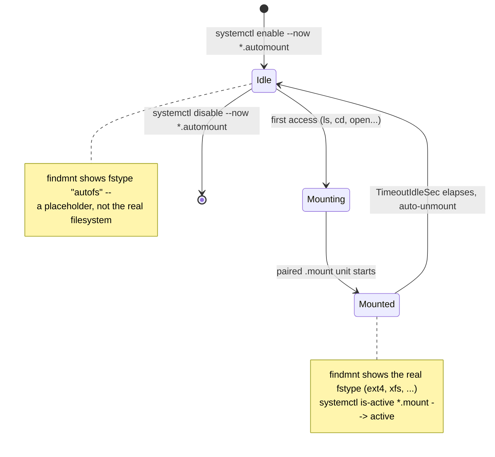

# Part 2 — Writing Native .mount and .automount Units

> Prerequisite: [Part 1 — How /etc/fstab Becomes systemd Units](./course-01-fstab-generated-units-and-naming.md). Next: [Part 3 — The fstab Shortcut and Common Pitfalls](./course-03-fstab-shortcut-and-pitfalls.md).

Part 1 showed that a hand-written unit in `/etc/systemd/system/` always wins over whatever the fstab generator would produce for the same path. This part writes one of those units for real — first a plain `.mount`, then an `.automount` paired with it — and along the way settles what `enable` and `daemon-reload` actually do, since both commands are easy to run without understanding what changed.

## Anatomy of a `.mount` unit

A `.mount` unit lives in `/etc/systemd/system/`, named per Part 1's rule. Its `[Mount]` section carries the same information as an fstab line: `What=` (the device — `UUID=` works), `Where=` (the mount point, matching the filename), `Type=`, and `Options=`.

> [!TIP]
> **Try it — mount via a unit**
>
> ```sh
> UUID=$(sudo blkid -s UUID -o value /dev/vdb)
> sudo mkdir -p /srv/data
> sudo tee /etc/systemd/system/srv-data.mount >/dev/null <<EOF
> [Unit]
> Description=Data filesystem at /srv/data
>
> [Mount]
> What=UUID=$UUID
> Where=/srv/data
> Type=ext4
> Options=defaults,nofail
>
> [Install]
> WantedBy=multi-user.target
> EOF
> sudo systemctl daemon-reload
> sudo systemctl start srv-data.mount
> findmnt /srv/data
> ```
>
> Expect something like:
>
> ```text
> TARGET     SOURCE    FSTYPE OPTIONS
> /srv/data  /dev/vdb  ext4   rw,relatime,nofail
> ```
>
> `findmnt` (*find mount*) confirms it. `sudo systemctl enable srv-data.mount` would make it mount at boot too — the next section explains exactly what `enable` does to make that true.

## What `daemon-reload`, `enable`, and `start` each actually touch

These three get run together often enough that it is easy to lose track of which one does what. Each touches a different layer:

```text
edit unit file on disk
        |
        v
daemon-reload   -- re-reads ALL unit files from disk (and re-runs generators).
        |          Does not start, stop, enable, or disable anything.
        v
enable          -- reads the unit's [Install] section and creates a symlink:
        |          WantedBy=multi-user.target means the symlink goes into
        |          /etc/systemd/system/multi-user.target.wants/. That symlink
        |          is the *entire* effect of enable — it wires this unit into
        |          the boot dependency graph so it starts next boot.
        |          A unit with no [Install] section has nothing for enable to do.
        v
start           -- actually runs the unit right now (mounts the filesystem).
                    Independent of enable: start without enable runs it once,
                    this boot only; enable without start sets it up for next
                    boot but does nothing this session (hence --now to do both).
```

If you edit a unit file and only run `systemctl restart`, nothing changes — `restart` re-runs the unit using the copy systemd already has loaded in memory, not the file on disk. `daemon-reload` is what makes systemd re-read the file; only after that does a `restart` (or `start`) pick up the edit.

Ordering between units works the same layered way: `After=`/`Before=` control *sequence* only — they say nothing about whether the other unit runs at all. `Requires=` pulls the other unit in and fails this one if it fails. For mounts specifically, systemd usually does this for you: any unit that references a path under an fstab-listed mount gets an automatic `RequiresMountsFor=` dependency, so you rarely need to write `After=srv-data.mount` by hand unless you are ordering against something unusual.

## Adding an `.automount`

An `.automount` unit does not mount anything itself. It watches the mount point; the first access triggers the paired `.mount` unit. Both units share the base name — `srv-data.automount` pairs with `srv-data.mount`. `TimeoutIdleSec=` unmounts again after a period with no activity. You enable the **`.automount`**, not the `.mount` — enabling the `.mount` directly would mount it unconditionally at boot, defeating the point.



> [!TIP]
> **Try it — mount on first access**
>
> ```sh
> sudo systemctl stop srv-data.mount
> sudo tee /etc/systemd/system/srv-data.automount >/dev/null <<EOF
> [Unit]
> Description=Automount for /srv/data
>
> [Automount]
> Where=/srv/data
> TimeoutIdleSec=30
>
> [Install]
> WantedBy=multi-user.target
> EOF
> sudo systemctl daemon-reload
> sudo systemctl enable --now srv-data.automount
> findmnt /srv/data
> ls /srv/data
> systemctl is-active srv-data.mount
> ```
>
> Expect something like:
>
> ```text
> /srv/data  systemd-1  autofs  rw,relatime,...   <- before access: an autofs trigger
> (ls output)
> active                                          <- after access: really mounted
> ```
>
> Before the `ls`, `findmnt` shows `/srv/data` as an `autofs` trigger point owned by systemd — the `.automount` unit's `enable --now`, not the `.mount`, is what put it there. The `ls` triggers `srv-data.mount`; after ~30 seconds idle it unmounts again. This is systemd's built-in equivalent of autofs (Section 050) — no map files, but no wildcards either.

> *`enable` doesn't start a unit — it wires the `[Install]` section into the boot graph; only `start` (or an automount trigger) actually runs it.*

## Reference

- `man systemd.mount` — the full `[Mount]` section directive list.
- `man systemd.automount` — `[Automount]` directives including `TimeoutIdleSec=`.
- `man systemd.unit` — `[Install]`, `WantedBy=`, and the `After=`/`Requires=` dependency directives.
- `man systemctl` — exact semantics of `daemon-reload`, `enable`, `start`, and `--now`.
