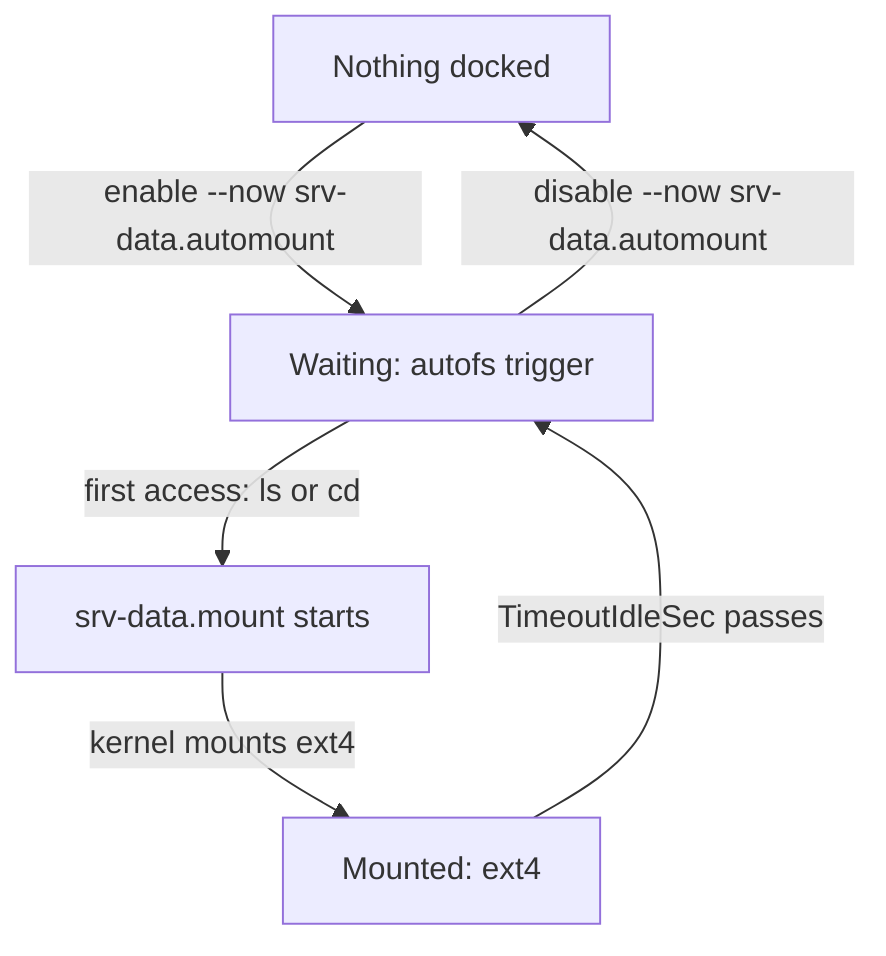

# Writing Native .mount and .automount Units

Astronaut, now you write duty orders by hand. A hand-written unit in `/etc/systemd/system/` always wins over anything the fstab generator writes for the same path. On this page you write a plain `.mount` unit, then pair it with an `.automount` unit that docks the hold only when someone knocks on the hatch. On the way, you learn exactly what `daemon-reload`, `enable` and `start` each change.

## Anatomy of a `.mount` unit

A `.mount` unit carries the same facts as a line in `/etc/fstab`, written as named settings. This section shows a real unit first, then what each setting means.

### Write and start a mount unit

The spare disk in your playground already has an ext4 filesystem with the label `DATA`. It is usually `/dev/vdb`; confirm the name with `lsblk` first. Print its UUID, the hold's serial number, and create the mount point:

<!-- astrona:playground:renew -->

```sh
sudo blkid -s UUID -o value /dev/vdb
sudo mkdir -p /srv/data
```

Save this as `/etc/systemd/system/srv-data.mount`. Replace `<UUID>` with the value `blkid` printed. Files under `/etc` are saved with `sudo`, for example `sudo nano /etc/systemd/system/srv-data.mount`:

```ini
[Unit]
Description=Data filesystem at /srv/data

[Mount]
What=UUID=<UUID>
Where=/srv/data
Type=ext4
Options=defaults,nofail

[Install]
WantedBy=multi-user.target
```

Apply it:

```sh
sudo systemctl daemon-reload
sudo systemctl start srv-data.mount
```

Then check the result:

```sh
findmnt /srv/data
```

Expect something like:

```text
TARGET     SOURCE    FSTYPE OPTIONS
/srv/data  /dev/vdb  ext4   rw,relatime,nofail
```

`findmnt` (find mount) reads the kernel's table of mounts and confirms that the hold is docked. Your `OPTIONS` column may show only `rw,relatime`. `nofail` is read by systemd and `mount`, not by the kernel, so it does not always appear there.

### What each setting means

The `[Mount]` section holds four settings. Each one matches a field in an `/etc/fstab` line:

```text
 What=      the device to mount. UUID= works, and survives device names moving.
 Where=     the mount point. It must match the unit's filename.
 Type=      the filesystem type, here ext4.
 Options=   mount options, the same ones fstab uses.
```

The `[Install]` section is not used when you `start` the unit. It only matters when you `enable` it, as the next section shows. `nofail` means that a missing disk does not fail the boot: systemd notes the problem and carries on.

## What `daemon-reload`, `enable` and `start` each change

People often run these three commands together and lose track of which one does what. Each one touches a different layer, and only one of them actually mounts anything.

### Three commands, three layers

| Command | What it changes | What it does not do |
| --- | --- | --- |
| `sudo systemctl daemon-reload` | systemd reads every unit file from disk again, and runs the generators again | It does not start, stop, enable or disable anything |
| `sudo systemctl enable <unit>` | systemd reads the unit's `[Install]` section and creates a link. `WantedBy=multi-user.target` puts the link in `/etc/systemd/system/multi-user.target.wants/`, so the unit starts at the next boot | It does not start the unit now. A unit with no `[Install]` section gives `enable` nothing to do |
| `sudo systemctl start <unit>` | systemd runs the unit right now, so the kernel mounts the filesystem | It does not survive a reboot. Without `enable`, the unit runs this boot only |

`enable --now` does both: it creates the boot link and starts the unit at once.

If you edit a unit file and only run `systemctl restart`, nothing changes. `restart` reuses the copy systemd already holds in memory, not the file on disk. Run `daemon-reload` first so systemd reads the file again; only then does `restart` or `start` use your edit.

### Ordering between units

Ordering works in the same layered way. `After=` and `Before=` only set the **order**: they say nothing about whether the other unit runs at all. `Requires=` pulls the other unit in, and fails this unit if the other one fails.

For mounts, systemd often adds this for you. A mount inside another mount, or a service whose working directory sits on a mount, gets an automatic `RequiresMountsFor=` dependency. So you rarely need to write `After=srv-data.mount` by hand.

## Adding an `.automount`

An **`.automount` unit** is a duty order to dock a hold the moment someone knocks on the hatch. It does not mount anything itself. It watches the mount point, and the first access starts the paired `.mount` unit.

### How the pair works

Both units share the same base name: `srv-data.automount` pairs with `srv-data.mount`. `TimeoutIdleSec=` undocks the hold again after a period with no activity.


```mermaid
flowchart TB
    O["Nothing docked"] -->|"enable --now srv-data.automount"| W["Waiting: autofs trigger"]
    W -->|"first access: ls or cd"| M["srv-data.mount starts"]
    M -->|"kernel mounts ext4"| D["Mounted: ext4"]
    D -->|"TimeoutIdleSec passes"| W
    W -->|"disable --now srv-data.automount"| O
```

The diagram shows the cycle. While the unit waits, `findmnt` shows the type `autofs`, a placeholder and not the real filesystem. After the first access, `findmnt` shows the real type, such as ext4, and `systemctl is-active srv-data.mount` prints `active`.

You enable the **`.automount`**, not the `.mount`. Enabling the `.mount` would dock the hold at every boot whether anyone needs it or not, which defeats the point.

### Mount on first access

Stop the plain mount first, so the automount can take over the hatch:

```sh
sudo systemctl stop srv-data.mount
```

Save this as `/etc/systemd/system/srv-data.automount`:

```ini
[Unit]
Description=Automount for /srv/data

[Automount]
Where=/srv/data
TimeoutIdleSec=30

[Install]
WantedBy=multi-user.target
```

Apply it:

```sh
sudo systemctl daemon-reload
sudo systemctl enable --now srv-data.automount
```

Then check the result. Look at the hatch, knock on it with `ls`, and ask whether the mount unit is now running:

```sh
findmnt /srv/data
ls /srv/data
systemctl is-active srv-data.mount
```

Expect something like:

```text
/srv/data  systemd-1  autofs  rw,relatime,...   <- before access: an autofs trigger
(ls output)
active                                          <- after access: really mounted
```

Before the `ls`, `findmnt` shows `/srv/data` as an `autofs` trigger owned by systemd. The `.automount` unit's `enable --now` put it there, not the `.mount`. The `ls` makes systemd start `srv-data.mount`, and the kernel mounts the ext4 filesystem. After about 30 seconds with nobody using it, systemd unmounts it again.

This is systemd's built-in version of autofs, the docking robot that follows a map of holds and hatches. It has no map files, but it has no wildcards either.

> *`enable` does not start a unit. It wires the `[Install]` section into the boot order; only `start`, or an automount trigger, actually runs it.*

## Common pitfalls

> [!WARNING]
> - **Editing a unit and not reloading.** systemd only reads unit files again on `daemon-reload`. A plain `restart` reuses what is already in memory. Run `sudo systemctl daemon-reload` after every new or changed unit, and after every change to `/etc/fstab`.
> - **Enabling the `.mount` instead of the `.automount`.** For on-demand mounting, enable and start the `.automount`, and leave the `.mount` to be started by the trigger. Enabling the `.mount` mounts it at every boot instead.
> - **Leaving `nofail` off a `.mount` unit.** This is the same rule as in fstab. A required device that is missing fails the unit, and any unit that requires it fails too.

## Your mission: systemd .mount and .automount Units

You can now write a native `.mount` unit, pair it with an `.automount` unit and trigger it by accessing the path. The mission asks you to format a raw disk and make it appear at `/srv/appdata` on demand, using only hand-written units.

The mission runs on its own training ship. A playground cannot be paused, so remove it first to free memory; it always starts clean again:

```sh
astrona destroy section-010-module-06-playground
```

Then start the mission and connect to it:

```sh
astrona run --git git@github.com:astrona-io/ATS004.git -c sections/section-010/module-06/labs/lab-01
astrona ssh ats-004-lab-016
```

Read the task in [`question.md`](./labs/lab-01/question.md) and solve it on your own first. When you think you are done, send it for grading:

```sh
astrona submit -c sections/section-010/module-06/labs/lab-01
```

When the mission is done, remove it and start a fresh playground:

```sh
astrona destroy ats-004-lab-016
astrona run --git ssh://git@github.com/astrona-io/ATS004.git -c sections/section-010/module-06/playground
```
