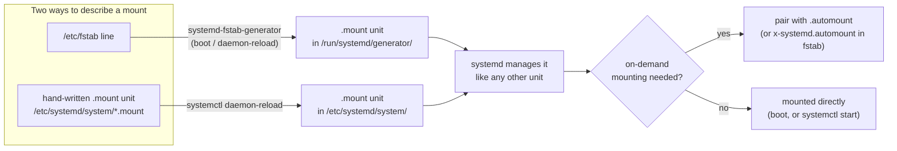

# systemd Mount and Automount Units

<!-- astrona:playground -->
> [!NOTE]
> 🧪 **Hands-on playground for this module** — a clean, throwaway machine to explore on. No task, no grading. Folder: [`playground/`](https://github.com/astrona-io/ATS004/tree/main/sections/section-010/module-06/playground)
>
> ```sh
> astrona run --git ssh://git@github.com/astrona-io/ATS004.git -c sections/section-010/module-06/playground
> astrona destroy section-010-module-06-playground
> ```

On a systemd machine, every mount is a **unit** — the same kind of managed object as a service. `/etc/fstab` is a convenience front end: at boot, systemd's fstab generator turns each line into a `.mount` unit automatically. You can also write those units by hand, which gives finer control over ordering and dependencies, and pair each with an `.automount` unit for on-demand mounting built into systemd.



Both starting points end up as the same kind of systemd unit — the three parts below walk each path in order, then show how they interact when both target the same mount point.

## How this module is organised

1. **[Part 1 — How /etc/fstab Becomes systemd Units](./course-01-fstab-generated-units-and-naming.md)** — what `systemd-fstab-generator` does and when, why generated units live in `/run/systemd/generator/`, the unit search order that decides which copy of a unit wins, and the mount-path filename rule.
2. **[Part 2 — Writing Native .mount and .automount Units](./course-02-native-mount-and-automount-units.md)** — the `[Mount]`/`[Automount]` section format, exactly what `daemon-reload`, `enable`, and `start` each do, and the automount idle-timeout lifecycle.
3. **[Part 3 — The fstab Shortcut and Common Pitfalls](./course-03-fstab-shortcut-and-pitfalls.md)** — the `x-systemd.*` fstab options, what happens when an fstab line and a hand-written unit target the same path, and a consolidated pitfall list.

## Learning objectives

After this module you can:

- Explain how `/etc/fstab` entries become `.mount` units, when `systemd-fstab-generator` runs, and list mount units with `systemctl`.
- State the systemd unit search order and predict which file wins when a hand-written unit and a generated one share a name.
- Derive a `.mount` unit's required filename from its mount path with `systemd-escape`.
- Write and activate a native `.mount` unit, explaining what `daemon-reload`, `enable`, and `start` each change.
- Add an `.automount` unit for on-demand mounting with an idle timeout, and describe its idle/mounting/mounted lifecycle.
- Get the same on-demand behaviour from `/etc/fstab` using `x-systemd.automount` and related options.
- Explain why an fstab line and a hand-written unit for the same path do not combine, and which one wins.

## Before you start

You need the previous module's material: the six `/etc/fstab` fields and identifying devices by `UUID=`. Basic `systemctl` usage (`start`, `status`, `enable`) is assumed.

The linked playground gives you an Ubuntu server VM with one spare ext4 filesystem (label `DATA`, commonly `/dev/vdb`), `/etc/fstab` backed up to `/etc/fstab.orig`, and passwordless `sudo`. Run the command blocks in Parts 1–3 in that VM after `astrona ssh astro-section-010-module-06-playground`.
