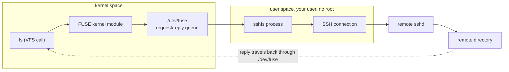

# Part 1 — SSHFS and the FUSE Mechanism

> Prerequisite: [Module landing page](./course.md). Next: [Part 2 — Performance, Sharing & Unmounting](./course-02-performance-sharing-and-unmounting.md).

This part settles what SSHFS actually is before you touch a mount option: not a network protocol of its own, but an ordinary program riding on top of a general kernel facility for user-space filesystems. Every later checkpoint — why it's slow for some workloads, who can see a mount, how permissions are checked — is a direct consequence of the mechanism this part covers.

## What SSHFS is for

> As an analogy: SSHFS is a bicycle courier. It is quick to dispatch, needs no loading dock, and uses roads that already exist. It is not a freight line — you would not move a datacentre's worth of data through it. The analogy breaks down because a courier makes one trip, while SSHFS handles every `open`, `read`, and `write` your programs make against the mount, indefinitely.

Concretely: `sshfs alice@db-server:/var/log/app ~/app-logs` makes the remote `/var/log/app` appear at your local `~/app-logs`. Listing, reading, and (if permitted) writing all work through the existing SSH channel. Nothing is installed on `db-server` beyond the SSH server it already runs.

## The FUSE mechanism underneath

Traditionally a filesystem driver is kernel code: it runs at the kernel's privilege level, a bug in it can crash the whole machine, and only root can load one.

**FUSE** — Filesystem in Userspace — changes that by inserting a relay. FUSE the kernel module registers itself as the driver for a mount, but it does no filesystem work itself. Every VFS call the kernel would normally hand straight to a driver — `open`, `read`, `write`, `readdir`, `getattr` — FUSE instead packages as a small message and writes to a special character device, `/dev/fuse`, that only the FUSE module and its paired user-space program can see. The user-space program — here, `sshfs` — sits in a loop reading requests off `/dev/fuse`, does whatever work answering them requires, and writes a reply back onto the same device. The kernel resumes the original caller only once that reply lands.

That queue is the entire contract. FUSE does not care whether the user-space side talks to a network, a database, or nothing at all — `sshfd` translates each message into an SSH-carried request to the remote host and turns the response back into a FUSE reply, but a different FUSE program could equally serve files from an S3 bucket or a compressed archive with the same kernel-side mechanism. The chain for a single directory listing on `~/app-logs` is:

```text
ls  ->  kernel (VFS)  ->  /dev/fuse  ->  sshfs process  ->  SSH  ->  remote sshd  ->  remote directory
```

and the answer travels back the same way. Because the `sshfs` process is an ordinary process owned by the user who ran it — not kernel code — you can create the mount without root, and a crash in `sshfs` cannot take the kernel down with it; the mount just stops answering (`ls` hangs, then errors) until you clean it up:



> [!TIP]
> **Try it — mount a remote directory and see the FUSE type**
>
> On `client`:
>
> ```sh
> sshfs srv:/srv/logs ~/remote
> mount | grep fuse.sshfs
> ls -l ~/remote
> cat ~/remote/app.log
> ```
>
> Expect something like:
>
> ```text
> srv:/srv/logs on /home/ubuntu/remote type fuse.sshfs (rw,nosuid,nodev,relatime,user_id=1000,group_id=1000)
> -rw-r--r-- 1 root   root   18 Aug 29 12:00 app.log
> -rw-r--r-- 1 root   root   21 Aug 29 12:00 access.log
> -rw------- 1 ubuntu ubuntu 20 Aug 29 12:00 secret.txt
> srv app.log line 1
> ```
>
> The filesystem type is `fuse.sshfs`, not a kernel filesystem like `ext4` or `nfs`. Every `ls` and `cat` you just ran became a message on `/dev/fuse`, answered by the local `sshfs` process — running as your login user, no `sudo` anywhere — fetching the data from `srv` over SSH. `ls -l` shows each file's owner as it is *on `srv`*: the two logs belong to `root` there, `secret.txt` to your user.

> *A FUSE mount has no filesystem logic in the kernel at all — the kernel module is just a message relay, which is exactly why an unprivileged, crash-safe, install-nothing-on-the-server filesystem like SSHFS is possible.*

## Reference

- `man 8 mount.fuse3` — the mount helper FUSE filesystems use, and the generic FUSE mount options it accepts.
- `man sshfs` — the full option list; most of what matters for this module is `-o allow_other` and `-o default_permissions`, covered in Part 2.
