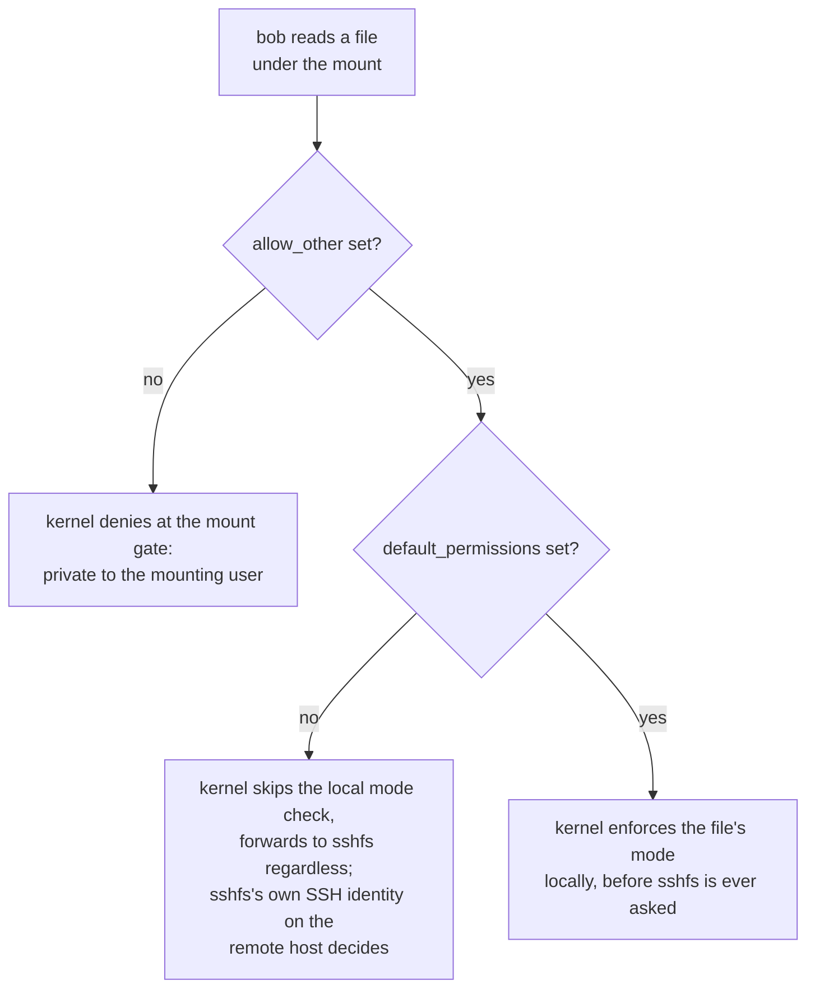

# Part 2 — Performance, Sharing & Unmounting

> Prerequisite: [Part 1 — SSHFS and the FUSE Mechanism](./course-01-sshfs-and-fuse.md). Next: [Module landing page](./course.md).

Part 1 established the request/reply relay every SSHFS operation makes through `/dev/fuse` and out over SSH. This part covers what that relay costs, who else on the local machine can walk through it, and how to take a mount back down.

## Why SSHFS is slow for many small files

Every VFS call your program makes — not every *file*, every `open`, `read`, `write`, `close` — becomes one message on `/dev/fuse`, one context switch into the `sshfs` process, and one network round trip to `srv`. Streaming one large file amortises that cost over a lot of data: a handful of round trips move megabytes. An operation like compiling a source tree, which does thousands of tiny `open`/`read`/`close` sequences — one full round trip *per file*, not per byte — pays that fixed per-call cost thousands of times over, and crawls regardless of how fast the network itself is. Use SSHFS for ad-hoc access and light editing; use NFS (the next module) or a local copy for anything throughput-sensitive or file-count-heavy.

## Who can see the mount: `allow_other`

By default a FUSE mount is readable only by the user who created it — the kernel checks this once, for the mount as a whole, before a request is even packaged for `/dev/fuse`. You ran `sshfs`, so only you can enter `~/remote`; every other local user, including `bob`, gets "Permission denied" straight from the kernel — even for a harmless directory listing, and even though the files themselves might be world-readable on `srv`. This is a deliberate safety default: it stops one user from handing every other account on the box a path into a remote host that only the mounting user was authenticated to reach.

To let other local users and service accounts into the mount, add `-o allow_other`. On most systems this also requires a one-time root opt-in: the line `user_allow_other` in `/etc/fuse.conf` (already set in the playground) — without it, an unprivileged user's `-o allow_other` is silently refused by the FUSE kernel module itself.

> [!TIP]
> **Try it — the private-by-default rule, then open it up**
>
> On `client`, with the mount from Part 1's checkpoint still active:
>
> ```sh
> sudo -u bob ls ~/remote
> fusermount -u ~/remote
> sshfs -o allow_other srv:/srv/logs ~/remote
> sudo -u bob ls ~/remote
> ```
>
> (`~/remote` expands to your login user's home before `sudo` runs, so `bob` is being pointed at *your* mount point.)
>
> Expect something like:
>
> ```text
> ls: cannot access '/home/ubuntu/remote': Permission denied
>
> (after remounting with allow_other:)
> access.log  app.log  secret.txt
> ```
>
> As user `bob`, the first `ls` fails even though the directory listing itself is harmless — the mount is private to you, the user who ran `sshfs`. After remounting with `-o allow_other`, `bob` can list it. The `mount` line now includes `allow_other` in its options.

## Where permissions are enforced: `default_permissions`

`allow_other` only relaxes the mount-wide gate from the previous section — it says nothing about individual file modes. Without `default_permissions`, the local kernel does **not** consult each file's mode when a request comes in; it forwards the request to `sshfs` regardless, and `sshfs` reads whatever the remote server lets *it* read — because `sshfs` connects to `srv` as whoever ran it, here your login user.

So with `-o allow_other` alone, local user `bob` reading `secret.txt` succeeds: the local kernel does not check the `600` mode before forwarding the request, and the `sshfs` process is connected to `srv` as your login user, who *owns* `secret.txt` there and *can* read it. The permission check that would normally stop `bob` never runs on this machine at all.

Adding `-o default_permissions` tells the local kernel to enforce the file modes it sees — from the remote `stat` data FUSE has already cached — before the request is ever packaged for `sshfs`. Now `bob` reading a `600` file owned by your user is denied locally, matching what you would expect from the permission bits, without a message ever crossing `/dev/fuse`.



> [!TIP]
> **Try it — flip where the check happens**
>
> On `client`:
>
> ```sh
> sudo -u bob cat ~/remote/secret.txt
> fusermount -u ~/remote
> sshfs -o allow_other,default_permissions srv:/srv/logs ~/remote
> sudo -u bob cat ~/remote/secret.txt
> ```
>
> Expect something like:
>
> ```text
> credentials: hunter2
>
> (after remounting with default_permissions:)
> cat: /home/ubuntu/remote/secret.txt: Permission denied
> ```
>
> Same file, same user, opposite result. Without `default_permissions` the `600` mode was never checked locally and the `sshfs` process — connected to `srv` as your login user, which owns the file there — happily read it for `bob`. With `default_permissions`, the local kernel applied the mode and stopped `bob` before a FUSE request was even sent.

## Unmounting

You mounted as your normal user, so detach it with `fusermount` — the FUSE **mount** helper; `-u` **u**nmounts — which does not need root, for the same reason mounting didn't:

```sh
fusermount -u ~/remote
```

`umount` works too, but as a system call it needs root:

```sh
sudo umount ~/remote
```

Either way, a "target is busy" error means something still has the mount open — the same diagnosis (`lsof +D`, `fuser -mv`, `cd` out of the directory) as for a local disk applies, because it is the same VFS-level busy-mount mechanism regardless of what sits behind the mount.

> [!WARNING]
> **Common pitfalls**
>
> - **Expecting others to see your mount.** A FUSE mount is private to the mounting user unless you pass `-o allow_other` *and* `/etc/fuse.conf` contains `user_allow_other`. Missing either one keeps everyone else locked out at the mount gate.
> - **Assuming `allow_other` also enforces file permissions.** It does not. Without `default_permissions`, the local kernel skips per-file mode checks entirely and the `sshfs` process's own remote access decides what is readable. Add `default_permissions` when you want the mode bits honoured locally.
> - **Using SSHFS for build trees or databases.** The per-call context switch plus network round trip makes many-small-file workloads extremely slow — it scales with call count, not data volume. It is an ad-hoc tool.
> - **Reaching for `sudo umount` out of habit.** These mounts are non-root; `fusermount -u <dir>` takes them down without `sudo`. `umount` still works but needs root.
> - **Leaving stale mounts after the remote host goes away.** If `srv` disappears, the mount can hang on access — every call is still waiting on a FUSE reply that will never arrive. Unmount it (`fusermount -u`, add `-z` for a lazy detach if it resists) rather than leaving processes stuck on it.

> *Every SSHFS behaviour in this module falls out of one fact: the kernel never talks to the remote host directly, it only ever relays through `/dev/fuse` to a user-space process — which is why the mount is unprivileged, why it's slow per-call rather than per-byte, and why "who can see it" and "who gets checked" are two separate, independently-set questions.*

## Reference

- `man fusermount3` — the non-root mount/unmount helper and its `-z` (lazy unmount) option.
- `man sshfs` — `-o allow_other` and `-o default_permissions`, covered above, plus reconnect and caching options worth knowing for a flaky link.
