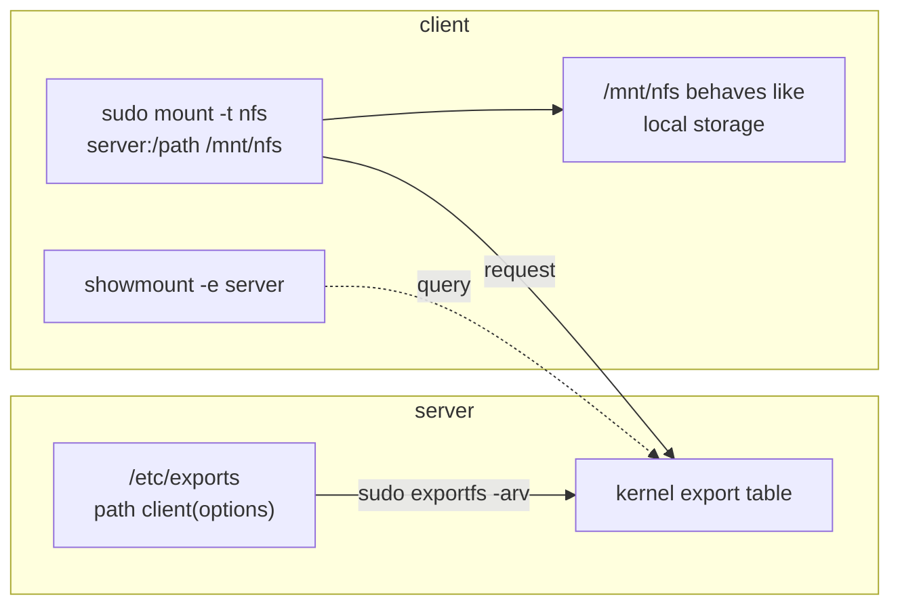

# Part 1 — Client-Server Model & Exports

> Prerequisite: [Module landing page](./course.md). Next: [Part 2 — Mounting, Read-Only & a Down Server](./course-02-mounting-readonly-and-server-down.md).

This part settles the server half of NFS: what an export actually is, the RPC machinery that makes one reachable, and the options that decide who gets in and how durable a write is. Part 2 covers the client's side of the same exchange.

## The client-server model

> As an analogy: NFS is a warehouse with a loading dock. The warehouse manager posts a list of which bays are open and which delivery companies may use them (`/etc/exports`); a truck that is on the list backs up to a bay and works directly from the shelves (`mount`). The analogy breaks down because an NFS client sees the files as an ordinary part of its own directory tree, not as a separate "remote" place — programs cannot tell the difference.

The server names directories it is willing to share and restricts each to specific clients. A client checks what is on offer, then mounts a share into its own tree. From then on the mounted path behaves like local storage.



The rest of this module walks each half of that picture: writing and applying the export (below), then discovering and mounting it (Part 2).

Underneath both halves, NFS speaks **RPC** — Remote Procedure Call, Sun's original mechanism for calling a function on another machine as if it were local. Three daemons cooperate on the server: **`rpcbind`** is a directory of RPC services and the ports they're currently listening on (RPC services don't use fixed ports the way HTTP uses 80); **`nfsd`** is the kernel-side worker that actually serves file data; **`rpc.mountd`** handles the initial `mount` handshake — checking the client against `/etc/exports` and handing back a file handle — after which the client talks to `nfsd` directly for every read and write. This is why `rpcbind` has to be up *before* `mountd` can register itself, and why a client mount can fail with "RPC: Unable to receive" if `rpcbind` restarted without the other two re-registering.

## The server side: `/etc/exports`

Each line of `/etc/exports` is one exported path, followed by one or more `client(options)` groups with **no space** between the client and its parenthesised options. A representative line:

```text
/nfs/share   10.10.20.0/24(ro,sync,no_subtree_check)
```

This offers `/nfs/share` to any host in `10.10.20.0/24`, read-only. The options:

- **`ro` / `rw`** — read-only (the default) or read-write. `ro` is the safe choice unless clients genuinely need to write.
- **`sync` / `async`** — with `sync` (the modern default), the server acknowledges a write only after the data is on stable storage, so a server crash cannot silently lose an acknowledged write. `async` replies before the data is durable: faster, but a crash can lose data the client believes was saved.
- **`no_subtree_check`** — when you export a subdirectory of a larger filesystem, subtree checking makes the server verify on each request that the file still sits inside the exported subtree, which breaks awkwardly when files are renamed. `no_subtree_check` disables that. It is the default in current `nfs-utils`; naming it explicitly just documents intent and silences a startup warning.

The server does not re-read `/etc/exports` automatically. Apply changes with `exportfs` — **export f**ile**s**ystems, the tool that maintains the kernel's in-memory table of active exports (the `TAB` in the diagram above, which is what `mountd` actually consults on each mount request, not the file):

```sh
sudo exportfs -arv
```

`-a` processes all entries, `-r` re-syncs the running state to the file (adding new exports, dropping removed ones), `-v` prints what happened.

> [!TIP]
> **Try it — declare and apply an export**
>
> On `server`:
>
> ```sh
> echo '/nfs/share  10.10.20.0/24(ro,sync,no_subtree_check)' | sudo tee -a /etc/exports
> sudo exportfs -arv
> sudo exportfs -v
> ```
>
> Expect something like:
>
> ```text
> exporting 10.10.20.0/24:/nfs/share
>
> /nfs/share    10.10.20.0/24(ro,wdelay,root_squash,no_subtree_check,sec=sys,ro,secure,...)
> ```
>
> `exportfs -arv` reports it exported the path; `exportfs -v` then lists it in the active kernel table with the options the server actually applied (it fills in defaults like `root_squash`, which maps a client's root to an unprivileged user — the export existing in the file means nothing to a client until this table has it).

> *An export only exists to a client once it's in the kernel's in-memory table — `/etc/exports` is just the file `exportfs -r` reads to build that table, which is why editing the file alone changes nothing.*

## Reference

- `man exports` — the full `/etc/exports` option list, including `root_squash`/`no_root_squash` and `all_squash`.
- `man rpcinfo` — `rpcinfo -p localhost` lists every RPC service currently registered with `rpcbind`, useful for confirming `mountd`/`nfsd` actually registered after a restart.
