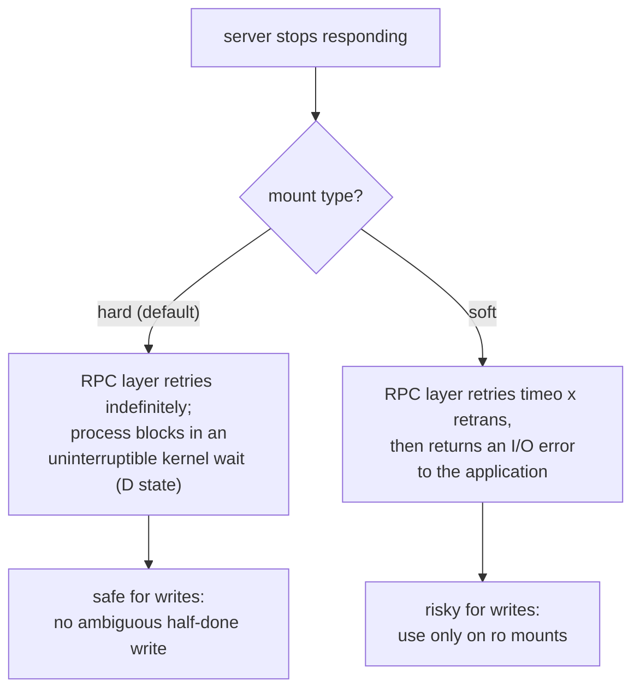

# Part 2 — Mounting, Read-Only & a Down Server

> Prerequisite: [Part 1 — Client-Server Model & Exports](./course-01-client-server-and-exports.md). Next: [Module landing page](./course.md).

Part 1 built the export and put it in the server's kernel table. This part covers the client half: finding what's on offer, mounting it, what a read-only export actually enforces, and — the option that matters most in an outage — what happens to a client when the server stops answering.

## The client side: discover, then mount

Before mounting, ask the server what it exports and to whom with `showmount -e <server>` — `showmount` reports what an NFS server is sharing, and `-e` narrows that to the **e**xport list. This is a direct RPC query against `mountd`, the same daemon that will handle the actual mount request — so a successful `showmount` is also a decent sanity check that the RPC stack (Part 1) is up. If your client's address is covered and the path is listed, mount it with the standard `mount` command and `-t nfs`.

> [!TIP]
> **Try it — list the export and mount it**
>
> On `client`:
>
> ```sh
> showmount -e server
> sudo mount -t nfs server:/nfs/share /mnt/nfs
> df -h -t nfs4 -t nfs
> cat /mnt/nfs/report.txt
> ```
>
> Expect something like:
>
> ```text
> Export list for server:
> /nfs/share 10.10.20.0/24
>
> Filesystem            Size  Used Avail Use% Mounted on
> server:/nfs/share      15G  2.1G   12G  15% /mnt/nfs
> shared report from server
> ```
>
> `showmount -e` confirms the export and its allowed network. After `mount`, `/mnt/nfs` is part of the client's own tree — `df` shows it as a filesystem and `cat` reads a file straight from `server`, with every read now going directly to `nfsd` rather than back through `mountd`.

## Read-only means read-only

An `ro` export is enforced by the server. A client can mount it, read everything, and cannot create or modify files regardless of local permissions or `sudo` — the check happens in `nfsd` on `server`, not on the client, so no amount of client-side privilege changes it.

> [!TIP]
> **Try it — a write against a read-only export**
>
> On `client`, with `/mnt/nfs` mounted:
>
> ```sh
> sudo touch /mnt/nfs/newfile
> ```
>
> Expect something like:
>
> ```text
> touch: cannot touch '/mnt/nfs/newfile': Read-only file system
> ```
>
> The write is refused at the filesystem level. To allow writes you would change `ro` to `rw` in `/etc/exports` on `server`, re-run `sudo exportfs -arv`, and remount on the client.

## When the server goes away: `hard` vs `soft`

By default an NFS mount is **`hard`**: if the server stops responding, the client's RPC layer retries the request indefinitely, and any process touching the mount blocks in the kernel until the server returns. Such a process is usually unkillable, even with `kill -9`, because it is stuck in a kernel wait, not a user-space loop a signal can interrupt — the same "uninterruptible sleep" (`D` state in `ps`) you'd see waiting on a slow local disk. For data you cannot afford to have written incorrectly, this is the correct behaviour: the RPC call eventually completes once the server is back, rather than the client ever having to guess whether a write landed.

A **`soft`** mount changes that retry policy: the RPC layer gives up after `retrans` retries of `timeo` (tenths of a second) each, and returns an I/O error to the application instead of blocking forever. The system stays responsive, but a `soft` mount can let a write's RPC call time out with the write actually having landed on the server (or not) — the client has no reliable way to know which, so it is advisable **only for read-only mounts**, where a failed retry just means "try the read again," not "did that write happen or not."

The old `intr` option (make operations interruptible by signals) is obsolete: since Linux 2.6.25 it is a no-op, because the kernel already lets fatal signals break a `hard` mount's wait. Do not rely on it. For a responsive read-only client, use `soft` with a modest `timeo` and `retrans`; otherwise keep the `hard` default.



> [!TIP]
> **Try it — set soft-mount options and read them back**
>
> On `client`:
>
> ```sh
> sudo umount /mnt/nfs
> sudo mount -t nfs -o soft,timeo=30,retrans=2 server:/nfs/share /mnt/nfs
> mount | grep /mnt/nfs
> ```
>
> Expect something like:
>
> ```text
> server:/nfs/share on /mnt/nfs type nfs4 (rw,relatime,vers=4.2,...,soft,...,timeo=30,retrans=2,...)
> ```
>
> The option string now shows `soft`, `timeo=30`, and `retrans=2`. This playground does not sever the network, so you will not see the I/O-error behaviour itself — but with these options a dead `server` would make the RPC layer give up and reads fail after roughly `timeo × retrans` tenths of a second instead of blocking forever.

> [!WARNING]
> **Common pitfalls**
>
> - **A space between the client and its options.** `/nfs/share 10.10.20.0/24 (rw)` (with a space) is parsed as "export to `10.10.20.0/24` with defaults, and also to *any* host with `rw`". Write `10.10.20.0/24(rw)` with no space.
> - **Editing `/etc/exports` and expecting it to take effect.** Nothing happens until `sudo exportfs -arv` (or an NFS server restart) rebuilds the kernel's export table from it. Removing a line likewise needs `-r` to actually withdraw the export.
> - **Using `async` for convenience.** It trades durability for speed; an acknowledged write can vanish in a server crash. Keep `sync` unless you have measured the need and accept the risk.
> - **`soft` on a read-write mount.** A timed-out write leaves the client unable to tell whether it landed — repeating it can duplicate data, not repeating it can lose it. Use `soft` only for `ro` mounts; use the `hard` default for anything writable.
> - **Reaching for `intr`.** It has done nothing since Linux 2.6.25. Fatal signals already interrupt `hard`-mount waits; for responsiveness tune `soft`/`timeo`/`retrans` instead.

> *`hard` versus `soft` is really a choice about what the client's RPC layer is allowed to give up on — and because NFS gives no way to ask "did my last write actually happen," giving up is only safe when nothing was being written.*

## Reference

- `man nfs` — the full mount-option list, including `timeo`/`retrans` defaults and the version-specific (`vers=3` vs `vers=4`) behaviour differences.
- `man showmount` — `-a` for currently-mounted clients as the server sees them, useful when auditing who is actually connected.
