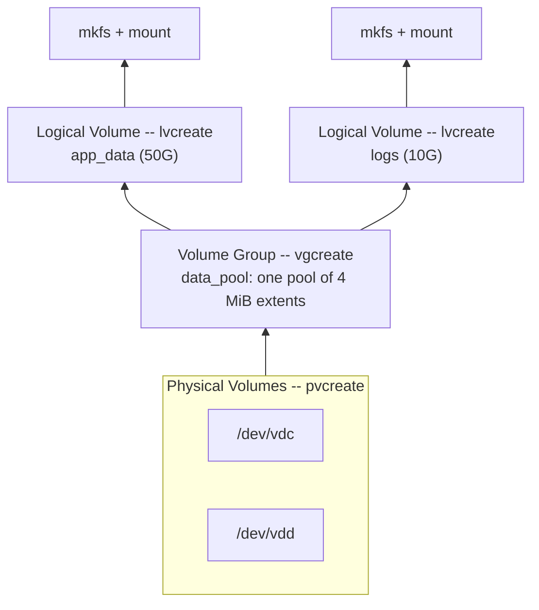

# Part 1 — Why LVM & the Three-Layer Model

> Prerequisite: [Module landing page](./course.md). Next: [Part 2 — Physical Volumes & Volume Groups](./course-02-pv-and-vg.md).

A plain partition is a fixed byte range on one disk — resizing it means either shrinking a neighbor (if one exists and has room) or copying everything to bigger hardware. This part covers what LVM inserts between disks and filesystems to remove that rigidity, and names the three layers every later command operates on.

## The problem a partition table cannot solve

A partition table describes byte ranges directly on physical disk geometry: partition 2 starts here, is this many sectors long, ends there. That description is baked into the disk the moment you write it. Two consequences follow directly from that fact, not from any particular tool's limitation:

- **A partition cannot outgrow its disk.** There is nowhere else for the extra sectors to come from — the partition table only knows about the one disk it lives on.
- **Moving a partition's data to different physical disks means copying it.** The byte range *is* the identity; there's no layer of indirection to redirect without physically relocating the bytes.

> As an analogy: a plain partitioned disk is a building with poured concrete interior walls — the floor plan is fixed at construction time. LVM is the same building fitted out with modular cubicle partitions: the same floor space, but a wall moves next week without demolition. The analogy breaks down because LVM can also *add more floor space* by absorbing another disk into the pool — no amount of rearranging cubicles in one fixed building achieves that.

LVM fixes both problems the same way most abstraction layers do: by adding a level of indirection. Instead of a filesystem sitting directly on a partition's byte range, it sits on a logical volume — a name that LVM maps to wherever the underlying bytes actually are, and can remap without the filesystem ever noticing.

## The three layers

LVM stacks three layers, each built from the one below:

```text
  Logical Volumes    app_data (50G)   logs (10G)      <- format & mount these
  ------------------------------------------------
  Volume Group       data_pool  (one pool of extents)
  ------------------------------------------------
  Physical Volumes   /dev/vdc   /dev/vdd             <- initialised disks/partitions
```

- A **physical volume (PV)** is a whole disk or a partition that you have marked for LVM use.
- A **volume group (VG)** is one or more PVs pooled into a single space.
- A **logical volume (LV)** is a slice carved out of a VG. It appears as a block device you format and mount; it does not have to fit on any single physical disk.



Concretely: with LVM you can start a database volume at 50 GB, and when it approaches full, add a new disk to the pool and grow the volume — and the filesystem on top of it — in a few seconds, with the database still running. Every remaining part of this module (and all of the next module, *Advanced LVM Operations*) is really about one underlying structure that makes this possible.

## What actually makes the indirection work

The VG layer doesn't just group disks — it slices the pooled space into fixed-size chunks called **physical extents (PEs)**, 4 MiB each by default, and an LV is not a byte range at all. It is **a list of extent assignments**: `(this PV, extent N) → (this LV, extent M)`, one entry per extent the LV owns. At activation time, the kernel's **device-mapper** subsystem reads that list and builds a virtual block device that stitches the assigned extents into one linear address space — regardless of which physical disk each extent actually sits on.

That's the whole trick. A filesystem written on top only ever sees one contiguous device; it has no way to ask "which physical disk is byte X really on" and no reason to. LVM is free to move, relocate, or add extents to the underlying list, and the filesystem's view never changes shape.

This module (Parts 2–3) covers building that stack up for the first time: creating PVs, pooling them into a VG, and carving out an LV. The *Advanced LVM Operations* module that follows covers editing an already-built stack live — moving extents between disks, growing, and shrinking — which is the exact same list-of-assignments mechanism, just edited after the fact instead of built fresh.

> *A logical volume is not a place on disk — it's a list of extent assignments that device-mapper turns into one virtual disk. Every LVM command in this module and the next is either building that list or editing it.*

## Reference

- `man lvm` — the top-level man page defining PV/VG/LV/PE terminology, and the full command index by layer.
- `man dmsetup` — device-mapper's own inspection tool; `dmsetup table` on an active LV shows the raw extent-to-device mapping this part describes conceptually.
