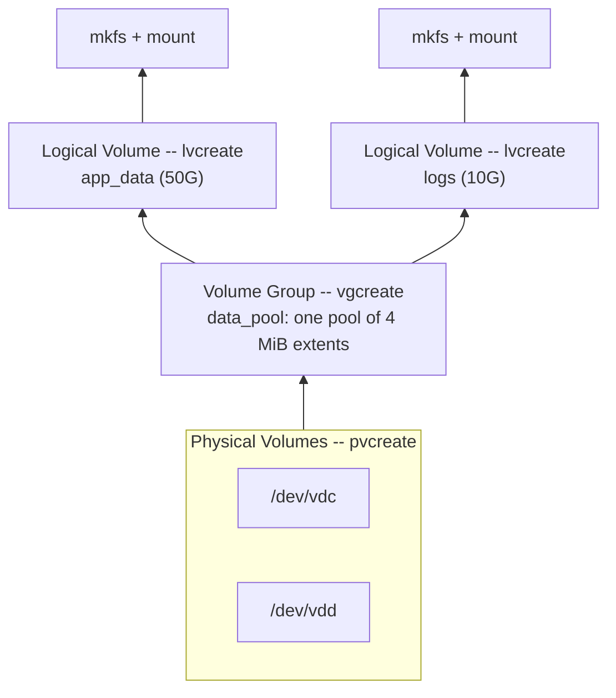

# LVM Fundamentals

<!-- astrona:playground -->
> [!NOTE]
> 🧪 **Hands-on playground for this module** — a clean, throwaway machine to explore on. No task, no grading. Folder: [`playground/`](https://github.com/astrona-io/ATS004/tree/main/sections/section-030/module-01/playground)
>
> ```sh
> astrona run --git ssh://git@github.com/astrona-io/ATS004.git -c sections/section-030/module-01/playground
> astrona destroy section-030-module-01-playground
> ```

A plain partition is welded to one disk at a fixed size. When it fills up, growing it means copying everything to a bigger disk and swapping mount points — usually with downtime. The Logical Volume Manager (LVM) removes that rigidity by inserting an abstraction layer between physical disks and the filesystems the OS mounts, so volumes can grow, shrink, and move across disks while they are in use.



## How this module is organised

1. **[Part 1 — Why LVM & the Three-Layer Model](./course-01-why-lvm-and-the-stack.md)** — what a partition table can't do, the PV/VG/LV stack, and the extent-list model that explains every command in this module and the next.
2. **[Part 2 — Physical Volumes & Volume Groups](./course-02-pv-and-vg.md)** — marking disks with `pvcreate`, and pooling them into an extent pool with `vgcreate`.
3. **[Part 3 — Logical Volumes](./course-03-logical-volumes.md)** — carving an LV with `lvcreate`, where the default allocator actually places its extents, and the module's pitfalls.

## Learning objectives

After this module you can:

- Explain the roles of a physical volume (PV), a volume group (VG), and a logical volume (LV), and how they stack.
- Describe an LV as a list of extent assignments that device-mapper replays into one virtual block device, and explain why that indirection is what a plain partition lacks.
- Initialise disks as PVs with `pvcreate` and inspect them with `pvs` / `pvdisplay`.
- Pool PVs into a VG with `vgcreate` and read its size and extent size with `vgs` / `vgdisplay`.
- Carve an LV from a VG with `lvcreate`, then format and mount it like a normal partition.
- State the default allocation policy and identify which physical disks an LV's extents actually live on with `lvs -o +devices`.

## Before you start

You should know how to format and mount a filesystem (`mkfs.ext4`, `mount`, `df`) from the earlier sections and be comfortable with `sudo`.

The linked playground gives you an Ubuntu server VM with passwordless `sudo`, the `lvm2` toolset installed, and **three spare 1 GB disks** — `/dev/vdc`, `/dev/vdd`, `/dev/vde` (also reachable by their stable serial names `/dev/disk/by-id/virtio-s30m01-a`, `…-b`, `…-c`) — that carry no LVM metadata and no filesystem. They are wiped on every boot. Connect to the VM with `astrona ssh astro-section-030-module-01-playground`, then run the command blocks in each part there.

A quick note on the disk names before you touch anything: `/dev/vda` is the system disk with the OS on it, and `/dev/vdb` is a tiny (~366 KiB) read-only disk the platform uses for boot configuration — leave both alone. Only `vdc`, `vdd`, and `vde` are yours to experiment with. Always run `lsblk` first and match on the serial column, not on the letter.
