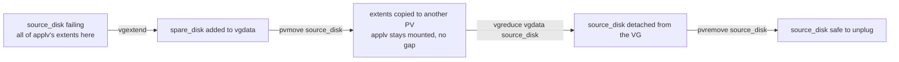

# Advanced LVM Operations

<!-- astrona:playground -->
> [!NOTE]
> 🧪 **Hands-on playground for this module** — a clean, throwaway machine to explore on. No task, no grading. Folder: [`playground/`](https://github.com/astrona-io/ATS004/tree/main/sections/section-030/module-02/playground)
>
> ```sh
> astrona run --git ssh://git@github.com/astrona-io/ATS004.git -c sections/section-030/module-02/playground
> astrona destroy section-030-module-02-playground
> ```

The previous module built an LVM stack. This one changes it while it is in use: moving a volume's data off a dying disk, pulling that disk out of the pool, and growing a volume and its filesystem — all with the filesystem mounted and applications writing to it.

These operations rewrite where real data lives. A wrong device name or a missing `+` sign destroys data. The commands are short; the care is in reading the current state first.



That is the whole module in one migration: extend, move, reduce, remove — and it is also the shape of every part below, because every one of those verbs is really just an edit to a single underlying structure: an LV's list of extent assignments.

## How this module is organised

1. **[Part 1 — The LVM Stack, Recapped & Reading State](./course-01-stack-and-state.md)** — the extent-list model that explains every command below; the `pv`/`vg`/`lv` command-naming pattern; reading `pvs`/`vgs`/`lvs -o +devices` before touching anything.
2. **[Part 2 — Live Migration: pvmove](./course-02-pvmove-migration.md)** — adding a spare disk with `vgextend`, and what `pvmove` actually does underneath (extent-by-extent mirror-and-repoint) to move data off a live, mounted volume with zero downtime.
3. **[Part 3 — vgreduce, and Growing/Shrinking a Volume](./course-03-vgreduce-lvextend.md)** — retiring an emptied disk with `vgreduce` + `pvremove`; growing a volume live with `lvextend`; shrinking one offline with `resize2fs` + `lvreduce`, in the order that doesn't destroy data; and why XFS cannot shrink at all.

## Learning objectives

After this module you can:

- Explain an LV as a list of extent assignments, and derive from that model why relocating, growing, and removing extents all work the way they do.
- Add a disk to a live volume group with `pvcreate` + `vgextend`.
- Evacuate all extents off a physical volume with `pvmove` while its volume stays mounted, and explain why the migration is crash-safe and resumable.
- Remove an emptied disk from a pool with `vgreduce` and clear its LVM label with `pvremove`, and state the exact condition `vgreduce` checks before it will allow removal.
- Grow a logical volume with `lvextend` and then grow the filesystem with `resize2fs` (ext4) or `xfs_growfs` (XFS), and explain why those are two separate steps.
- Explain why `lvextend -L 20G` and `lvextend -L +20G` are dangerously different.
- Shrink an ext4 logical volume with `e2fsck -f`, `resize2fs`, then `lvreduce` — in that order — and explain why reversing it destroys data.
- State why XFS supports no shrink path, on either the filesystem or the volume, unlike ext4.

## Before you start

This module builds directly on the previous one. Part 1 recaps the pieces you need — the three LVM layers, the physical extent, and the `pvs` / `vgs` / `lvs` inspection commands — but if none of those terms are familiar, read *LVM Fundamentals* first.

The linked playground gives you an Ubuntu server VM with a **pre-built stack**: volume group `vgdata` on two 1 GB disks, logical volume `applv` (400 MiB ext4) with all its extents on the first disk, mounted at `/mnt/applv` with sample files, and a third disk left raw as the replacement. The three disks' kernel names are written to `/etc/playground-disks` as `source_disk`, `second_disk`, `spare_disk` — read that file rather than assuming a `vdX` order, because the letters can shift between boots. Connect with `astrona ssh astro-section-030-module-02-playground` and run the command blocks in each part inside that VM.
