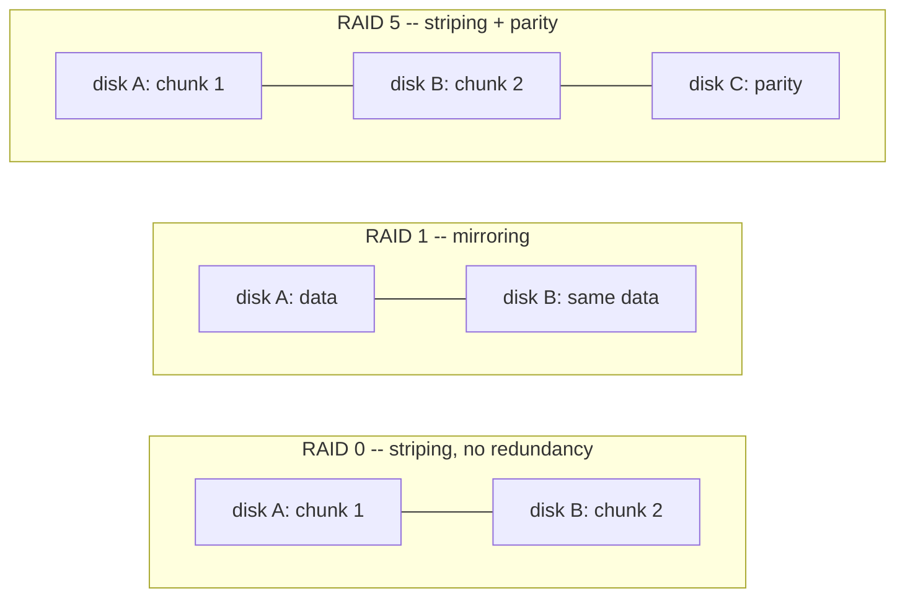

# Part 1 — RAID Levels

> Prerequisite: [Module landing page](./course.md). Next: [Part 2 — Creating & Persisting an Array](./course-02-creating-and-persisting.md).

Before creating anything, this part covers the bargain each RAID level makes between usable space, disk-failure tolerance, and minimum disk count — because that choice, made once at `mdadm --create` time, is expensive to change later.

## The four levels

Each level is a different bargain between usable space, how many disk failures it survives, and how many disks it needs.

| Level | Layout | Min disks | Usable capacity | Survives | Notes |
| --- | --- | --- | --- | --- | --- |
| **0** | striping | 2 | 100% | **nothing** | Fast. One disk dies, all data is gone. Not redundancy — the opposite. |
| **1** | mirroring | 2 | 50% (size of one disk) | 1 disk (any) | Simple, robust. Reads can be faster; writes go to every mirror. |
| **5** | striping + one parity block | 3 | (N−1) disks | 1 disk (any) | Good capacity/safety balance. Rebuilds are slow and stress the survivors. |
| **10** | mirrored pairs, then striped | 4 | 50% | 1 disk per mirror pair | Fast and redundant; costs half the raw capacity. |

"Survives 1 disk" means the array keeps serving data in a **degraded** state until you replace the failed disk and it rebuilds — covered in the next module, *RAID Maintenance and Recovery*. RAID is not a backup — it protects against a disk dying, not against deletion, corruption, or a fire.

## Why the minimum disk counts are what they are

These aren't arbitrary limits — each minimum falls straight out of what the layout needs geometrically to do what it claims:

- **RAID 0 needs 2** because striping across one disk is meaningless — there's nothing to stripe *with*.
- **RAID 1 needs 2** because a mirror of one disk isn't a mirror.
- **RAID 5 needs 3** because "N−1 disks of usable capacity, survives 1 failure" requires at least one disk's worth of space dedicated to parity *and* at least two disks' worth of actual data to make that parity meaningful — below 3 disks, RAID 5 degenerates into RAID 1.
- **RAID 10 needs 4** because it is mirrored pairs, then striped across the pairs — one pair is just RAID 1, so a second pair is required before there's anything to stripe across.

This also predicts the parity math for RAID 5 directly: with N disks, one disk's worth of every stripe is parity (computed as the XOR of the other N−1 blocks), so usable capacity is (N−1)/N of the raw total, and losing any single disk still leaves enough information — the surviving data blocks plus the parity block — to reconstruct what was on it.

As a picture, the layouts differ in what each disk actually holds:



> [!TIP]
> **Try it — the empty state**
>
> ```sh
> cat /proc/mdstat
> lsblk -dn -o NAME,SIZE
> ```
>
> Expect something like:
>
> ```text
> Personalities : [raid1] [raid6] [raid5] [raid10]
> unused devices: <none>
>
> vda   15G
> vdb    1G
> vdc    1G
> vdd    1G
> vde    1G
> ```
>
> `/proc/mdstat` lists the RAID levels the kernel can do and shows no arrays yet. The four 1 GB disks are the raw material Part 2 builds an array from.

> *Every RAID level's minimum disk count and usable-capacity fraction falls out of the same question: how many disks does this layout need before the redundancy math actually works?*

## Reference

- `man mdadm` — the `--level` values this module uses (`0`, `1`, `5`) plus `6` and others not covered here.
- `cat /proc/mdstat` — always available, no man page; the fastest way to check what levels a running kernel supports and what arrays currently exist.
