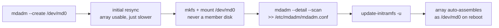

# Software RAID Fundamentals

<!-- astrona:playground -->
> [!NOTE]
> 🧪 **Hands-on playground for this module** — a clean, throwaway machine to explore on. No task, no grading. Folder: [`playground/`](https://github.com/astrona-io/ATS004/tree/main/sections/section-030/module-03/playground)
>
> ```sh
> astrona run --git ssh://git@github.com/astrona-io/ATS004.git -c sections/section-030/module-03/playground
> astrona destroy section-030-module-03-playground
> ```

RAID (Redundant Array of Independent Disks) combines several disks into one block device that is faster, or fault-tolerant, or both — depending on the layout you choose. Linux does this in software with the kernel's `md` (multiple devices) driver, managed by the `mdadm` command. The result, `/dev/md0`, is used exactly like any other disk: partition it, put a filesystem on it, mount it.

This module covers the common RAID levels and what each trades away, creating an array with `mdadm`, putting a filesystem on it, and the configuration step that makes the array reassemble itself at boot.



## How this module is organised

1. **[Part 1 — RAID Levels](./course-01-raid-levels.md)** — the capacity/redundancy/minimum-disk bargain each level makes, and why those minimums are what they are.
2. **[Part 2 — Creating & Persisting an Array](./course-02-creating-and-persisting.md)** — `mdadm --create`, what a RAID superblock actually records, putting a filesystem on the array, and making it survive a reboot.

## Learning objectives

After this module you can:

- Describe RAID 0, 1, 5, and 10 in terms of capacity, redundancy, and minimum disks, and derive each minimum from the layout's geometry.
- Create an array with `mdadm --create` and read its state from `/proc/mdstat` and `mdadm --detail`.
- Explain what a RAID superblock stores per member disk, and why that lets `mdadm` detect a stale disk.
- Put a filesystem on the array device and mount it.
- Persist an array with `/etc/mdadm/mdadm.conf` and an initramfs update, and explain why both are needed.

## Before you start

You should know how to create and mount a filesystem (`mkfs.ext4`, `mount`) and identify disks with `lsblk`.

The linked playground gives you an Ubuntu server VM with `mdadm` installed and **four raw 1 GB spare disks** (commonly `/dev/vdb`–`/dev/vde`), wiped on every boot. Run the command blocks in each part below in that VM after `astrona ssh section-030-module-03-playground`.
