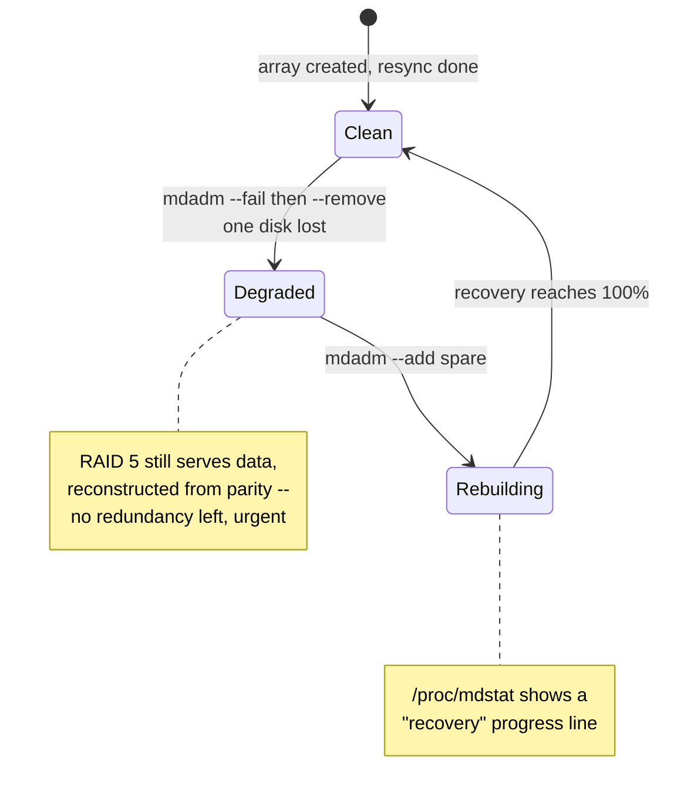

# Part 1 — Reading Health and Handling a Failure

> Prerequisite: [Module 4 overview](./course.md). Next: [Part 2 — Growing an Array and Getting Notified](./course-02-growth-and-monitoring.md).

Before you can fix a degraded array you need to recognise one, and know exactly what "degraded" costs you while you fix it. This part covers reading `/proc/mdstat` and `mdadm --detail`, marking a member failed and removing it, and adding a replacement — the fail → remove → add → rebuild cycle that is the entire reason RAID exists.



## Reading array health

Two views. `/proc/mdstat` is the quick status: the level, the member list, and a bracket map like `[UUU]` — one character per device, `U` for up, `_` for missing. `mdadm --detail /dev/md0` is the full report: state, per-device role and status, and rebuild progress.

> [!TIP]
> **Try it — the healthy baseline**
>
> ```sh
> cat /proc/mdstat
> sudo mdadm --detail /dev/md0 | grep -E 'State|Devices|Rebuild'
> cat /mnt/raid/data.txt
> ```
>
> Expect something like:
>
> ```text
> md0 : active raid5 vdd[3] vdc[1] vdb[0]
>       2093056 blocks super 1.2 level 5, 512k chunk, algorithm 2 [3/3] [UUU]
>
>              State : clean
>      Raid Devices : 3
>     Total Devices : 3
>     Active Devices : 3
>   Working Devices : 3
>    Failed Devices : 0
>
> critical dataset row 1
> ```
>
> `[3/3] [UUU]` and `State : clean` — all three members up, RAID 5 giving ~2 GB usable (two disks' worth; the third holds parity, distributed). The data file reads normally.

## What "degraded" actually costs you

"Degraded" is not a single behaviour — it means something different depending on the level, because each level reads data back a different way:

- **RAID 1 degraded** — the mirror lost a copy. Reads just go to whichever disk is still up; there is no extra work, only less safety margin.
- **RAID 5 degraded** — a disk is gone, so every read that touches a block on the missing disk cannot come from disk at all. It has to be reconstructed: `mdadm` XORs together the corresponding blocks on every surviving disk (data and parity alike) to recompute the missing one, on the fly, for every single access. That reconstruction is why a degraded RAID 5 array is measurably slower, and why it has **zero** remaining redundancy — the parity block that would let it survive a *second* failure has just been consumed reconstructing the first.

This is the mechanical reason "replace promptly" is not just good hygiene: a degraded RAID 5 array is one more failure away from total data loss, with no math left to fall back on.

## Failing and removing a disk

When a disk throws errors, `mdadm` often marks it failed on its own. You can also do it manually — before pulling a disk for replacement, or to test. `mdadm --manage /dev/md0 --fail <device>` marks a member faulty; the array immediately drops to **degraded**: still serving data (RAID 5 tolerates one loss), but with no remaining redundancy. `--remove` then detaches the failed member so a new one can take its slot.

Underneath, each member disk carries a **RAID superblock** — metadata naming the array and recording which numbered "role slot" that disk fills (member 0, member 1, …). `--fail` flips a status bit in that bookkeeping without touching the slot; `--remove` frees the slot so `--add` can hand it to a new disk.

> [!TIP]
> **Try it — degrade the array on purpose**
>
> ```sh
> . /etc/playground-raid
> sudo mdadm --manage /dev/md0 --fail "$member2"
> cat /proc/mdstat
> sudo mdadm --manage /dev/md0 --remove "$member2"
> cat /mnt/raid/data.txt
> ```
>
> Expect something like:
>
> ```text
> md0 : active raid5 vdd[3] vdc[1](F) vdb[0]
>       2093056 blocks ... [3/2] [U_U]
>
> critical dataset row 1
> ```
>
> `(F)` marks the failed member and the map is now `[U_U]` — `[3/2]`, one device short. The file still reads: RAID 5 reconstructs the missing data from parity on the fly (see above). This is the window where a *second* failure would lose everything, so replacement is urgent.

## Adding a replacement and rebuilding

`mdadm --manage /dev/md0 --add <device>` puts a fresh disk into the empty slot. `md` immediately starts a **rebuild**: reading every surviving disk and computing what belonged on the new one — the same XOR reconstruction described above, but this time it writes the result to the new disk instead of just handing it to a reader. `/proc/mdstat` shows a `recovery` progress line. The array stays usable throughout, just slower and still degraded until the rebuild completes.

> [!TIP]
> **Try it — replace and watch the rebuild**
>
> ```sh
> . /etc/playground-raid
> sudo mdadm --manage /dev/md0 --add "$spare"
> cat /proc/mdstat
> sudo mdadm --detail /dev/md0 | grep -E 'State|Rebuild'
> ```
>
> Expect something like:
>
> ```text
> md0 : active raid5 vde[4] vdd[3] vdb[0]
>       2093056 blocks ... [3/2] [U_U]
>       [=====>...............]  recovery = 27% (280000/1046528) finish=0.4min ...
>
>              State : clean, degraded, recovering
> ```
>
> The spare (`vde` here) joined as device 4 and the `recovery` line is climbing. When it reaches 100%, the map returns to `[UUU]` and `State` goes back to `clean`. On a real multi-terabyte array this takes hours and hammers the surviving disks — which is why a second failure during a RAID 5 rebuild is a classic way to lose an array.

> [!WARNING]
> **Common pitfalls — health and failure**
>
> - **`--fail` on a non-redundant array.** `--fail` a member of a RAID 0, or the *second* member of a degraded RAID 5, and the array is dead. `--fail` is only safe while redundancy remains.
> - **Not replacing a failed disk promptly.** A degraded array has no safety margin, for the mechanical reason above: RAID 5 has already spent its parity reconstructing the first loss. The rebuild window and the "waiting for a replacement" window are both times a second failure is fatal.
> - **Re-adding a disk that still has its old superblock.** Its role-slot metadata from a previous array will confuse the reassembly. Run `mdadm --zero-superblock <device>` before `--add`, or it may be misidentified.

> *Degraded means the parity math is already spent — the priority is always getting a replacement in, not admiring the array's ability to limp along.*

## Reference

- `man mdadm` — the `--manage` mode options (`--fail`, `--remove`, `--add`) are documented under "For managing/modifying an array".
- `man md` — the kernel driver's man page; the "SCRUBBING AND MISMATCHES" and "RAID5" sections explain the parity mechanics referenced above in more detail than mdadm's own docs.
