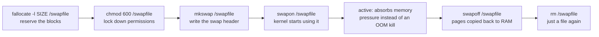

# Part 2 — Allocating, Activating & Deactivating a Swap File

> Prerequisite: [Part 1 — What Swap Is & Checking What You Have](./course-01-what-swap-is-and-checking-it.md). Next: [Module landing page](./course.md).

Part 1 covered why the kernel swaps. This part is the mechanical lifecycle: turn an ordinary file into something the kernel will use as swap, activate it, and take it back out again — the same four commands in the landing page's diagram, one section each.

## Allocating and securing the file

A swap file is an ordinary file whose blocks the kernel uses as swap. `fallocate -l <size> <path>` reserves the space by asking the filesystem to mark the blocks as allocated on disk, without writing zeros to them — near-instant on ext4 and XFS, because it is a metadata operation (extent allocation), not a data-copy one. This matters for swap specifically: a *sparse* file (blocks not yet allocated, filled with holes) would force the filesystem to allocate storage on the first write to each page — exactly the kind of latency spike swap exists to avoid. `fallocate` guarantees the blocks are real and contiguous-ish before the kernel ever needs them under memory pressure. (On Btrfs a `fallocate`d file is unsuitable for swap for a related reason — Btrfs's copy-on-write semantics mean a page's physical location can move under it, which the swap subsystem cannot tolerate; there you need a specific procedure with `chattr +C` to disable COW on the file first. The playground's root filesystem is ext4, so plain `fallocate` is fine.)

The permissions matter. When the kernel swaps a page out, it writes the raw contents of memory — which can include passwords and keys — into the file. If any user can read the swap file, they can read those secrets off disk. Set the file to mode `600` (owner read/write only, and the owner is root) before activating it. `swapon` will warn about "insecure permissions" on a world-readable file and still activate it, so the check is on you.

> [!TIP]
> **Try it — allocate, then lock it down**
>
> ```sh
> sudo fallocate -l 512M /swapfile
> ls -lh /swapfile
> sudo chmod 600 /swapfile
> ls -l /swapfile
> ```
>
> Expect something like:
>
> ```text
> -rw-r--r-- 1 root root 512M Aug 29 12:00 /swapfile
> -rw------- 1 root root 512M Aug 29 12:00 /swapfile
> ```
>
> The file is 512 MiB immediately (no long `dd` wait, because `fallocate` allocated the extents without writing them). After `chmod 600` the permission string is `-rw-------`: only root can read it, so pages written there are not exposed.

## Formatting and activating



`mkswap <path>` does not write a filesystem — it writes a **swap header**: a fixed-format signature (`SWAPSPACE2`), a randomly generated UUID identifying this swap area, the page size the kernel that formatted it uses, and a bitmap of usable pages. That header is the entire reason a swap area is not "just a file with data in it" — it is what lets `swapon` recognise the file as swap-formatted rather than accidentally activating an arbitrary file. `swapon <path>` reads that header, validates the signature and page-size match the running kernel's, and — if it passes — registers the area with the kernel's swap subsystem. Both need root.

> [!TIP]
> **Try it — format, activate, and confirm**
>
> ```sh
> sudo mkswap /swapfile
> sudo swapon /swapfile
> swapon --show
> free -h
> ```
>
> Expect something like:
>
> ```text
> Setting up swapspace version 1, size = 512 MiB (536866816 bytes)
> no label, UUID=1b9e...c4
>
> NAME      TYPE SIZE USED PRIO
> /swapfile file 512M   0B   -2
>
>                total        used        free      shared  buff/cache   available
> Swap:          512Mi          0B       512Mi
> ```
>
> `swapon --show` now lists `/swapfile`, and `free` shows a 512 MiB swap total. `PRIO -2` is the automatic priority; Module 2 covers setting it deliberately. If RAM now fills, idle pages go here instead of triggering the OOM killer.

## Deactivating

`swapoff <path>` stops the kernel using that area. It first copies every page currently in the swap file back into RAM, so it needs enough free RAM (plus other swap) to hold that data — on a memory-starved system `swapoff` can be slow or fail with "Cannot allocate memory": there is nowhere to put the pages it is trying to reclaim. Once it succeeds, the file is just a file again — the swap header is still physically there, but nothing is registered with the kernel to read it as one — and you can delete it.

> [!TIP]
> **Try it — turn it off and clean up**
>
> ```sh
> sudo swapoff /swapfile
> swapon --show
> sudo rm /swapfile
> free -h
> ```
>
> Expect something like:
>
> ```text
> (swapon --show prints nothing again)
>
> Swap:             0B          0B          0B
> ```
>
> `swapoff` removed `/swapfile` from the active list and `free` shows swap back at zero. Because almost nothing was in swap, the copy-back was instant; on a busy system this step can take a while.

> [!WARNING]
> **Common pitfalls**
>
> - **World-readable swap.** A swap file that skips `chmod 600` exposes swapped-out memory — including secrets — to any local user. `swapon` only warns, it does not stop you.
> - **`fallocate` on the wrong filesystem.** On Btrfs a `fallocate`d file will not work as swap (`swapon` fails) because of copy-on-write. Use ext4/XFS, or Btrfs's dedicated `chattr +C` procedure.
> - **Expecting the swap file to survive a reboot.** `swapon /swapfile` is not persistent. It must be added to `/etc/fstab` (next module) to come back automatically.
> - **`swapoff` on a system under memory pressure.** It has to pull all swapped pages back into RAM. If they do not fit, it fails and the swap stays active. Free memory first, or add other swap.
> - **Treating swap as extra RAM.** Heavy, constant swapping ("thrashing") makes a system crawl — every page fault now costs a disk read. Swap absorbs spikes; it does not fix a chronic RAM shortage.

> *`mkswap` writes a header, not a filesystem — that header is the only thing separating "a file `swapon` will use" from "a file `swapon` will refuse."*

## Reference

- `man mkswap` / `man swapon` / `man swapoff` — exact flags, including `mkswap -L` for a label and `swapon -p` for priority (Module 2).
- `man 8 fallocate` — allocation semantics and filesystem support notes.
