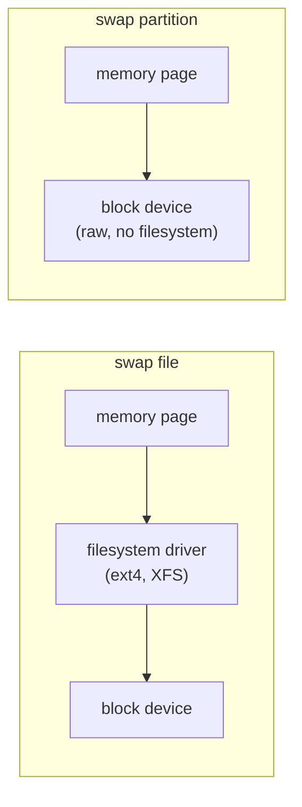

# Part 1 — Partition vs File & Creating the Partition

> Prerequisite: [Module landing page](./course.md). Next: [Part 2 — Formatting, Priorities & Persistence](./course-02-formatting-priorities-persistence.md).

Module 1 built a swap file — quick, but every page it handles passes through the filesystem driver on its way to disk. This part covers the alternative that skips that layer, and how to build one.

## Partition vs file

> As an analogy: a swap file is a drawer inside a shared filing cabinet — you reach it through the cabinet's mechanism. A swap partition is a chute in the floor that drops straight to the basement. Fewer moving parts in the path. The analogy breaks down because the real difference is modest on SSDs; the filesystem overhead of a swap file matters most on slow spinning disks and heavily loaded systems.

A swap partition is any block device set aside for swap: a physical partition like `/dev/vdb1`, or an LVM logical volume like `/dev/mapper/vg-swap`. You do **not** put a filesystem on it — `mkswap` writes a swap header directly onto the device, the same header format Module 1 covered, just landing on raw sectors instead of file blocks. The layer a swap file adds — and a partition skips — is the filesystem driver sitting between the page and the block device:



Concretely, that missing layer means: no extent lookup to translate a file offset into a physical block, no filesystem journal to update, no page-cache bookkeeping for the file itself. For a machine's baseline swap capacity — the amount you expect to use routinely, not just in an emergency — a partition (or LVM volume) is the standard choice; a swap file is the fast, no-repartitioning add-on Module 1 covered.

## Creating the partition

Give the spare disk a partition table and one partition spanning it, typed for swap. `parted`'s `linux-swap` filesystem keyword sets the partition table's type code (so tools like `lsblk -f` and installers correctly identify it as swap) — it does not write a filesystem, and it does not write the swap header either; that is still `mkswap`'s job, next part.

> [!TIP]
> **Try it — carve a swap partition**
>
> ```sh
> lsblk /dev/vdb
> sudo parted -s /dev/vdb mklabel gpt
> sudo parted -s /dev/vdb mkpart swap linux-swap 1MiB 100%
> sudo partprobe /dev/vdb
> lsblk /dev/vdb
> ```
>
> Expect something like:
>
> ```text
> vdb    254:16   0   1G  0 disk
>
> vdb    254:16   0   1G  0 disk
> └─vdb1 254:17   01022M  0 part
> ```
>
> `/dev/vdb1` now exists, sized to the whole disk. It has a partition type of "Linux swap" but no header yet — `mkswap` adds that next.

> *A swap partition is not a special kind of partition at the block-device level — it is an ordinary partition holding a `mkswap` header instead of a filesystem superblock, with one less layer (the filesystem driver) between a page and the disk.*

## Reference

- `man parted` — the `mkpart` syntax and the `linux-swap` type keyword used above.
- `man 8 partprobe` — why it is needed after `parted` on a device the kernel already has open.
