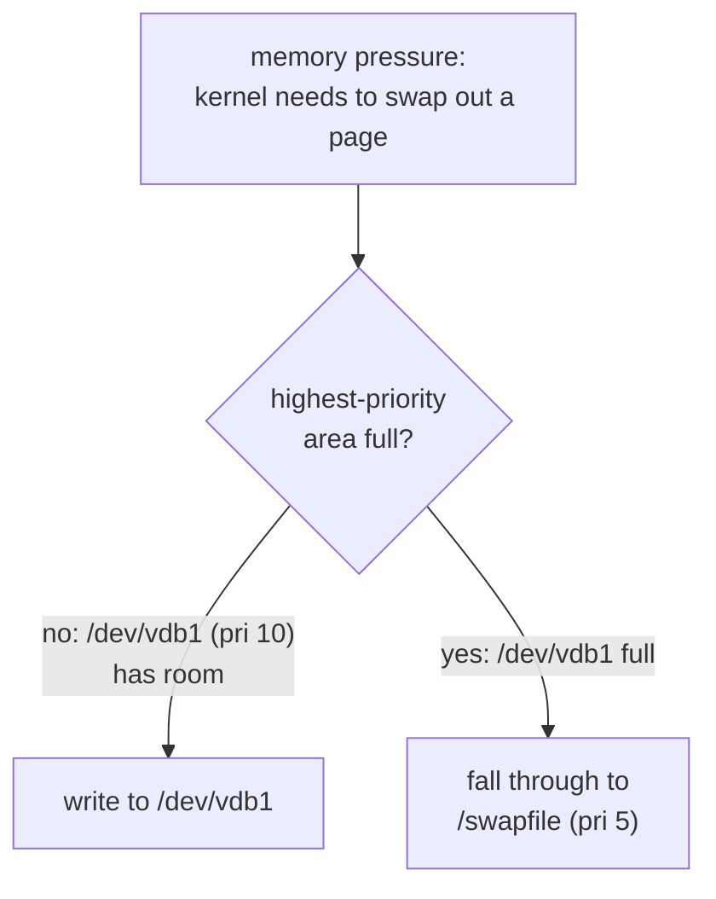

# Part 2 — Formatting, Priorities & Persistence

> Prerequisite: [Part 1 — Partition vs File & Creating the Partition](./course-01-partition-vs-file-and-creating-it.md). Next: [Module landing page](./course.md).

Part 1 built a raw swap partition. This part activates it, adds a second swap area so priority has something to demonstrate, and makes both survive a reboot.

## Formatting and activating

`mkswap <device>` writes the swap signature and a UUID onto the partition — the same header Module 1's `mkswap` wrote into a file, now landing directly on the partition's raw blocks. `swapon <device>` activates it. Because there is no filesystem in the path, reads and writes go straight to those blocks.

> [!TIP]
> **Try it — make it swap and turn it on**
>
> ```sh
> sudo mkswap /dev/vdb1
> sudo swapon /dev/vdb1
> swapon --show
> ```
>
> Expect something like:
>
> ```text
> Setting up swapspace version 1, size = 1022 MiB
> no label, UUID=7c2e...9a
>
> NAME      TYPE      SIZE USED PRIO
> /dev/vdb1 partition 1022M   0B   -2
> ```
>
> `swapon --show` lists `/dev/vdb1` with `TYPE partition` (a swap file shows `TYPE file`). `PRIO -2` was assigned automatically — the next section sets it on purpose.

## Priorities: preferring the fast area

A machine can have several swap areas active at once. Internally, the kernel keeps swap areas in **priority buckets**: for two areas at the *same* priority, it round-robins page writes between them (spreading the load, useful when both are equally fast disks); but it always drains a **higher**-priority bucket completely before writing a single page into a lower one. So mixed-speed swap only behaves well when you break the tie yourself — leave a fast partition and a slow file at the same default priority and the kernel treats them as equals, dragging the fast one down to the slow one's pace on every write it round-robins there.

The `pri=` value fixes this. User-set priorities run 0–32767; **higher wins**, and the fill order is strict, not proportional:



To see this you need a second area. Create a small swap file the same way as Module 1 — `fallocate`, `chmod 600`, `mkswap` — then activate both with explicit priorities.

> [!TIP]
> **Try it — two areas, explicit fill order**
>
> ```sh
> sudo fallocate -l 256M /swapfile
> sudo chmod 600 /swapfile
> sudo mkswap /swapfile
> sudo swapoff -a
> sudo swapon -p 10 /dev/vdb1
> sudo swapon -p 5 /swapfile
> swapon --show
> ```
>
> Expect something like:
>
> ```text
> NAME      TYPE      SIZE USED PRIO
> /dev/vdb1 partition 1022M   0B   10
> /swapfile file      256M    0B    5
> ```
>
> The `PRIO` column shows `10` for the partition and `5` for the file. Under memory pressure the kernel would fill `/dev/vdb1` entirely before touching `/swapfile` — the slow fallback only comes into play in a real emergency, once the fast area is exhausted.

## Making it persistent

`swapon` activations are lost on reboot. `/etc/fstab` restores them. A swap line has six fields:

```text
UUID=7c2e...9a   none   swap   sw,pri=10   0   0
/swapfile        none   swap   sw,pri=5    0   0
```

- **device** — use `UUID=` for a partition (stable across disk reordering), found with `blkid`; a swap file is named by its path.
- **mount point** — `none`; swap is not in the directory tree.
- **type** — `swap`.
- **options** — `sw` (the conventional placeholder for "swap defaults") plus `pri=` for priority.
- **dump / pass** — `0` and `0`; neither backup nor `fsck` applies to swap.

Apply changes without rebooting by deactivating all swap and reactivating from the file.

> [!TIP]
> **Try it — write fstab entries and apply them**
>
> ```sh
> sudo blkid /dev/vdb1
> echo "UUID=$(sudo blkid -s UUID -o value /dev/vdb1)  none  swap  sw,pri=10  0  0" | sudo tee -a /etc/fstab
> echo "/swapfile  none  swap  sw,pri=5  0  0" | sudo tee -a /etc/fstab
> sudo swapoff -a
> sudo swapon -a
> swapon --show
> ```
>
> Expect something like:
>
> ```text
> NAME      TYPE      SIZE USED PRIO
> /dev/vdb1 partition 1022M   0B   10
> /swapfile file      256M    0B    5
> ```
>
> `swapon -a` read both lines from `/etc/fstab` and brought the areas up with the priorities you wrote. This configuration now survives a reboot. To undo the edits: `sudo cp /etc/fstab.orig /etc/fstab`.

> [!WARNING]
> **Common pitfalls**
>
> - **Putting a filesystem on a swap partition.** Do not run `mkfs.ext4` on it. `mkswap` is the only formatting a swap device needs; a filesystem there just wastes the `mkswap` step and confuses `blkid`.
> - **Naming a swap partition by `/dev/vdb1` in fstab.** Kernel device names can change between boots; the wrong device could be activated as swap. Use `UUID=` from `blkid`.
> - **Relying on the default with mixed-speed swap.** Equal (default) priorities make the kernel round-robin writes across a fast and a slow area together. Set `pri=` so the fast one fills first.
> - **Assuming `pri=` on the command line persists.** `swapon -p 10 ...` lasts until reboot only. The priority must be in the `/etc/fstab` options column to stick.
> - **Editing `/etc/fstab` with no backup.** A malformed swap line makes `swapon -a` error (boot usually still continues, unlike a bad filesystem line). Keep a copy — the playground's is `/etc/fstab.orig` — and re-run `swapon -a` after editing to catch mistakes now rather than at the next reboot.

> *Equal priority means round-robin between areas; unequal priority means the higher one drains completely before the lower one sees a single page — "higher wins" is an on/off fill order, not a weighted preference.*

## Reference

- `man 5 fstab` — the six-field swap-line format and the `sw`/`pri=` options.
- `man swapon` — `-p` for the runtime override, `-a` for "activate everything in fstab", and the priority range.
