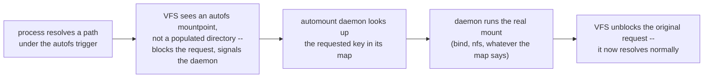
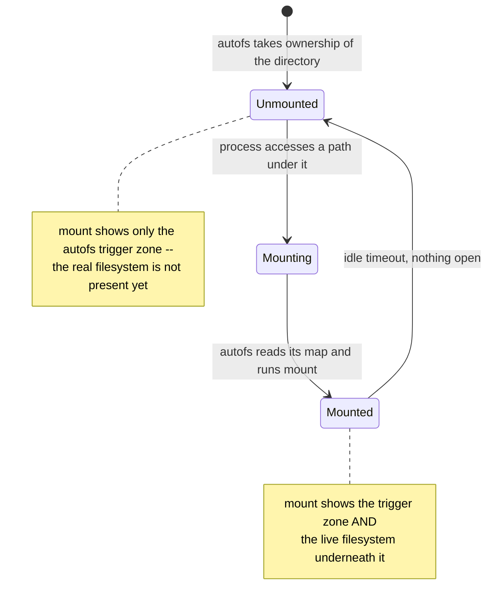

# Part 1 — How On-Demand Mounting Works, and Enabling autofs

> Prerequisite: [Module landing page](./course.md). Next: [Part 2 — The Master Map, Triggering & Idle Unmount](./course-02-master-map-and-triggering.md).

This part settles the one idea everything else in the module depends on: `autofs` does not "watch" a directory the way a file-change monitor does. It sits in the kernel's request path for that directory and only does anything when a request actually arrives. Understand that trap-and-resume mechanism first, and the master-map syntax in Part 2 reads as configuration for it rather than a set of rules to memorise.

## How on-demand mounting works

> As an analogy: `autofs` is a retrieval clerk at a closed-stacks library. Nothing is on the reading tables by default. Ask for a specific book and the clerk fetches it in the moment; leave it untouched for a while and the clerk reshelves it. The analogy breaks down because `autofs` fetches and reshelves with no visible delay or action — the directory simply is or is not mounted.

Concretely, three pieces cooperate:

1. **The `autofs` kernel module** owns a *trigger mountpoint* — a lightweight pseudo-filesystem the VFS treats specially. It is what `mount` shows with `type autofs`.
2. **The `automount` daemon** (`autofs.service`) is the userspace half. It registered the trigger mountpoint with the kernel and holds the parsed maps in memory.
3. **The requesting process** — whatever runs `cd`, `ls`, `open()`, anything that resolves the path.

The sequence on a cold request:



This is why the trigger zone can exist with genuinely nothing behind it: the kernel is not polling anything, it is parked on a single blocked request until the daemon answers. There is no race between "check if mounted" and "mount it" the way a shell script doing that manually would have — the kernel itself is the synchronization point.



After the configured idle time with nothing open under the mount, the daemon reverses the process: it unmounts the real filesystem and the trigger zone goes back to "empty" — still owned by `autofs`, still ready to trap the next request.

## Enabling the service

`autofs` runs as a systemd service. `enable --now` both starts it and sets it to start at boot — with no master-map entries yet, it is running but not managing anything.

> [!TIP]
> **Try it — start autofs**
>
> ```sh
> sudo systemctl enable --now autofs
> systemctl status autofs --no-pager
> ```
>
> Expect something like:
>
> ```text
> ● autofs.service - Automounts filesystems on demand
>      Loaded: loaded (/lib/systemd/system/autofs.service; enabled; ...)
>      Active: active (running) since ...
> ```
>
> `Active: active (running)` and `enabled` mean the daemon is up and will return after a reboot. It has read `/etc/auto.master` at startup but that file is still empty of real entries — nothing is under its control until Part 2 adds one.

> *`autofs` never polls a directory to see if it should mount something — the kernel blocks the request and hands it a name to look up. Nothing is mounted, or being checked, in between requests.*

## Reference

- `man autofs` — the overview page; points at `auto.master`, `autofs.conf`, and the daemon options.
- `man automount` — the daemon's own man page, including `--timeout`, `--ghost`, and browse-mode flags not covered in this module.
