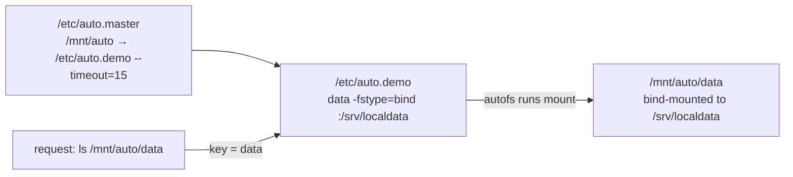

# Part 2 — The Master Map, Triggering & Idle Unmount

> Prerequisite: [Part 1 — How On-Demand Mounting Works, and Enabling autofs](./course-01-mechanism-and-enabling.md). Next: [Module landing page](./course.md).

Part 1 covered the mechanism in the abstract: a trigger mountpoint, a daemon, a map lookup. This part is the map itself — `/etc/auto.master` and the sub-map it points at — and what actually happens, in order, from the moment a process touches a path to the moment `autofs` lets it go idle again.

## The master map: `/etc/auto.master`

`/etc/auto.master` lists which directories `autofs` controls. Each line has three parts:

```text
/mnt/auto    /etc/auto.demo    --timeout=15
```

1. **The managed directory** — `/mnt/auto`. `autofs` takes ownership of it. This form, where requests land on *keys underneath* the directory, is an **indirect map**.
2. **The map file** — `/etc/auto.demo`. When something is requested inside `/mnt/auto`, `autofs` looks here for what to mount.
3. **Options** — here `--timeout=15` means "unmount anything under this directory after 15 seconds with no open files". Real deployments use longer values such as `--timeout=300` or `600`; 15 is short so you can watch the unmount happen.

The alternative is a **direct map**, written with `/-` as the managed "directory" and absolute paths as the keys in the map file. Direct maps suit a handful of fixed mount points scattered around the tree; indirect maps suit many siblings under one parent. Indirect is the common case, and the one this module builds.

If `/etc/auto.master` has multiple entries, the daemon matches each request against the **longest managed-directory prefix** that owns the path — the same "most specific wins" rule a router table or an Nginx `location` block uses. Two indirect entries never legitimately overlap in practice (each owns a disjoint parent directory), but a direct map (`/-`) and an indirect map can both technically claim the same path; the direct entry, being an exact key rather than a prefix, wins.

The map file for this example holds one entry — a local bind mount of `/srv/localdata`:

```text
data    -fstype=bind    :/srv/localdata
```

Put together, a request for a key resolves through both files before `autofs` ever runs `mount`:



The master map is read once at daemon start (or on a reload) and held in memory — it is not re-parsed per request. Only the *sub-map* lookup for a specific key happens live, at request time, which is what lets an indirect map serve keys that did not exist when the daemon started.

After any change to `/etc/auto.master` or a map file, reload the service so the daemon re-reads its in-memory copy.

> [!TIP]
> **Try it — put a directory under autofs control**
>
> ```sh
> echo '/mnt/auto  /etc/auto.demo  --timeout=15' | sudo tee -a /etc/auto.master
> echo 'data  -fstype=bind  :/srv/localdata' | sudo tee /etc/auto.demo
> sudo systemctl reload autofs
> mount | grep autofs
> ls /mnt/auto
> ```
>
> Expect something like:
>
> ```text
> /etc/auto.demo on /mnt/auto type autofs (rw,relatime,fd=7,pgrp=...,timeout=15,...)
>
> (ls /mnt/auto prints nothing)
> ```
>
> `mount` shows `/mnt/auto` as type `autofs` — the trigger zone is active, exactly the kernel-owned pseudo-filesystem from Part 1. `ls /mnt/auto` is empty because nothing has been requested yet; `autofs` creates the `data` subdirectory only when someone asks for it — it is not sitting there unmounted, it does not exist until the trap fires.

## Triggering a mount

The mount happens the instant a process references a key under the managed directory — this is Part 1's trap firing for real. Nothing special is needed: `ls`, `cd`, or opening a file all resolve the path, which is all the kernel needs to raise the request.

> [!TIP]
> **Try it — reach for the key and watch it mount**
>
> ```sh
> ls /mnt/auto/data
> cat /mnt/auto/data/hello.txt
> mount | grep /mnt/auto
> ```
>
> Expect something like:
>
> ```text
> hello.txt  notes.txt
> hello from the on-demand bind mount
>
> /etc/auto.demo on /mnt/auto type autofs (...)
> /srv/localdata on /mnt/auto/data type none (rw,relatime,bind)
> ```
>
> The `ls` triggered `autofs`: `/mnt/auto/data` now exists and shows the files from `/srv/localdata`, and `mount` lists a second line — the actual bind mount that `autofs` created on demand, stacked underneath the trigger zone from the first line.

## The idle unmount

Once nothing is reading from the mount and no shell is sitting in it, `autofs` unmounts it after the timeout from the master-map line. The trigger zone stays — only the on-demand mount underneath goes away, ready to be re-triggered by the next request.

> [!TIP]
> **Try it — let it time out**
>
> ```sh
> cd ~
> sleep 20
> mount | grep /mnt/auto
> ```
>
> Expect something like:
>
> ```text
> /etc/auto.demo on /mnt/auto type autofs (...)
> ```
>
> After ~15 seconds idle, the `bind` line is gone — only the `autofs` trigger line remains. The next `ls /mnt/auto/data` would mount it again. Make sure you `cd` out of `/mnt/auto/data` first; a shell inside it keeps the mount busy (an open file handle, in kernel terms — the same reference-count mechanism a plain `umount` checks) and the timeout never fires.

> [!WARNING]
> **Common pitfalls**
>
> - **Creating the managed directory's sub-entries by hand.** `mkdir /mnt/auto/data` makes the path exist as a normal empty folder, so the kernel never raises the "not found" that `autofs` needs to trap. `autofs` creates and removes those subdirectories itself.
> - **Editing a map and expecting it to take effect.** The master map is read once into memory (this part, above); `autofs` does not watch the files on disk. Run `sudo systemctl reload autofs` after any change to `/etc/auto.master` or a map file.
> - **A shell sitting in the mount.** If your working directory is under the on-demand mount, it counts as in use and the idle timeout will not unmount it. `cd` out first.
> - **Confusing the `autofs` line with the real mount.** `mount` shows the trigger zone (type `autofs`) at all times and the actual filesystem (type `nfs`, `bind`, …) only while it is active. Grep for the real type to check whether something is mounted right now.
> - **Very short timeouts in production.** Frequent unmount/remount churn adds latency and log noise. Short values like `15` are for learning; pick minutes for real use.

> *The master map is parsed once and held in memory; only the key lookup inside a sub-map happens live, per request — which is exactly what lets one indirect entry serve keys nobody wrote down until this moment.*

## Reference

- `man auto.master` — full master-map syntax, including direct maps and per-entry options this module didn't cover.
- `man 5 autofs` — sub-map file format shared by every map source type (file, NIS, LDAP).
