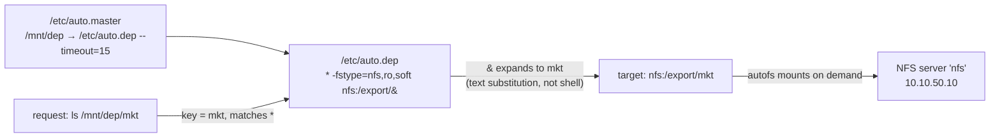

# Part 2 — Idle Unmount & Wildcards

> Prerequisite: [Part 1 — Discovering Exports & Writing a Sub-map](./course-01-discovering-and-submap.md). Next: [Module landing page](./course.md).

Part 1 mapped two exports by name. This part covers the timeout behaviour for a network mount specifically, then removes the "one line per export" limit with a wildcard key — the form that actually scales to hundreds of targets.

## The idle unmount

The `--timeout=15` from the master-map line applies to everything under `/mnt/dep`, the same mechanism Module 1 introduced — nothing NFS-specific about the countdown itself. With nothing open on `/mnt/dep/eng` and no shell inside it, `autofs` unmounts it after about 15 seconds. Real deployments use longer values — the section objective mentions 300 seconds; 15 just makes it watchable.

> [!TIP]
> **Try it — watch it detach**
>
> ```sh
> cd ~
> sleep 20
> mount | grep /mnt/dep
> ```
>
> Expect something like:
>
> ```text
> /etc/auto.dep on /mnt/dep type autofs (...)
> ```
>
> Only the `autofs` line remains — the `nfs4` mount is gone. Accessing `/mnt/dep/eng` again re-mounts it on the spot. If the `nfs4` line is still there, a process still has the mount busy; `cd` out of it and wait again.

## Wildcards: one line for many targets

Two departments need two lines. Hundreds of user home directories would need hundreds — unmanageable. A wildcard entry maps any key to a target computed from the key's name:

```text
*   -fstype=nfs,ro,soft   nfs:/export/&
```

- `*` as the key matches **any** name requested under the managed directory, but only if no more specific line matches first — a sub-map with both an explicit key and a wildcard checks the explicit key first; the wildcard is the fallback, not a competing match. This is the same "most specific wins" precedence Module 1 introduced for the master map, one level down at the key-lookup stage.
- `&` in the target is replaced with **the text that `*` matched**. This substitution happens once, at lookup time, when the daemon parses the matched line for this specific request — it is the map parser doing simple text substitution, not shell expansion, so nothing wraps `&` in quotes and no shell metacharacters in the key are be interpreted.

So a request for `/mnt/dep/mkt` makes `*` match `mkt`, and `&` expands to `mkt`, mounting `nfs:/export/mkt`. One line covers every current and future `/export/<name>` the server has — including exports that did not exist when `/etc/auto.dep` was written.



> [!TIP]
> **Try it — replace the explicit keys with a wildcard**
>
> ```sh
> sudo tee /etc/auto.dep <<'EOF'
> *  -fstype=nfs,ro,soft  nfs:/export/&
> EOF
> sudo systemctl reload autofs
> ls /mnt/dep/mkt
> cat /mnt/dep/mkt/mkt-readme.txt
> mount | grep /mnt/dep
> ```
>
> Expect something like:
>
> ```text
> mkt-readme.txt
> marketing shared file
>
> nfs:/export/mkt on /mnt/dep/mkt type nfs4 (ro,...)
> ```
>
> `mkt` was never named in the map, yet it mounted — `*` caught the name and `&` built `nfs:/export/mkt`. Requesting `/mnt/dep/eng` would work the same way. Roll everything back with `sudo cp /etc/auto.master.orig /etc/auto.master`, `sudo rm /etc/auto.dep`, `sudo systemctl reload autofs`.

> [!WARNING]
> **Common pitfalls**
>
> - **Pre-creating the key directory.** `mkdir /mnt/dep/eng` makes the path exist, so the kernel never signals `autofs` and the NFS mount never happens. Let `autofs` create and remove those directories.
> - **Forgetting to reload.** `autofs` does not re-read `/etc/auto.master` or the sub-map on its own. `sudo systemctl reload autofs` after every edit.
> - **Spaces inside the options field.** `-fstype=nfs, ro, soft` breaks parsing. Write the options comma-joined with no spaces: `-fstype=nfs,ro,soft`.
> - **Adding `intr`.** It has done nothing since Linux 2.6.25. Use `soft` with a sane `timeo`/`retrans` if you need reads to fail fast; otherwise the default is fine.
> - **A wildcard that does not match the server's layout.** `nfs:/export/&` only works if every export really is `/export/<key>`. If names differ, you need explicit keys or a smarter map.
> - **A shell left inside an automounted directory.** It keeps the mount busy so the idle timeout never fires. `cd` out when you are done looking.

> *`*` only ever loses to a more specific key in the same map — never the other way around — which is what makes it safe to add a wildcard fallback line alongside explicit exceptions instead of choosing one or the other.*

## Reference

- `man 5 autofs` — wildcard and substitution (`&`, `*`) syntax reference, shared across every map source type.
- `man nfs` — `soft`/`hard` semantics revisited: this module's read-only wildcard case is exactly the scenario `soft` is safe for.
