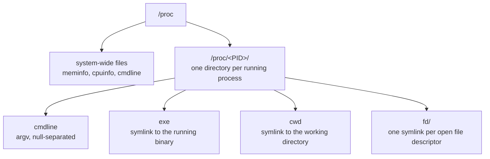

# Part 1 — /proc as a Live View & System-wide Files

> Prerequisite: none — this is the first part of the module. Next: [Part 2 — Per-Process Directories & Open File Descriptors](./course-02-per-process-and-file-descriptors.md).

`/proc` looks like a directory tree, and every normal tool (`cat`, `ls`, `grep`) treats it as one. But nothing under `/proc` is stored on disk. This part settles the mechanism that makes that true, then uses it to read the two most common system-wide facts: memory and CPU.

## `/proc` is a live view, not files

> As an analogy: `/proc` is a car's instrument cluster. The fuel gauge is not a stored document; it is a needle wired to a live sensor. Reading `/proc/meminfo` likewise triggers the kernel to sample its current state and render it. The analogy breaks down because you can also *write* to some `/proc` files to change kernel behaviour — a gauge you can push on — which the next module covers.

The mechanism: `/proc` is a **procfs**, a filesystem type implemented entirely in kernel code with no backing store — no disk blocks anywhere hold `/proc/meminfo`'s bytes. Every file's inode is wired to a kernel function instead of a block map. When something opens and reads `/proc/meminfo`, the VFS (virtual filesystem layer — the same dispatch layer that routes reads to ext4 or XFS) calls that function *right then*, and the function walks the kernel's live memory-accounting structures and writes out a fresh text report. Close the file, and nothing persisted; read it again a second later and the numbers may differ, because it ran again.

That mechanism is exactly why `ls -l` reports a length of 0 for most `/proc` files: there is no stored byte count to report, because there are no stored bytes — only a function that hasn't been asked to run yet.

> [!TIP]
> **Try it — zero bytes, real content**
>
> ```sh
> ls -l /proc | head
> stat -c '%s bytes  %n' /proc/meminfo
> head -n 3 /proc/meminfo
> ```
>
> Expect something like:
>
> ```text
> dr-xr-xr-x  9 root root 0 Aug 29 12:00 1
> dr-xr-xr-x  9 root root 0 Aug 29 12:00 1234
> -r--r--r--  1 root root 0 Aug 29 12:00 meminfo
> ...
> 0 bytes  /proc/meminfo
> MemTotal:        2019684 kB
> MemAvailable:    1650000 kB
> ```
>
> `stat` says `/proc/meminfo` is 0 bytes, yet `head` prints real numbers — the read triggered generation; the stat call has nothing to measure without reading. The numbered directories at the top (`1`, `1234`, …) are one per running process; Part 2 opens those.



## System-wide files

The top level of `/proc` holds global state, each file backed by its own generator function. `/proc/meminfo` is the full, unrounded memory accounting — `free` is essentially a formatter over it, not an independent source. `/proc/cpuinfo` describes each CPU by walking the kernel's per-CPU data at read time, which is why a hot-added or hot-removed CPU shows up immediately with no cache to invalidate. `/proc/cmdline` is the exact string the bootloader passed to the kernel — the one case here that genuinely doesn't change after boot, since nothing re-samples it.

> [!TIP]
> **Try it — the numbers behind `free`**
>
> ```sh
> grep -E '^(MemTotal|MemAvailable|MemFree):' /proc/meminfo
> free -k | head -n 2
> ```
>
> Expect something like:
>
> ```text
> MemTotal:        2019684 kB
> MemFree:          140000 kB
> MemAvailable:    1650000 kB
>
>                total        used        free      shared  buff/cache   available
> Mem:         2019684      ...          140000      ...        ...       1650000
> ```
>
> The `total` and `available` columns from `free -k` are the same numbers as `MemTotal` and `MemAvailable` in `/proc/meminfo`, because `free` opens that exact file, generation function and all, and reformats what it reads — the file is the source, not a cache of it.

> *Every `/proc` read is a function call dressed as a file read — that single fact explains the 0-byte size, why the numbers are always current, and why the directory for a process disappears the instant it exits (Part 2).*

## Reference

- `man 5 proc` — the authoritative field-by-field reference for every file this part and the next one touch.
- `man free` — confirms `free` is a thin formatter over `/proc/meminfo`, nothing more.
