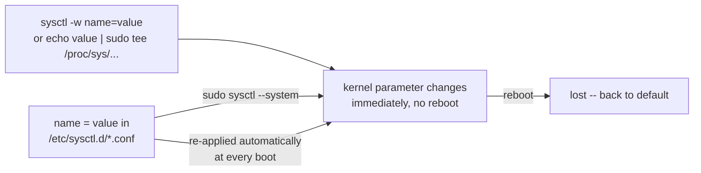

# Part 2 — sysctl: Viewing, Changing & Persisting

> Prerequisite: [Part 1 — The Hardware Tree & the Mount List](./course-01-hardware-tree-and-mount-list.md). Next: [Module landing page](./course.md).

Part 1's `/sys` files were mostly hardware readouts with the occasional control. The files under `/proc/sys/` are the opposite emphasis: every one is a live, writable kernel parameter, and `sysctl` is the standard front end for reading and changing them — this part covers both the immediate change and the separate step that makes it survive a reboot.

## Viewing and changing kernel parameters: `sysctl`

`sysctl` maps each `/proc/sys/` file path to a dot-separated name, so `/proc/sys/net/ipv4/ip_forward` becomes `net.ipv4.ip_forward`. That mapping is the *entire* relationship between the two: `sysctl <name>` and `cat /proc/sys/<path>` read the identical value through the identical kernel handler, and `sysctl -w <name>=<value>` and writing the file directly both trigger the identical write handler. `sysctl` is not a separate subsystem sitting in front of `/proc/sys` — it is a name-translation convenience over the exact same interface.

A concrete one: `net.ipv4.ip_forward` controls whether the kernel forwards IP packets between interfaces (acts as a router). It is `0` by default.

You cannot write these with `sudo echo 1 > /proc/sys/...` — the shell opens the redirect as your normal user *before* `sudo` runs, so the write is denied before `sudo` ever gets involved. `sysctl -w` (which itself runs as root and performs the write from inside a already-privileged process) or `echo 1 | sudo tee <file>` (where `tee`, not the shell, does the writing, and `tee` is what runs under `sudo`) both sidestep the redirect-ordering problem correctly.

> [!TIP]
> **Try it — read, change, and confirm the same knob two ways**
>
> ```sh
> sysctl net.ipv4.ip_forward
> sudo sysctl -w net.ipv4.ip_forward=1
> cat /proc/sys/net/ipv4/ip_forward
> sudo sysctl -w net.ipv4.ip_forward=0
> ```
>
> Expect something like:
>
> ```text
> net.ipv4.ip_forward = 0
> net.ipv4.ip_forward = 1
> 1
> net.ipv4.ip_forward = 0
> ```
>
> `sysctl -w` set the value and `cat` on the raw `/proc/sys` file shows the same `1` — not "a synced copy", the *same* parameter, read through two names for the same handler. The last line puts it back to `0`. On this single-interface VM, toggling `ip_forward` has no visible effect; on a real router it changes packet handling the instant it is set.

## Making a change persist

`sysctl -w` and direct writes to `/proc/sys` are gone after a reboot — nothing about them was ever recorded outside the running kernel's own state, so there's nothing left to restore. Persistence means telling something to *replay* the write at every boot, which is what a `.conf` file under `/etc/sysctl.d/` does: `systemd-sysctl.service` reads it early in boot and issues the same `name = value` writes sysctl would.

The precedence when multiple files could set the same key: `systemd-sysctl` reads `/etc/sysctl.d/`, `/run/sysctl.d/`, and `/usr/lib/sysctl.d/`, in that priority order (admin-owned `/etc` beats a same-named file under `/usr/lib`'s vendor defaults); within one directory, files apply in lexical filename order, and a later file's value for a key overrides an earlier file's value for the same key. `/etc/sysctl.conf`, the traditional single file, is applied last of all — so it overrides any `sysctl.d` drop-in that sets the same key, which is the opposite of what the "modern convention" framing below might suggest and worth remembering explicitly.

`sysctl -p` with no argument reads *only* `/etc/sysctl.conf` — it does not walk `sysctl.d` at all. To apply everything the way boot does, use `sysctl --system` (or `sysctl -p /etc/sysctl.d/99-mytuning.conf` for just one file).



> [!TIP]
> **Try it — persist and re-apply**
>
> ```sh
> echo 'net.ipv4.ip_forward = 1' | sudo tee /etc/sysctl.d/99-playground.conf
> sudo sysctl --system | grep ip_forward
> sysctl net.ipv4.ip_forward
> sudo rm /etc/sysctl.d/99-playground.conf
> sudo sysctl -w net.ipv4.ip_forward=0
> ```
>
> Expect something like:
>
> ```text
> net.ipv4.ip_forward = 1
> * Applying /etc/sysctl.d/99-playground.conf ...
> net.ipv4.ip_forward = 1
> net.ipv4.ip_forward = 1
> ```
>
> `sysctl --system` walked the drop-in directories in precedence order, applied `99-playground.conf`, and the parameter now reads `1` and would survive a reboot. The last two lines remove the file and reset the running value, leaving the VM as you found it.

> [!WARNING]
> **Common pitfalls**
>
> - **`sudo echo 1 > /proc/sys/...`.** The shell performs the `>` redirect as your user before `sudo` starts, so it fails with "Permission denied". Use `sudo sysctl -w name=value` or `echo 1 | sudo tee /proc/sys/...`.
> - **Expecting `sysctl -p` to read `/etc/sysctl.d/`.** Bare `sysctl -p` only reads `/etc/sysctl.conf`. Use `sysctl --system` for the drop-in directories, or pass the file path explicitly.
> - **Editing `/proc/sys` and calling it permanent.** Runtime writes vanish on reboot — nothing about a raw write is recorded anywhere else. Persistence needs a `.conf` file plus a reload.
> - **Assuming a `sysctl.d` drop-in always wins.** `/etc/sysctl.conf` is applied *last*, after every `sysctl.d` file — if it also sets the key, it overrides your drop-in, not the other way around.
> - **Trusting `/etc/mtab` as a separate record.** It is a symlink to `/proc/self/mounts` on current systems (Part 1). `/proc/mounts` is the authority.
> - **Assuming every `/sys` file is read-only.** Many are, but some have a `store` function and act as controls (Part 1). Writing the wrong one (I/O scheduler, device power state) can disrupt a running system — change `/sys` values only when you know what the attribute does.

## Reference

- `man 8 sysctl` — the `-w`, `-p`, and `--system` flags used throughout this part.
- `man 5 sysctl.d` — the full precedence rule across `/etc`, `/run`, and `/usr/lib`, and the filename-ordering tie-break, in authoritative detail.
