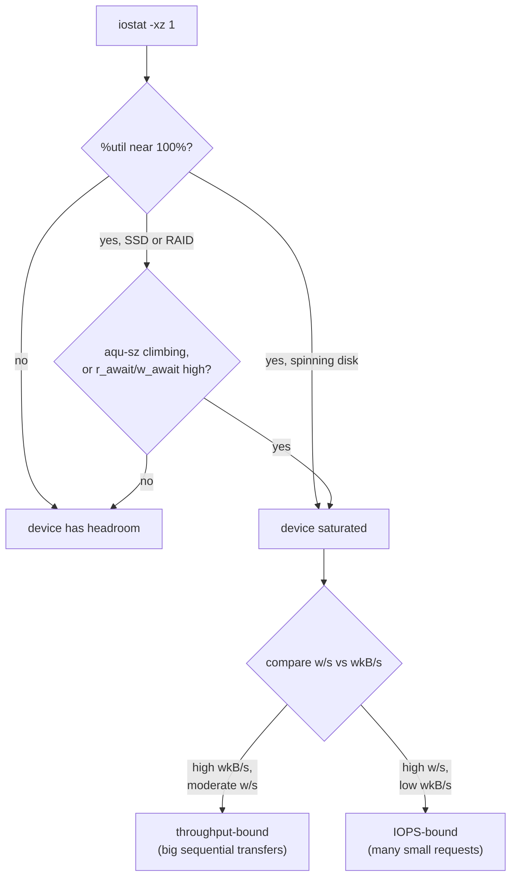

# Part 2 — Reading iostat & Watching Saturation

> Prerequisite: [Part 1 — I/O Wait, IOPS & Throughput](./course-01-io-wait-iops-throughput.md). Next: [Module landing page](./course.md).

Part 1 named the two things that can limit a disk. This part reads the tool that measures both live, then watches a real device cross from healthy into saturated so the numbers stop being abstract.

## Reading `iostat`

Run without options, `iostat` prints one average since boot — no use for a live problem. For debugging you want a fresh sample every second, the extended columns, and idle devices hidden:

```sh
iostat -xz 1
```

- `-x` — extended statistics (the latency and queue columns).
- `-z` — omit devices with no activity this interval.
- `1` — repeat every 1 second. Add a count (`iostat -xz 1 5`) to stop after five samples.

`r_await` / `w_await` are the column that most directly answers "is this slow *for the application*": each is the average time, in milliseconds, from when a request is submitted to when it completes — queue time plus service time combined, not just the time the disk itself spends on it. A request can sit queued behind others for most of that time and still count fully toward `w_await`; that is deliberate, because queue time is exactly what an application blocked on that write actually experiences. This is also why `%util` and `w_await` can disagree: `%util` alone measures "was the device doing something," `aqu-sz`/`await` measure "how much is piled up and how long does it take" — a device can be at 100% `%util` with a short queue and low `await` (genuinely just always busy, but keeping up), or a lower `%util` with a climbing `aqu-sz` and rising `await` on a device that services requests in parallel, which is the earlier warning sign on SSDs and RAID.

The columns that diagnose a bottleneck, and how they combine into a verdict:



`%util` alone is enough on a single spinning disk; SSDs and RAID service requests in parallel, so confirm with `aqu-sz` and `w_await` too (see pitfalls below).

| Column | Meaning |
| --- | --- |
| `%util` | Percentage of the interval the device had at least one request in flight. Near 100 means "always busy" — a strong signal on a single spinning disk, weaker on SSDs and RAID (see pitfalls). |
| `aqu-sz` | Average number of requests queued plus in service. Climbing = requests arriving faster than the device clears them. (Older `sysstat` called this `avgqu-sz`.) |
| `r_await` / `w_await` | Average time in milliseconds for a read / write request to complete, queue time included. This is the latency applications actually feel. (Older `sysstat` reported a single combined `await`.) |
| `r/s` / `w/s` | Read / write requests completed per second — IOPS. |
| `rkB/s` / `wkB/s` | Kilobytes read / written per second — throughput. |

> [!TIP]
> **Try it — the idle baseline**
>
> ```sh
> iostat -xz 1 3
> ```
>
> Expect something like:
>
> ```text
> Device   r/s   w/s  rkB/s  wkB/s  r_await  w_await  aqu-sz  %util
> vda     0.00  1.20   0.00   6.40     0.00     0.30    0.00   0.13
> ```
>
> On an idle VM only the root device (`vda`) shows the odd housekeeping write; `%util` is a fraction of a percent, `aqu-sz` ≈ 0, `w_await` is sub-millisecond. `/mnt/perf`'s device does not appear at all — `-z` hid it because nothing is touching it. This is what "healthy" looks like.

## Watching a device saturate

Now generate load on `/mnt/perf` from a second shell and watch the same columns move.

> [!TIP]
> **Try it — drive one device to 100%**
>
> In a second shell:
>
> ```sh
> start-io-load seq
> ```
>
> Back in the first shell:
>
> ```sh
> iostat -xz 1
> ```
>
> Expect something like:
>
> ```text
> Device   r/s    w/s   rkB/s    wkB/s  r_await  w_await  aqu-sz  %util
> vdb     0.00  480.0    0.00  491000     0.00     4.10    2.00   99.8
> ```
>
> The spare disk (`vdb` here) is now in the list: `%util` is pinned near 100, `aqu-sz` sits around 1–3 (requests waiting), and `w_await` has risen from sub-millisecond to several milliseconds. `wkB/s` in the hundreds of thousands with a moderate `w/s` says this is a big-transfer, throughput-bound load. Run `stop-io-load` and the device drops back off the list within a second or two.

## Throughput-bound versus IOPS-bound

The two load modes stress different limits. `start-io-load seq` writes in 1 MiB chunks — few operations, many bytes. `start-io-load rand` writes 4 KiB blocks to scattered offsets — many operations, few bytes each. Comparing `w/s` against `wkB/s` tells them apart.

> [!TIP]
> **Try it — compare the two shapes of load**
>
> ```sh
> stop-io-load
> start-io-load rand
> iostat -xz 1
> ```
>
> Expect something like:
>
> ```text
> Device   r/s     w/s   rkB/s   wkB/s  r_await  w_await  aqu-sz  %util
> vdb     0.00  9800.0    0.00   39200     0.30     0.75    7.20   99.5
> ```
>
> Against the sequential run, `w/s` jumped from a few hundred to several thousand while `wkB/s` fell sharply — the device is busy doing *many small* writes, not moving bulk data. `aqu-sz` is higher because small requests pile up. On a physical spinning disk `w_await` would balloon here as the head seeks; on this virtio disk the effect is milder but the IOPS/throughput contrast is still clear. `stop-io-load` when done.

> [!WARNING]
> **Common pitfalls**
>
> - **Trusting `%util` on SSDs or RAID.** These devices service many requests in parallel, so `%util` can read 100 while the device still has headroom. Use `aqu-sz` and `w_await` alongside it, not `%util` alone.
> - **Reading `iostat` with no interval.** A bare `iostat` shows an average since boot that hides any current spike. Always give an interval (`iostat -xz 1`) for live work.
> - **Assuming one `await` number.** Current `sysstat` splits it into `r_await` and `w_await`, and renamed `avgqu-sz` to `aqu-sz`. Older docs and older systems differ.
> - **Fixed latency thresholds.** "20–30 ms is bad" is a rough guide for spinning disks. An all-flash array in trouble might be at 2 ms; a healthy archive disk might sit at 15 ms. Compare against that device's own baseline.
> - **Blaming the CPU.** High load average with high I/O wait and idle user CPU is a storage problem. Check `iostat` before adding CPU.

> *`%util` says the device was busy; `aqu-sz` and `await` say how busy and for how long a request actually waited — on anything that services requests in parallel, only the second pair tells you if there's still headroom.*

## Reference

- `man iostat` — every column this part uses, plus `-p` (per-partition) and `-d`/`-c` for device-only or CPU-only output.
- `man sar` — `iostat`'s sibling for historical/logged samples, useful when the spike already happened.
