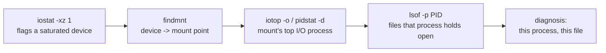

# Part 2 — lsof & Closing the Loop

> Prerequisite: [Part 1 — From Device to Process: iotop & pidstat](./course-01-iotop-and-pidstat.md). Next: [Module landing page](./course.md).

Part 1 got you from a saturated device to the PID responsible. This part gets from that PID to the exact file, then chains all four tools — this module's and the previous module's — into one diagnosis you can state with confidence.

## `lsof`: which file the process is hitting

A PID is not enough when the process is a database or a log shipper — you need the specific file. `lsof -p <PID>` lists everything that process has open: libraries, sockets, and regular files. Filter the `NAME` column for the saturated mount point.

> [!TIP]
> **Try it — the exact file**
>
> ```sh
> sudo lsof -p 2451 | grep /mnt/perf
> sudo lsof /mnt/perf/leak.log
> ```
>
> Expect something like:
>
> ```text
> fio     2451 ubuntu    5u   REG  254,16  536870912  12  /mnt/perf/leak.log
>
> COMMAND   PID   USER   FD   TYPE DEVICE  SIZE/OFF NODE NAME
> fio      2451 ubuntu    5u   REG  254,16 536870912   12  /mnt/perf/leak.log
> ```
>
> `lsof -p` shows PID `2451` holds `/mnt/perf/leak.log` open for writing (`5u` — descriptor 5, read/write). Coming from the other direction, `lsof <path>` lists every process using that file. Either way you now have process *and* file.

## Closing the loop: device → mount → PID → file

Put the pieces together into a chain you can state with confidence.



Each arrow is a different accounting source answering a narrower question: `iostat` reads block-layer device counters (Section 070 module-01), `findmnt` reads the mount table, `iotop`/`pidstat` read per-process I/O accounting (Part 1), and `lsof` reads the kernel's open-file table. None of the four alone identifies "which file on which device" — the chain is the technique, not any single command.

> [!TIP]
> **Try it — the full trace**
>
> ```sh
> iostat -xz 1 2
> findmnt --noheadings --output SOURCE,TARGET /mnt/perf
> pidstat -d 1 1
> sudo lsof /mnt/perf/leak.log
> stop-io-load
> ```
>
> Expect something like:
>
> ```text
> Device   w/s    wkB/s  w_await  aqu-sz  %util
> vdb    210.0   215000     4.20    1.90   99.5      <- device vdb is saturated
>
> /dev/vdb  /mnt/perf                                <- vdb is mounted at /mnt/perf
>
>    UID   PID   kB_wr/s  Command
>   1000  2451  215000.00  fio                       <- PID 2451 is the writer
>
> fio 2451 ubuntu  5u  REG  254,16  ...  /mnt/perf/leak.log   <- writing this file
> ```
>
> The four commands form the sentence: *device `vdb` is at 100% util; `vdb` is mounted at `/mnt/perf`; PID 2451 is writing ~210 MB/s; the file is `/mnt/perf/leak.log`.* That is a complete diagnosis. `stop-io-load` clears it.

> [!WARNING]
> **Common pitfalls**
>
> - **`iotop` shows all zeros.** Task delay accounting is off (default on kernels ≥ 5.14) or you are not root. `sudo sysctl -w kernel.task_delayacct=1`, run with `sudo`, or use `pidstat -d`.
> - **Confusing TID with PID.** `iotop` shows thread IDs by default; a multithreaded process appears as several rows. Add `-P` to aggregate by process, and cross-check the number with `ps`.
> - **`lsof` missing entries.** Without `sudo` you only see your own processes' files. Run it as root to inspect another user's or a system service's handles.
> - **Acting before tracing.** Killing the top `iotop` process without checking the file can take down the wrong thing. Confirm the device → mount → file chain first, then decide.
> - **A file that `lsof` shows as `(deleted)`.** A process can hold a deleted file open and keep writing to it — space is not freed and it will not appear in `ls`. `lsof` still shows it, marked `(deleted)`; the fix is to restart or signal the process.

> *Four different accounting sources, one chain: block-layer counters narrow to a device, the mount table narrows to a path, per-process I/O accounting narrows to a PID, and the open-file table narrows to a file — skip a link and you're guessing, not diagnosing.*

## Reference

- `man lsof` — the FD column codes (`u`/`r`/`w`), and `-i` for the network-socket equivalent of this same technique.
- `man findmnt` — `--output` field selection, used here to answer "what device backs this mount" in one line.
