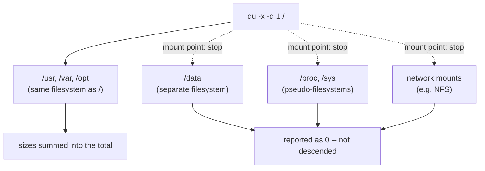

# Part 2 — Staying on One Filesystem & Allocated vs Apparent Size

> Prerequisite: [Part 1 — df vs du, and Reading du at a Sensible Depth](./course-01-df-vs-du-depth-and-units.md). Next: [Module landing page](./course.md).

Part 1 got `du`'s output readable. This part covers the two remaining ways its numbers can mislead you: wandering across mount boundaries it should not cross, and reporting a file's on-disk footprint when you wanted its logical length (or the reverse).

## Staying on one filesystem: `-x`

At `/`, a plain `du` is dangerous. The root of a server is a mosaic of mounted filesystems: the local root disk, network shares under `/mnt`, and pseudo-filesystems like `/proc` and `/sys` that are kernel interfaces, not storage — `/proc/kcore`, for instance, presents itself as a file the size of your address space. A `du -h -d 1 /` walks into all of them: it tries to size a remote NFS share over the wire, and it churns through `/proc` producing meaningless numbers and permission errors.

`du -x` (`--one-file-system`) stops at every mount point. The mechanism is a device-ID check: every file `du` `stat`s carries the device ID of the filesystem it lives on, and `du -x` compares each entry's device ID to the one it started on. The moment the walk would cross onto `/data`, `/proc`, or an NFS mount — a different device ID — it does not descend, and that path contributes nothing to the total. This is the same device-ID boundary a mount point itself represents; `-x` simply refuses to follow it downward, in either direction (into a real filesystem or into a pseudo one).



> [!TIP]
> **Try it — audit just the root filesystem**
>
> ```sh
> du -hx -d 1 / | sort -hr
> ```
>
> Expect something like:
>
> ```text
> 3.1G    /
> 1.9G    /usr
> 480M    /var
> 257M    /opt
> 0       /data
> 0       /proc
> ```
>
> `/data` and `/proc` show `0` — `-x` refused to cross into them by device ID, so they contribute nothing. Drop the `x` and rerun: `/data` jumps to ~400 MiB and `/proc` spews errors. Only the `-x` form is a safe, accurate answer to "what is filling the root disk?".

## Allocated blocks versus apparent size

By default `du` reports **disk space actually allocated**, in filesystem blocks — not the file's logical length. The two differ for **sparse files**: a file created at 512 MiB but never fully written (a VM image, a preallocated database file) has a large apparent size but only a few blocks actually assigned to it on disk. A sparse file's unwritten regions are not zero-filled blocks sitting on the platter — they are gaps the filesystem's own block map records as absent, and the filesystem synthesizes zeroes on read for any offset that has no block assigned. `du --apparent-size` reports the logical length — the number `ls -l` also shows — instead of counting real blocks.

This mechanism is also one more reason `du` and `df` disagree, alongside Part 1's unlinked-but-open case: `df` includes filesystem metadata overhead (journal, inode tables) that belongs to no single file `du` could charge it to.

> [!TIP]
> **Try it — the sparse file two ways**
>
> ```sh
> du -h /opt/archive/sparse.img
> du -h --apparent-size /opt/archive/sparse.img
> ls -lh /opt/archive/sparse.img
> ```
>
> Expect something like:
>
> ```text
> 0       /opt/archive/sparse.img
> 512M    /opt/archive/sparse.img
> -rw-r--r-- 1 root root 512M ... /opt/archive/sparse.img
> ```
>
> Default `du` says ~0 — that is how much disk the file really occupies, because almost none of its block range has ever been written. `--apparent-size` and `ls -lh` both say 512M — the logical length recorded in the inode, independent of which blocks behind it are real. When a capacity audit and a directory listing disagree wildly, a sparse file is a common cause.

> [!WARNING]
> **Common pitfalls**
>
> - **`du` at `/` without `-x`.** It descends into `/proc`, `/sys`, `/dev`, and every network mount — slow, noisy, and inaccurate. Always `du -x` when auditing a filesystem from its root.
> - **Reading `du` without enough privilege.** As a normal user, `du` cannot enter directories you lack permission for and undercounts, printing "Permission denied" lines. Run capacity audits with `sudo`.
> - **`sort` without `-h`.** `sort -r` alone sorts `9M` above `10G` because it compares text. Use `sort -hr` so the units are understood.
> - **Assuming `du` and `df` must match.** Deleted-but-open files (Part 1), sparse files, reserved blocks, and metadata all make them differ legitimately. A large gap with no sparse files in sight often means a deleted file is still held open — check `lsof +L1`.
> - **Expecting `du` to follow symlinks.** It does not, by default — a symlinked directory counts as the tiny link, not its target. That is usually what you want for a capacity audit.

> *A mount point is a device-ID boundary `-x` refuses to cross; a sparse file is a block-map gap the filesystem fills with synthesized zeroes on read — two different mechanisms, both hiding behind a `du` number that looks smaller than you expected.*

## Reference

- `man du` — `--one-file-system` / `-x` and `--apparent-size` in full, including how they interact with `--exclude`.
- `man 5 proc` — what `/proc/kcore` and similar pseudo-files claim to be, and why `-x` matters most at `/`.
