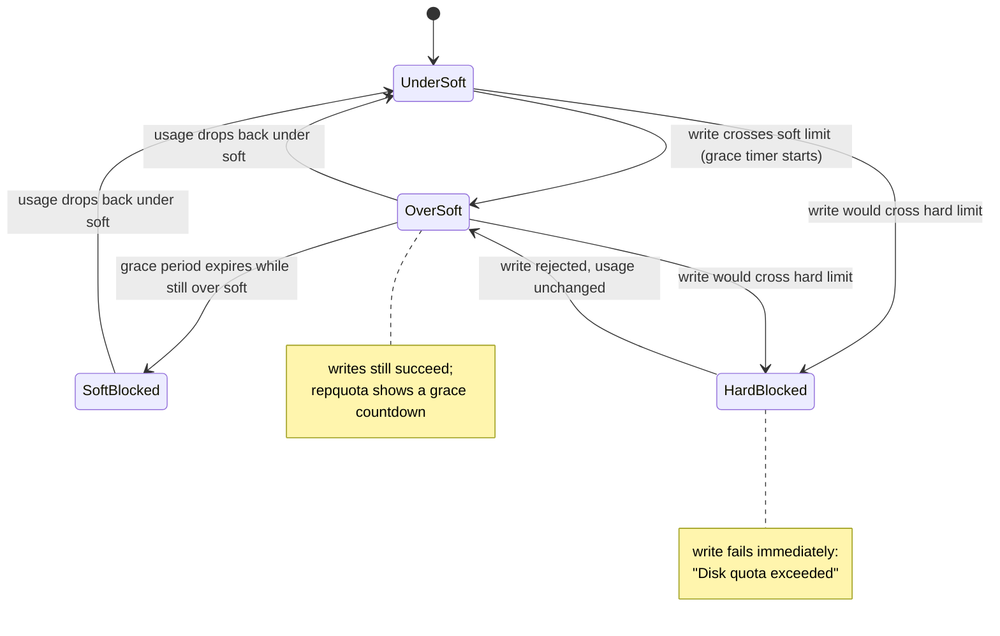

# Part 2 — Hitting the Limit & the Grace Period

> Prerequisite: [Part 1 — Turning Quotas On & Setting Limits](./course-01-turning-on-and-setting-limits.md). Next: [Module landing page](./course.md).

Part 1 set the numbers. This part watches what happens when usage reaches them — immediately at the hard limit, and on a countdown at the soft one.

## Hitting the limit

The hard limit stops a write mid-operation. Because the check runs inside the kernel's `write()` path (Part 1), the tool doing the writing gets the failure directly from its own write call — nothing is silently truncated beyond what fits, and nothing is buffered past the ceiling waiting to be flushed later.

> [!TIP]
> **Try it — write past the quota as alice**
>
> ```sh
> sudo -u alice dd if=/dev/zero of=/quota/alice/big bs=1M count=60
> sudo -u alice ls -lh /quota/alice/big
> sudo repquota -s /quota
> ```
>
> Expect something like:
>
> ```text
> dd: error writing '/quota/alice/big': Disk quota exceeded
> 49+0 records in
> 48+0 records out
>
> -rw-r--r-- 1 alice alice 49M ... /quota/alice/big
>
> User      used   soft   hard  grace
> alice     50M*   40M    50M   none
> ```
>
> `dd` wrote in 1 MiB chunks; the write that would have pushed total usage past 50 MiB was the one that failed, so the file stops a fraction under the hard ceiling rather than exactly at it. `repquota` marks alice's usage with `*` — over the soft limit — and the file stopped growing at the ceiling.

## The grace period

The grace period governs the soft limit only — the hard limit never grants extra time. It is a per-filesystem setting (with a separate value for blocks and inodes), configured with `setquota -t <block-grace> <inode-grace> <fs>` in seconds. The moment a write crosses the soft limit, the kernel timestamps that user's quota record; every write after that is still allowed (soft is not enforced like hard) but `repquota` computes and shows the countdown from that timestamp. If it reaches zero while the user is still over soft, the kernel starts treating soft as if it were hard — the same write-time rejection Part 2's first section showed, just triggered by a clock instead of a byte count.



> [!TIP]
> **Try it — set and observe the grace period**
>
> ```sh
> sudo setquota -t 3600 3600 /quota
> sudo repquota -s /quota
> sudo setquota -u bob 10M 50M 0 0 /quota
> sudo -u bob dd if=/dev/zero of=/quota/bob/f bs=1M count=20
> sudo repquota -s /quota
> ```
>
> Expect something like:
>
> ```text
> User      used   soft   hard  grace
> bob       20M*   10M    50M   59min
> ```
>
> bob is 20 MiB used against a 10 MiB soft / 50 MiB hard limit — over soft, under hard, so writes still succeed but a `59min` grace countdown has started from the moment he crossed 10 MiB. If bob is still over 10 MiB when it hits zero, the soft limit starts behaving like a hard one — `SoftBlocked` in the diagram above — until his usage drops back under it.

> [!WARNING]
> **Common pitfalls**
>
> - **Mount options missing.** Without `usrquota`/`grpquota` on the mount, `quotaon` fails. Put them in `/etc/fstab` and `mount -o remount` (or reboot); check with `findmnt -no OPTIONS <mp>`.
> - **Skipping `quotacheck` the first time.** Enforcement needs the accounting files built first — `quotaon` has nothing correct to load into the kernel otherwise. Run `quotacheck -cug` once (filesystem idle) before the first `quotaon`.
> - **Quotas are per-filesystem.** A limit on `/quota` says nothing about `/home` or `/`. Each filesystem has its own in-kernel accounting, and only if mounted with the options.
> - **Confusing soft and hard.** Soft can be exceeded until the grace period runs out; hard cannot be exceeded at all, ever, because the write-time check rejects it unconditionally. Set hard as the true ceiling and soft a bit below as the warning line.
> - **Root is exempt.** Processes running as root skip the write-time quota check entirely. Test enforcement as a normal user (`sudo -u alice ...`).
> - **`edquota` shows blocks in KiB.** The `blocks`/`inodes` "used" columns in `edquota` are current usage in 1 KiB units and are informational — editing them does nothing, because usage is derived from real data, not stored as an editable field. Change the `soft`/`hard` columns.

> *Hard is a wall the write-time check enforces unconditionally; soft is the same wall with a clock bolted on — cross it and a countdown starts, and only when that countdown reaches zero does soft start acting like hard.*

## Reference

- `man repquota` — report formats, `-s` for human units, `-a` for every quota-enabled filesystem at once.
- `man setquota` — the `-t` grace-period form, separate from the per-user block/inode form used in Part 1.
