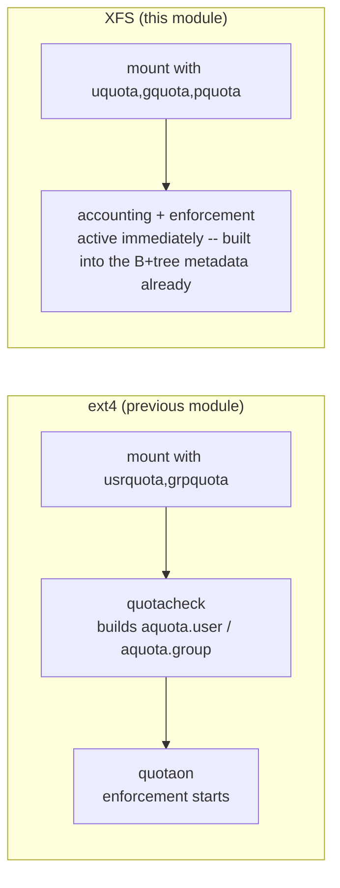

# Part 1 — XFS Quotas & User Limits

> Prerequisite: [Module landing page](./course.md). Next: [Part 2 — Defining & Enforcing a Project Quota](./course-02-project-quotas.md).

The previous module's ext4 workflow — mount option, then `quotacheck`, then `quotaon` — does not carry over. XFS collapses that into one step, for a reason worth understanding before the commands, because it explains why there is no XFS equivalent of "forgot to run quotacheck."

## XFS quotas are a mount option

XFS records quota usage in internal metadata, not in `aquota.*` files. There is **no `quotacheck`** and no separate `quotaon` for the normal case: quotas are enabled by mounting with the right option and are active from that moment.

The reason is architectural, not just a missing step: ext4 quota accounting is a **bolt-on** — a separate hidden file (`aquota.user`) that has to be built by walking the filesystem after the fact, because ext4's own on-disk format was never designed to know about quotas. XFS's on-disk format includes quota accounting **inside its own B+tree metadata** — the same structures that track free space and inode allocation — from the moment the filesystem is created. There is nothing to "build" by scanning, because the running total is maintained incrementally as part of every allocation and free, the same as XFS's own free-space counters. Mounting with the option simply tells the kernel to start reading and enforcing against numbers that were already being kept.

- `uquota` / `usrquota` — user quotas, accounting **and** enforcement.
- `gquota` / `grpquota` — group quotas.
- `pquota` / `prjquota` — project quotas (Part 2).
- `uqnoenforce` (and `gqnoenforce`, `pqnoenforce`) — account only, do not block writes. Useful for measuring before you set limits.

On most current kernels you can combine `uquota` with either `gquota` or `pquota`; group and project quotas historically shared the same on-disk field, so some setups cannot have both at once. The root filesystem is a special case — it needs the options passed on the kernel command line, not just fstab, because the root filesystem is mounted before `/etc/fstab` is even read.



`xfs_quota` is the management tool. Plain mode is read-only; `-x` (expert mode) is required to change anything. `-c '<command>'` runs one sub-command.

> [!TIP]
> **Try it — check the quota state**
>
> ```sh
> findmnt -no OPTIONS /srv/xfs
> sudo xfs_quota -x -c 'state' /srv/xfs
> ```
>
> Expect something like:
>
> ```text
> rw,relatime,attr2,inode64,logbufs=8,logbsize=32k,usrquota,prjquota
>
> User quota state on /srv/xfs (/dev/vdb)
>   Accounting: ON
>   Enforcement: ON
> ...
> Project quota state on /srv/xfs (/dev/vdb)
>   Accounting: ON
>   Enforcement: ON
> ```
>
> `usrquota` and `prjquota` are on the mount, and `state` reports both accounting and enforcement `ON` — no `quotacheck` step was needed, because there was never a separate accounting file to build.

## User limits

`xfs_quota -x -c 'limit bsoft=<n> bhard=<n> <user>' <fs>` sets a user's block limits (`isoft=`/`ihard=` for inode counts). `report` shows usage; `-h` for human units, `-u` for the user report (the default).

> [!TIP]
> **Try it — limit alice and exceed it**
>
> ```sh
> sudo xfs_quota -x -c 'limit bsoft=40m bhard=50m alice' /srv/xfs
> sudo xfs_quota -x -c 'report -h' /srv/xfs
> sudo -u alice dd if=/dev/zero of=/srv/xfs/alice-file bs=1M count=60
> sudo xfs_quota -x -c 'report -h' /srv/xfs
> ```
>
> Expect something like:
>
> ```text
> User quota on /srv/xfs (/dev/vdb)
>                         Blocks
> User        Used   Soft   Hard Warn/Grace
> alice          0     40M    50M  00 [------]
>
> dd: error writing '/srv/xfs/alice-file': Disk quota exceeded
> 49+0 records in
>
> alice         50M    40M    50M  00 [--------]
> ```
>
> alice's writes stop at the 50 MiB hard limit with the same "Disk quota exceeded" error as ext4 — the enforcement point (kernel write-syscall check) is identical between the two filesystems; only where the accounting numbers live differs. Soft, hard, and grace all mean the same thing here as in the previous module — only the tool and its underlying storage differ.

> *ext4 bolts quota accounting on after the fact via a file `quotacheck` builds; XFS keeps that accounting inside its own B+tree from creation — which is why one filesystem has a "did you remember to quotacheck" pitfall and the other does not.*

## Reference

- `man xfs_quota` — the full expert-mode command set (`limit`, `report`, `state`, `project`, covered next in Part 2).
- `man 5 xfs` — XFS's on-disk quota metadata, for the architectural detail behind why no separate accounting pass is needed.
