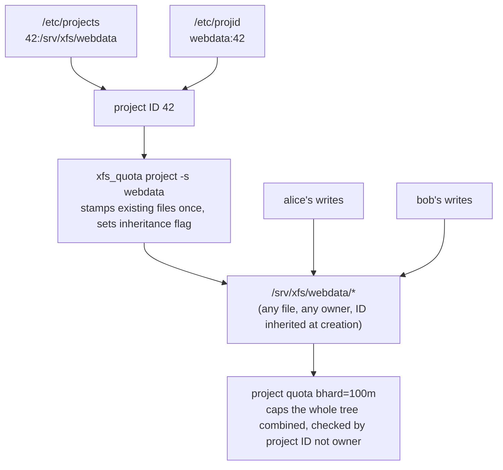

# Part 2 — Defining & Enforcing a Project Quota

> Prerequisite: [Part 1 — XFS Quotas & User Limits](./course-01-xfs-quotas-and-user-limits.md). Next: [Module landing page](./course.md).

User and group quotas cap *who* owns the data. A **project quota** caps a *directory tree*, regardless of who owns each file inside it — the tool for "the `/var/www/site` directory may use at most 10 GB," full stop, no matter which of a dozen service accounts writes into it.

## Defining a project

A project is a numeric ID attached to a directory tree. Every file created anywhere under that tree inherits the project ID, and the project's quota caps the whole tree's usage. Two files map the pieces:

- `/etc/projects` — `<id>:<path>` (the ID-to-directory mapping).
- `/etc/projid` — `<name>:<id>` (a friendly name for the ID).

Then `xfs_quota -x -c 'project -s <name>' <fs>` walks the tree and stamps the project ID onto existing files. This is the one place XFS quotas *do* require an explicit initialization pass, and the reason is the mirror image of Part 1: a file's project ID is stored per-inode, so a file that existed before the project was defined has no ID yet — `project -s` is that one-time backfill, plus it sets an inheritance flag on the directory so every *new* file created afterward gets stamped automatically at creation time, with no equivalent scan ever needed again.

> [!TIP]
> **Try it — create the `webdata` project**
>
> ```sh
> echo '42:/srv/xfs/webdata' | sudo tee -a /etc/projects
> echo 'webdata:42' | sudo tee -a /etc/projid
> sudo xfs_quota -x -c 'project -s webdata' /srv/xfs
> sudo xfs_quota -x -c 'report -p -h' /srv/xfs
> ```
>
> Expect something like:
>
> ```text
> Setting up project webdata (path /srv/xfs/webdata)...
> Processed 1 (/etc/projects and cmdline) paths for project webdata
>
> Project quota on /srv/xfs (/dev/vdb)
>                         Blocks
> Project     Used   Soft   Hard Warn/Grace
> webdata        0      0      0  00 [------]
> ```
>
> The project now exists and `report -p` lists it, with no limit set yet. Every existing file under `/srv/xfs/webdata` was stamped with project ID `42` by that one `project -s` pass, and the directory's inheritance flag means anything created under it from now on is stamped automatically, at write time, with no further scans.

## Enforcing a project quota

`xfs_quota -x -c 'limit -p bhard=<n> <name>' <fs>` sets the project's limit. From then on, the *combined* size of everything under the tree is capped — writes by any user fail once the tree hits the ceiling, checked the same way a user or group limit is: at write-syscall time, against the project ID stamped on the file being written to, not against whoever owns it.



> [!TIP]
> **Try it — cap the directory regardless of who writes**
>
> ```sh
> sudo xfs_quota -x -c 'limit -p bhard=100m webdata' /srv/xfs
> sudo -u alice dd if=/dev/zero of=/srv/xfs/webdata/a bs=1M count=70
> sudo -u bob   dd if=/dev/zero of=/srv/xfs/webdata/b bs=1M count=70
> sudo xfs_quota -x -c 'report -p -h' /srv/xfs
> ```
>
> Expect something like:
>
> ```text
> (alice's dd succeeds — ~70M)
> dd: error writing '/srv/xfs/webdata/b': Disk quota exceeded
> 30+0 records in
>
> Project     Used   Soft   Hard Warn/Grace
> webdata      100M     0    100M  00 [--------]
> ```
>
> alice wrote ~70 MiB, then bob could only add ~30 MiB before the tree hit its 100 MiB project limit — even though bob has no personal quota and is not the tree's owner. The check ran against project ID `42`, which every file under `/srv/xfs/webdata` carries regardless of whose `dd` created it.

> [!WARNING]
> **Common pitfalls**
>
> - **Looking for `quotacheck` / `aquota.user`.** XFS has neither — quota accounting lives inside its own B+tree metadata from filesystem creation (Part 1), not a file built after the fact. If the mount option is missing, remount with it (or reboot).
> - **Forgetting `-x`.** `xfs_quota` only changes limits in expert mode. Without `-x`, `limit` and `project` are unavailable.
> - **`pquota` and `gquota` together.** On some kernels they conflict (shared on-disk field). Pick the one you need; combine with `uquota`.
> - **Setting a project limit before `project -s`.** The directory must be initialised first — that pass is what stamps existing files and sets the inheritance flag; a quota on an unstamped tree has nothing to enforce against.
> - **Root filesystem quotas via fstab only.** For quotas on `/`, the options must be on the kernel command line; an fstab-only option is ignored there, since fstab is not read until after root is already mounted.
> - **Expecting ext4 `setquota`/`repquota` to work on XFS.** They do not — those tools read and write `aquota.*` files, which do not exist on XFS. Use `xfs_quota` for XFS; the ext tools are for ext2/3/4.

> *A project ID is per-inode metadata stamped once by `project -s` and inherited automatically after that — the same "no scan needed" property that makes XFS quotas mount-option-simple in Part 1 shows up again here as "initialize once, then it's automatic."*

## Reference

- `man xfs_quota` — the `project` sub-command in full, including `-C` to check without stamping.
- `man 5 projects` / `man 5 projid` — the exact file formats for `/etc/projects` and `/etc/projid`.
