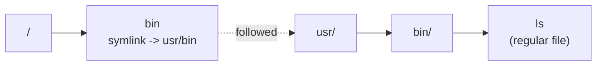

# Part 2 — Resolving, du's Blind Spot & Removing Safely

> Prerequisite: [Part 1 — What a Symlink Is & Finding Them](./course-01-what-a-symlink-is-and-finding-them.md). Next: [Module landing page](./course.md).

Part 1 established the substitution mechanism. This part uses it three ways: to see exactly where a chain of links ends up, to explain a `du` result that looks wrong until you remember the mechanism, and — most consequentially — to explain the one situation where that same substitution turns a harmless `rm` into data loss.

## Resolving where a link points

Several tools answer "where does this go?", with increasing thoroughness:

- `ls -ld <link>` — shows the target as stored in the link, often a *relative* path (`/bin -> usr/bin`). This is the raw string from Part 1, before any resolution happens.
- `readlink <link>` — prints just that stored target, nothing else. Still no resolution — same raw string as `ls -ld`, without the rest of the listing.
- `readlink -f <link>` / `realpath <link>` — actually perform the substitution, repeatedly if the target is itself a link, and print the final **absolute** path once nothing left to resolve is itself a link.
- `namei -l <path>` — shows every step of the resolution, link by link, with permissions — the substitution mechanism made visible one hop at a time.



> [!TIP]
> **Try it — raw target versus fully resolved**
>
> ```sh
> readlink /bin
> readlink -f /bin
> realpath /bin
> namei -l /bin/ls
> ```
>
> Expect something like:
>
> ```text
> usr/bin
> /usr/bin
> /usr/bin
> f: /bin/ls
>  dr-xr-xr-x root root /
>  lrwxrwxrwx root root bin -> usr/bin
>  drwxr-xr-x root root   usr
>  drwxr-xr-x root root   bin
>  -rwxr-xr-x root root   ls
> ```
>
> `readlink` alone gives the relative `usr/bin` actually stored in the link; `readlink -f` and `realpath` perform the substitution and resolve it to the absolute `/usr/bin`. `namei -l` shows the exact resolution step where `bin` is followed to `usr/bin` — useful when a path has several links in it and you need to know which hop goes where.

## `du` and symlinks

A symlink's own size is just the length of the path string it stores (Part 1) — a handful of bytes. `du` does not perform Part 1's substitution by default (it treats the link the way `find -type l` does, as an object in its own right), so measuring a symlinked directory reports essentially nothing for it.

> [!TIP]
> **Try it — a symlink weighs nothing**
>
> ```sh
> du -sh /bin
> du -sh /usr/bin
> ```
>
> Expect something like:
>
> ```text
> 0       /bin
> 180M    /usr/bin
> ```
>
> `du -sh /bin` reports `0` because `/bin` is a 7-byte link and `du` stops there without following it. The real space is under the target, `/usr/bin`. In a capacity audit this is what you want — otherwise a symlink would make you count the same data twice, once under the real path and once under every link that resolves to it.

## Removing a symlink safely

To delete a symlink and leave its target alone, name the link with **no trailing slash**:

```sh
rm /tmp/rmdemo/link
```

`rm` on a bare path removes the last path component as named — it does not need to resolve what that component points to, so the link itself is what gets removed; `/tmp/rmdemo/real` and its files are untouched. Repointing a link is `ln -sfn <new-target> <link>`.

> [!TIP]
> **Try it — remove the link, keep the data**
>
> ```sh
> reset-symlink-demo
> ls -ld /tmp/rmdemo/link
> rm /tmp/rmdemo/link
> ls /tmp/rmdemo/
> ls /tmp/rmdemo/real/
> ```
>
> Expect something like:
>
> ```text
> rebuilt: /tmp/rmdemo/real (2 files) and /tmp/rmdemo/link -> /tmp/rmdemo/real
> lrwxrwxrwx 1 root root 14 ... /tmp/rmdemo/link -> /tmp/rmdemo/real
> (after rm:)
> real
> a.txt  b.txt
> ```
>
> `link` is gone; `real/` and both files remain. That is the correct way to retire or repoint a symlink.

> [!WARNING]
> **The trailing slash on a symlink is dangerous**
>
> `rm /tmp/rmdemo/link` removes the link. `rm -rf /tmp/rmdemo/link/` — the same path **with a trailing slash** — does not. The mechanism is Part 1's substitution rule, applied to the *last* component instead of a middle one: POSIX path resolution treats a trailing slash as a requirement that the component it follows resolve to a directory. A symlink is not itself a directory, so the resolver performs exactly the substitution Part 1 described — follows the link one more hop to see what it points at — before `rm` ever gets a path to act on. `rm` then deletes the contents of whatever that resolved to: `/tmp/rmdemo/real/` (and, depending on your `rm` version, the `real` directory itself). Shell tab-completion often appends that slash for you, which is how this usually happens by accident rather than by typo.
>
> ```mermaid
> flowchart TD
>     START["rm target: /tmp/rmdemo/link"] --> Q{"trailing slash?"}
>     Q -->|"no slash<br/>rm .../link"| SAFE["last component named directly<br/>no resolution needed -- removes the symlink itself"]
>     Q -->|"trailing slash<br/>rm -rf .../link/"| DANGER["trailing slash forces resolution<br/>through the link to the target directory"]
> ```
>
> - Before `rm`-ing a symlink, check what it is and where it points: `ls -ld <path>`.
> - Never let a trailing slash stay on a symlink path you are about to delete.
> - To see your own system's exact behaviour safely, run `reset-symlink-demo`, then `rm -rf /tmp/rmdemo/link/` (with the slash), then `ls /tmp/rmdemo/real/` — and `reset-symlink-demo` again afterwards. Only do this in that disposable directory.
>
> **Other pitfalls**
>
> - **`readlink` without `-f` in a script.** The bare output can be a relative path that only makes sense from the link's own directory (Part 1's raw-string form). Use `readlink -f` or `realpath` for an absolute path.
> - **Assuming `find -type l` follows the link.** It matches the link itself, the same way `du` does not descend through one by default. `find -L` would make `find` perform the substitution on every path it walks, which is usually not what you want when auditing links rather than their targets.
> - **A dangling symlink.** If the target was moved or deleted, the link remains and points at nothing. `ls -l` shows the stored target; trying to resolve through it fails with "No such file or directory" the moment something requires the substitution to succeed.

> *Every symlink command in this module is the same one substitution rule from Part 1, applied at a different moment: `readlink -f` performs it eagerly, `du` and `find -type l` refuse to perform it at all, and a trailing slash on `rm` forces it to happen exactly once more than you meant.*

## Reference

- `man realpath` / `man readlink` — the `-f`/`-e`/`-m` variants and how they differ on a dangling link.
- `man namei` — `-l` for the long, permission-annotated resolution trace used above.
